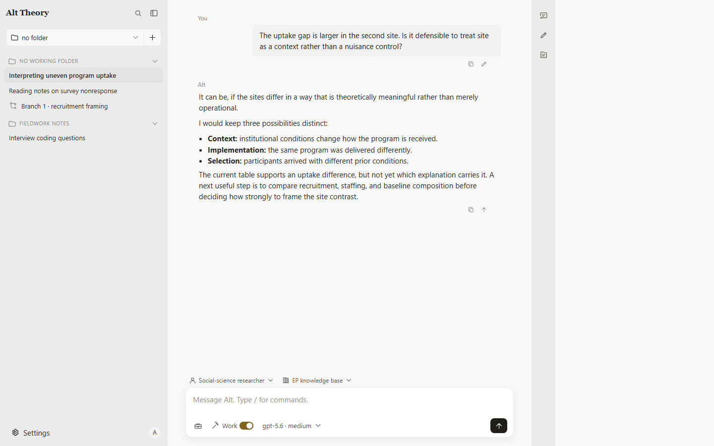
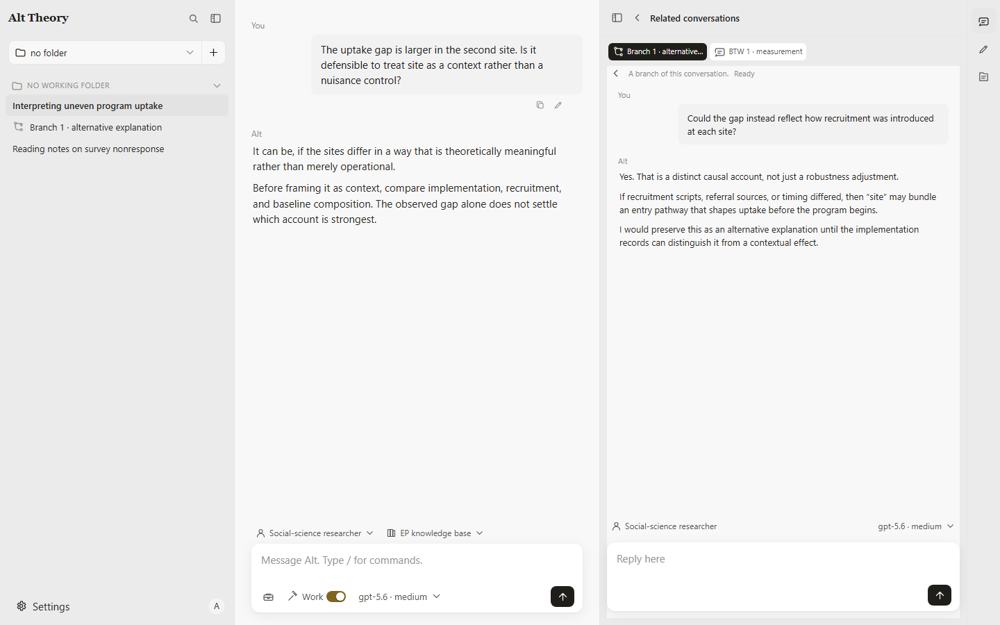
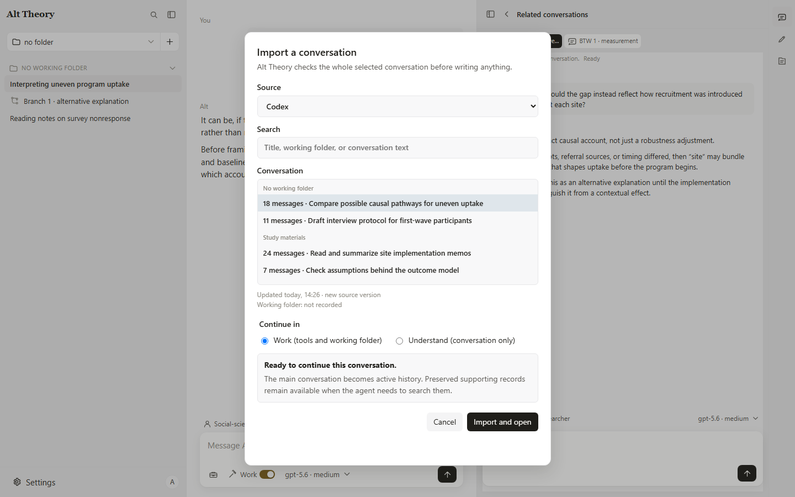

# Alt Theory

> “Efficiency is doing things right; effectiveness is doing the right things.”
> — Peter Drucker

As AI becomes more autonomous, proactive, and capable of producing plausible answers, there are still moments when you need to direct the research—or need the AI to understand and follow what you are actually trying to do.

**Alt Theory helps you think effectively and get serious research work done.**

Uncertainty is a normal part of serious research. Some should be resolved with evidence, some managed as a project develops, and some explored because new questions and theories begin there. Alt Theory is designed to distinguish between these situations, understand what the user is trying to achieve, and support the meta-level thinking involved in social-science and broader academic research.

Alt Theory can identify uncertainty, evidence, and competing interpretations; work with your files and research tools; and follow several directions without collapsing them into one answer. You can choose how it works with you, select the knowledge it draws on, invoke a particular method, compare alternatives, explore a side question, or give a bounded direction to a subagent.

Built on the [Pi coding-agent runtime](https://pi.dev), Alt Theory adds its own agent behavior, research assets, conversation architecture, and desktop interface. The current public Beta is intended for real work, while interfaces, configuration, and compatibility may still change between releases.



## A research product that evolves with AI

Alt Theory is a research product developed from the perspective of social scientists and evolves as AI capabilities change. Its longer-term concern is what happens as AI takes on more research execution and increasingly parts of exploration, and how researchers continue to shape questions, exercise judgment, develop theory, and preserve the knowledge traditions of their fields.

In 2025, it began as an environmental psychology knowledge base and a thinking partner for theory innovation. As agents became more capable of acting on files and tools, the current 2026 release supports a continuing research loop: understand a problem, work with evidence and files, explore alternative directions, and return without losing the inquiry's continuity. Its behavior, knowledge, methods, and conversation structure can be extended for different research questions, levels of theoretical interest, and degrees of agent experience.

## How Alt Theory works

### What Alt does automatically

- Its system behavior and **Soul**—a readable file of stable principles—provide a continuing stance toward evidence, uncertainty, pacing, and user choice.
- The selected **Role**—a readable instruction for how Alt interprets and communicates—shapes its responses for a recurring kind of research relationship or task.
- **Skills** activate when a situation calls for a particular method, such as aligning on goals before direction-setting work or recovering the changed context of an imported conversation.

### What the user controls

- Select, change, or clear the Role for a conversation.
- Select or disable a **knowledge base**: curated material for a field or research purpose rather than a temporary set of search results.
- Invoke a Skill explicitly when you want a particular way of working.
- Choose the working boundaries, permissions, and research tools available to the conversation.
- Create, compare, retain, or discard different lines of inquiry.

A selected knowledge base can preserve the scope, provenance, and internal traditions of a field while Alt also considers wider or more mainstream knowledge. Easier knowledge-base creation and community knowledge bases are future directions rather than current Beta claims.

### Selected skills

| Skill | When it helps | How it starts |
|---|---|---|
| `adaptive-aligning` | Situation, goals, or direction are not yet shared | Automatic or explicit |
| `adaptive-plan-record` | Multi-stage work needs a living plan and record | Automatic or explicit |
| `search-policy` | Claims need live verification and clear source labels | Automatic |
| `precise-edit` | Near-final text needs restrained editing | Automatic or explicit |
| `imported-session-context` | An imported conversation needs contextual recovery | Automatic |
| `alt-theory-help` | Setup or product use needs assistance | Through Helper |

Explicit Skill invocation is currently available through commands. A direct toolbar for common situational Skills is planned for the v1.3.1 Beta cycle.

## Explore more than one line of inquiry

Compared with Codex, Claude Code, OpenCode, and ZCode, Alt Theory adds a more flexible, user-directed exploration interface around agent work. Messages can be edited into comparisons, questions can move into BTW conversations, distinct directions can branch, and useful side work can be promoted.

| Control | What it is for |
|---|---|
| **Edit and compare** | Preserve the original and run an edited request as a sibling comparison |
| **Branch** | Follow a distinct direction without discarding the first |
| **BTW** | Explore a side question without pulling the main line away |
| **Subagent** | Give a bounded direction to another real, inspectable agent conversation |
| **Show in conversation list** | Promote useful side work into an independently retained conversation |

Subagents can communicate with both the main agent and the user. A promoted side conversation keeps its original relationship and provenance instead of becoming an unrelated transcript.



## Who it is for

Alt Theory is designed first for students and researchers in the social sciences: from a master's student framing a first question to a senior researcher deciding whether an AI tool belongs in a research plan. It also supports broader research-like knowledge work.

No agent-tool experience is required. If you mainly want discussion and documented reflection, **Understand** keeps the agent's reach deliberately bounded while retaining a small writable space for conversation summaries and notes. Product and setup questions can be taken to **Helper**, a fresh-context conversation available from the composer; see [Help and troubleshooting](#help-and-troubleshooting).

For research that needs live sources, files, analysis, or document production, the current conversation can use **Work** without discarding its earlier discussion. For example, Alt can run exploratory R or Python analysis, work with literature and documents, and produce tables, slides, or collaborator materials before returning to interpretation.

Professional agent users can bring an existing workspace and continue conversations imported from Codex, Claude Code, Grok Build, Pi Coding Agent, and OpenCode. See [Imports and cross-harness continuity](docs/en/system-guide/imports-and-continuity.md).

## Other features and capabilities

- Run multiple agent sessions and related conversations at the same time.
- Import supported conversation histories, including compacted sessions and supported image and tool records. The imported-session Skill helps Alt recognize missing source context, environmental changes, and the user's new direction.
- Keep Branches, BTW conversations, and subagents as distinct, inspectable session records rather than flattening them into one transcript.
- Delete conversations into Settings → Trash, restore them during the 30-day recovery period, or permanently delete them; comparison Branches remain independently retainable.
- Let subagents communicate with the main agent and user, and promote a useful subagent or side conversation when it becomes a better main direction.
- Work with local folders, attachments, documents, images, live search, R/Python analysis, and file-producing tasks through available tools and visible permission boundaries.
- Choose among supported models and providers rather than tying the product to one model vendor.
- Use the interface in English, 简体中文, or 繁體中文（香港）.

A stronger continuation hook for models that tend to stop or wait passively is planned for the v1.3.1 Beta cycle. A knowledge-base-making Skill remains a future direction.



See [Known limitations](docs/en/help/compatibility-formats-limitations.md) for current format and integration boundaries.

## Get Alt Theory

| Platform | Status |
|---|---|
| Windows x64 | **[Download Beta 1](https://github.com/syuan-research/alt-theory/releases/download/v1.3.0-beta.1/AltTheory-b1-win.zip)** |
| macOS Apple Silicon | Planned before v1.4; internal hard-bug validation remains |
| Linux and other architectures | Not currently claimed |

### Windows: download and launch

1. Download `AltTheory-b1-win.zip` from the GitHub Release.
2. Extract the complete `AltTheory` folder. This is a folder app, not an installer.
3. Open the folder and run `AltTheory.exe`.

The Beta is not code-signed. Windows SmartScreen may show an unidentified-app warning; choose **More info → Run anyway** only when the ZIP came from this repository's GitHub Release. The release includes a SHA-256 checksum for verification.

Node.js and npm are **not** required when using the downloaded app.

## First launch

Alt Theory opens directly into a conversation. Before the first conversation can run, configure at least one model in **Settings → Models**—either with an API key or a supported subscription sign-in.

Alt Theory supplies the workspace, behavior, and tools; the model comes from the provider you configure. The software is free, while model use is billed under that provider's terms.

- [Install and first launch](docs/en/start-here/install-and-launch.md)
- [Models, providers, and access](docs/en/system-guide/models-providers-access.md)
- [Start your first conversation](docs/en/start-here/first-conversation.md)

## Local data, permissions, and updates

Conversations and configuration are stored locally outside the app folder. The configured model receives the conversation content needed to reply; searches contact the selected search services. Nothing else is exported unless the user chooses to export it.

File and command actions remain visible and use approval boundaries. Start with a non-sensitive working folder until those boundaries are familiar.

To update the folder app: close Alt Theory, extract the new release into a new folder, and run the new `AltTheory.exe`. Replacing the app folder does not delete the separate conversation/configuration data directory.

- [Working folders, files, and paths](docs/en/system-guide/working-folders-files-paths.md)
- [Permissions and agent activity](docs/en/system-guide/permissions-approvals-agent-activity.md)
- [Compatibility and updates](docs/en/advanced/compatibility-updates-debugging.md)

## Help and troubleshooting

Open **Helper** from the composer's tools, or invoke `/helper`. From a blank screen it starts a Help conversation; beside existing work it opens separately with fresh context. Helper can answer questions about Alt Theory and help fix provider, key, model, and missing-tool setup from the current documentation.

- [Common questions](docs/en/help/common-questions.md)
- [Provider and model troubleshooting](docs/en/system-guide/models-providers-access.md)
- [Imports and cross-harness continuity](docs/en/system-guide/imports-and-continuity.md)
- [Full English documentation](docs/en/README.md)
- [简体中文文档](docs/zh-Hans/README.md)

A useful bug report includes what you did, what happened, what you expected, the Alt Theory version and platform, and whether the conversation was imported or had compacted.

## Build from source

This is the secondary path for developers and users who want to inspect or package the app themselves. Build desktop artifacts on the matching operating system. The current Windows build is tested with Node.js 24 and npm 11.

```bash
git clone https://github.com/syuan-research/alt-theory.git
cd alt-theory
npm ci
npm --prefix alt-theory-app/frontend ci
npm run build:electron
```

On Windows, the unpacked app is written to `dist/win-unpacked/`. For packaging, known compiler diagnostics, required output checks, and macOS commands, use the [canonical desktop bundle guide](development/releases/desktop-friend-bundle.md).

Useful development commands:

```bash
npm run dev:web:local:v6
npm run test:backend
npm run test:frontend
```

## Repository map

- `alt-theory-app/` — session engine, web server, and frontend.
- `agent-assets/` — runtime identity, roles, skills, knowledge bases, and guidance.
- `electron/` and `scripts/` — desktop runtime and packaging.
- `docs/en/`, `docs/zh-Hans/` — user documentation.
- `development/architecture/` — current technical architecture.
- `development/releases/` — release and packaging evidence.

## License

Alt Theory software is available under the MIT License. Original documentation and agent assets are available under CC BY 4.0. See [LICENSE.md](LICENSE.md) for path coverage and third-party notices.
