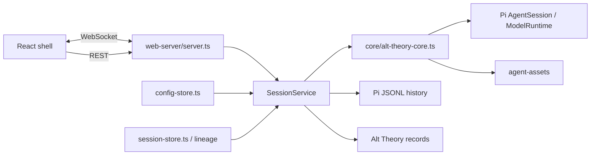

# Architecture: Core Session Engine

This file remains the public compatibility entry point for Alt Theory's session
architecture. It is now an overview and navigation map, not the detailed source
of truth for every session-related behavior. Follow the owning document before
changing a module.

## How to use this map

Start with the high-level module that owns the behavior being changed. Read the
linked document and its verification anchors, then inspect the current code. If
the change crosses modules, read each affected owner and preserve the interface
described here. Do not use this map to infer that the implementation is cleanly
partitioned.

The map is grounded in current implementation. It provides ownership and
navigation, not a complete file partition or an immediate refactor mandate.
Historical coupling may cross these module boundaries and is recorded below.

## High-level modules

The following modules are current, high-level mechanisms. “Module” is used in
the scale-agnostic `codebase-design` sense: a mechanism with an interface and
an implementation, including one that spans frontend, backend, storage, or
several files. Each module has implementation evidence, but its code boundary
may be uneven.

| Module | Owning document | Current boundary maturity |
|---|---|---|
| Session lifecycle and turn continuity | [`session-lifecycle-and-turn-continuity.md`](session-lifecycle-and-turn-continuity.md) | Coherent mechanism; historically coupled in `SessionService` and runtime code. |
| Conversation lineage and related sessions | [`branch-family-semantics.md`](branch-family-semantics.md) | Relatively clear behavioral boundary, with shared session/workspace interfaces. |
| Agent behavior and prompt composition | [`agent-behavior-and-assets.md`](agent-behavior-and-assets.md) | Coherent mechanism; prompt assembly and runtime asset loading remain coupled. |
| Provider/model configuration and selection | [`provider-model-configuration-and-selection.md`](provider-model-configuration-and-selection.md) | Coherent mechanism; persistence, UI, runtime resolution, and Pi are distributed. |
| Workspace, files, and action safety | [`workspace-files-and-action-safety.md`](workspace-files-and-action-safety.md) | Coherent policy mechanism; roots, lifecycle, routes, and Pi interception are distributed. |
| Research identity, visibility, privacy, and retention | [`research-identity-visibility-privacy-and-retention.md`](research-identity-visibility-privacy-and-retention.md) | Stable data contract with uneven feature maturity; researcher workflow remains provisional. |
| External-session import | [`session-import-adapters.md`](session-import-adapters.md) | Relatively clear adapter boundary in front of the ordinary session path. |

The maturity descriptions are honest descriptions of the current code, not
quality grades. They do not require every file to move under its module or every
historical coupling to be removed.

## What the session substrate connects

The managed session is the shared execution substrate used by ordinary,
reopened, replaced, imported, related, helper, and subagent conversations.
The important current interfaces are:



### Shared implementation anchors

These are integration anchors, not a claim that one file owns every behavior:

- `alt-theory-app/web-server/session-service.ts` — managed runtime registry,
  materialization, open/reopen/replacement, run operations, WebSocket
  subscription, agent-team delivery, and several cross-module mutations.
- `alt-theory-app/core/alt-theory-core.ts` — Pi runtime/resource loading,
  prompt/runtime assembly, tools, workspace roots, and interception binding.
- `alt-theory-app/web-server/server.ts` — REST and WebSocket boundaries,
  authentication context, draft creation, and surface protocol dispatch.
- `alt-theory-app/web-server/session-store.ts` — persisted session discovery,
  detail/transcript projection, lineage derivation, and family-facing records.
- `alt-theory-app/web-server/session-records.ts` — foundation record schemas and
  durable session paths.
- `alt-theory-app/web-server/config-store.ts` — provider/model configuration
  persistence, discovery views, and capability metadata.
- `alt-theory-app/web-server/run-state.ts`, `thinking-level.ts`,
  `child-outcome.ts`, and `alt-theory-app/core/failure.ts` — the four
  single-rule modules the v1.5 round added inside the session substrate: run
  phase and deferred switches, thinking-level resolution, lead-facing child
  outcomes, and the shared failure envelope. Each owning document above
  records their facts.
- `alt-theory-app/core/agent-assets.ts` — curated runtime asset roots and hashes.
- `alt-theory-app/web-server/websocket-protocol.ts` — shared transport types.

### Persistence and authority

Pi's JSONL history remains the conversation-body authority. Alt Theory's
`records/` files are thin control and projection records: session headers,
assembly/resume manifests, metrics, events, run lineage, security audit, and
optional UI aliases. They must not become a second conversation-body store.

The owning documents explain which record is authoritative for each mechanism:

- lifecycle, runs, active-leaf projection, retry/continue, compaction, and
  live-run state — [`session-lifecycle-and-turn-continuity.md`](session-lifecycle-and-turn-continuity.md);
- immutable lineage, family membership, promotion, deletion/restore, and family
  workspace unity — [`branch-family-semantics.md`](branch-family-semantics.md);
- provider/model configuration, defaults, capability metadata, overrides, and
  runtime resolution — [`provider-model-configuration-and-selection.md`](provider-model-configuration-and-selection.md);
- workspace roots, file routes, approvals, guarded actions, and audit —
  [`workspace-files-and-action-safety.md`](workspace-files-and-action-safety.md);
- identity, ownership, visibility, and hosted retention —
  [`research-identity-visibility-privacy-and-retention.md`](research-identity-visibility-privacy-and-retention.md);
- source provenance and imported-session records —
  [`session-import-adapters.md`](session-import-adapters.md).

## Important cross-module interfaces

### Session lifecycle and neighboring modules

`SessionService` assembles and manages the live `AgentSession`, but the
selection and policy details belong elsewhere:

- prompt layers, roles, custom instructions, knowledge declarations, skills,
  and generated facts are owned by
  [`agent-behavior-and-assets.md`](agent-behavior-and-assets.md);
- provider/model resolution and session overrides are owned by
  [`provider-model-configuration-and-selection.md`](provider-model-configuration-and-selection.md);
- workspace roots, tools, approvals, and action mediation are owned by
  [`workspace-files-and-action-safety.md`](workspace-files-and-action-safety.md);
- lineage, family membership, and related-child semantics are owned by
  [`branch-family-semantics.md`](branch-family-semantics.md);
- identity, visibility, access, and retention are owned by
  [`research-identity-visibility-privacy-and-retention.md`](research-identity-visibility-privacy-and-retention.md);
- imported sessions enter the ordinary lifecycle after adapter preflight and
  projection, as described in [`session-import-adapters.md`](session-import-adapters.md).

An implementation change may therefore touch `SessionService` without making
the changed behavior part of the lifecycle module. Use the owning document and
the interface being changed to decide where the factual documentation belongs.

### Current historical coupling

The current process is not seven isolated code packages. In particular,
`SessionService` still contains or coordinates prompt assembly, model
resolution, workspace changes, agent-team delivery, privacy/retention updates,
and lineage-adjacent operations. The core runtime also combines resource
loading, tools, workspace policy, and Pi interception. Frontend surfaces,
backend routes, persisted records, and Pi runtime behavior form one product
mechanism across several trees.

This coupling is a current fact. It is not evidence that all of these concerns
should be merged, nor evidence that the current map has already been enforced by
code. When authorized work touches a module, improving locality or clarifying
an interface is useful when the benefit justifies it; there is no repository-wide
cleanup tax.

## Supporting maps and cross-cutting references

These documents remain useful but are not additional high-level modules:

- [`information-architecture.md`](information-architecture.md) — product-surface
  placement, user-visible state, and navigation rules. It points to owning
  module documents for detailed behavior.
- [`researcher-console.md`](researcher-console.md) — current researcher-facing
  surface facts. Its study/review product meaning is provisional; unfinished
  user stories and pause reasons remain in private issues or SWE Plans.
- [`i18n.md`](i18n.md) — the small cross-cutting language mechanism.
- [`repo-structure-v0.3.md`](repo-structure-v0.3.md) — public repository and
  documentation boundaries; the filename is retained for link compatibility.
- [`local-windows-bundle.md`](local-windows-bundle.md) — historical pointer to
  the current release procedure.
- [`adr/`](adr/) — durable design choices and their trade-offs. The former
  [`prompt-cache-safety.md`](prompt-cache-safety.md) path is a compatibility
  pointer to [`adr/0004-prompt-cache-safety.md`](adr/0004-prompt-cache-safety.md).

Supporting documents may describe current facts or cross-cutting placement. They
must not silently become a second detailed owner for one of the seven modules.

## Current truth, intent, and partial features

Architecture records the system that exists now. A proposed or target design
belongs in the active private SWE Plan until it is implemented. An accepted ADR
may precede implementation, but this map and its owning Architecture documents
must not describe the target as current fact.

Code existence does not prove design intent. Describe current behavior from code
or runtime evidence. State a stronger invariant, rationale, or intentional
constraint only when an ADR or traceable Owner source supports it.

An implemented feature that was paused may keep a module document if its
implemented portion has a coherent contract; that document must state the
partial boundary and current gap. If implementation remains scattered and the
business logic is unsettled, keep useful current facts in the most natural
existing Architecture document, while the pause, unfinished user stories, and
future direction stay in a private issue or SWE Plan. Do not create a new public
document type for this case.

The current researcher console follows the latter rule: its implemented surface
facts remain documented, while its unresolved study setup, comparison protocol,
review meaning, and export direction are not Architecture facts.

## Verification and change guidance

For an Architecture update or reorganization:

1. Read this map and the owning module document.
2. Verify changed claims against current code, tests, or runtime evidence.
3. Check links and remove duplicate detailed claims from this overview.
4. Update only the factual scope affected by the authorized work.

Use the focused verification anchors in each owning document. The broad backend
check is:

```text
npm run test:backend
```

For module/interface/seam/depth questions, load the `codebase-design` skill.
For changing product terms or conceptual relationships, load
`domain-modeling`. For public Architecture or ADR maintenance, load the
`architecture` skill. Adding, deleting, splitting, merging, renaming, or
redefining a high-level module changes this map and must be discussed with the
Owner before it is persisted.

## Related decisions

The most relevant durable decisions are:

- [`ADR 0001 — session-scoped security extension`](adr/0001-session-scoped-security-extension.md)
  — Pi-native interception with Alt-owned session roots, approvals, and audit.
- [`ADR 0002 — mediated child-session substrate`](adr/0002-mediated-child-session-substrate.md)
  — related, helper, and subagent work uses ordinary managed sessions.
- [`ADR 0003 — deterministic external-session import`](adr/0003-deterministic-external-session-import.md)
  — source-specific projection, provenance, and explicit loss/refusal.
- [`ADR 0004 — prompt-cache safety`](adr/0004-prompt-cache-safety.md)
  — truthful short-horizon prefix reuse without an application TTL model.

These ADRs explain selected durable “why” choices. They do not replace the
current-behavior documents linked above.
