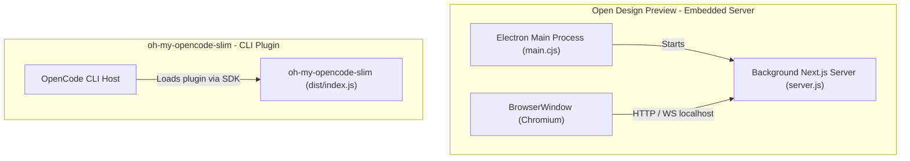

# Alt Theory Bundle Strategy Exploration

## Question and Scope

How is desktop bundling/packaging and plugin-based delivery structured in our reference repositories (specifically `Open Design Preview` and `oh-my-opencode-slim`), and how do their architectural patterns map to our Alt Theory bundle verification task?

## Quick Answer

We observed two distinct packaging/bundling architectures in the reference repositories:

1. **Embedded Local Server Architecture (Open Design Preview)**:
   The application runs an Electron browser window that connects to a background Next.js/Node server spun up inside the Electron main process. The web app contains a standalone built server and runs locally. Native modules (like SQLite) run in the main process, while standard web controllers run inside the Next.js runtime.
   
2. **CLI-Host Plugin Architecture (oh-my-opencode-slim)**:
   The application is packaged as a standard npm library and CLI tool. It registers itself as an extension/plugin to the OpenCode host application. It does not wrap itself in a custom browser window but relies on the host cli runtime to load and run it.

## Key Evidence

1. **[C:/Program Files/Open Design Preview/resources/app/package.json:1-17](file:///C:/Program%20Files/Open%20Design%20Preview/resources/app/package.json#L1-L17)**: Shows that the core Electron application (`open-design-packaged-app`) has native dependencies like `better-sqlite3` and blake3-wasm compiled inside its resources directory, loading `./main.cjs` as its main process script. Supporting the conclusion that the Electron shell is configured with native Node modules.
2. **[C:/Program Files/Open Design Preview/resources/app/main.cjs:1-5](file:///C:/Program%20Files/Open%20Design%20Preview/resources/app/main.cjs#L1-L5)**: Shows that the Electron main script dynamically imports `./prebundled/packaged-main.mjs`, illustrating a prebundled compilation step for the Electron main process.
3. **[C:/Program Files/Open Design Preview/resources/open-design-web-standalone/apps/web/server.js:1-44](file:///C:/Program%20Files/Open%20Design%20Preview/resources/open-design-web-standalone/apps/web/server.js#L1-L44)**: Shows that the standalone web component in Open Design Preview is a Next.js server configured for production standalone output (`output: "standalone"`), which runs via `startServer` on a designated port. Supporting the conclusion that the Electron app embeds a complete local web server rather than loading purely static client files.
4. **[D:/reference-repo/alvinunreal__oh-my-opencode-slim/package.json:75-84](file:///D:/reference-repo/alvinunreal__oh-my-opencode-slim/package.json#L75-L84)**: Lists `@opencode-ai/plugin` and `@opencode-ai/sdk` as core dependencies. Supporting the conclusion that this plugin relies entirely on the OpenCode system CLI environment to execute rather than creating its own window interface.
5. **[%LLM_THEO_WORKTREES_ROOT%/llm-theo-v0.3-dev/references/external-index.md:21](file:///%LLM_THEO_WORKTREES_ROOT%/llm-theo-v0.3-dev/references-to-legacy-materials/external-index.md#L21)**: Identifies `C:\Program Files\Open Design Preview\resources\open-design` as the reference folder for design systems, prompts, skills, and craft docs. Supporting the conclusion that the assets are kept unpacked in the resources folder for runtime lookup.

## Detail

### Open Design Preview (Electron + Standalone Next.js Server)
In `Open Design Preview`, the application is wrapped in Electron, but the user interface runs as a server-rendered web application. The main process starts the Next.js server in `open-design-web-standalone/apps/web/server.js` by calling `startServer` from `next/dist/server/lib/start-server`. 
Native modules like `better-sqlite3` and blake3-wasm are compiled against the Electron Node ABI and run inside the Electron main context (`resources/app/package.json`).

### oh-my-opencode-slim (CLI Plugin)
This repository is an orchestration plugin for OpenCode. It uses `bun build` to compile the TypeScript files in `src/index.ts` to `dist/index.js`, using Node as target. It exports entry points under `@opencode-ai/plugin` hooks and does not open a GUI of its own.

## Open Questions

1. **Native Modules Rebuilding in Alt Theory**:
   Alt Theory uses `@mariozechner/pi-ai` and `ws`. Do these dependencies contain compiled native modules that must be rebuilt for Electron (comparable to Open Design's `better-sqlite3` rebuild step)?
2. **WebSocket & Static Server bundling**:
   If Alt Theory adopts the Embedded Server pattern (similar to Open Design Preview), does the packaging tool (e.g. `electron-builder`) properly resolve path dependencies for `apps/alt-theory/web/server/server.ts` and the `public/` directory?

## Next Steps

1. Verify whether native compilation is triggered when installing `electron` in a separate worktree.
2. Confirm the relative path resolution of `agent-assets/kb/` when launching an embedded Express server from an Electron main process.

## Related Documents

- [AGENTS.md](file:///%LLM_THEO_WORKTREES_ROOT%/llm-theo-v0.3-dev/AGENTS.md)
- [external-index.md](file:///%LLM_THEO_WORKTREES_ROOT%/llm-theo-v0.3-dev/references-to-legacy-materials/external-index.md)
