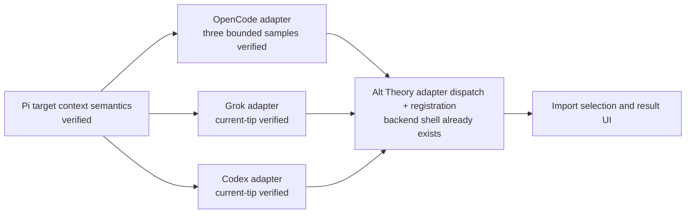

# Cross-Harness Current-Tip Import

## Background

Users already have substantial conversations in OpenCode, Codex, and Grok
Build. The useful product outcome is to select one of those conversations and
continue it through the Pi runtime used by Alt Theory without first rewriting
it as a handoff summary. A private probe produced runnable Pi sessions from one
real bounded sample of each harness.

The probe plan accumulated side questions about source-native rewind, old tips,
and branch reconstruction. Those questions are not required by this user story
and made the implementation path harder to see.

## Decision

The faithful import path targets the source conversation's **current
continuation state only**.

- Do not import or reconstruct source-native branches, abandoned tips, rewind
  points, edit history, retry history, or source UI control operations.
- Generate the ordinary Pi entry chain needed to open and continue the imported
  conversation. Those target `id` / `parentId` links do not claim to reproduce
  source ancestry.
- Use a deterministic adapter for each source harness. The normal import path
  reads persisted source data and does not require an agent, skill, or running
  source harness.
- A source runtime may be used as a test oracle when useful, but is never an
  import dependency. Replay is adapter-local only if a source format actually
  requires it to obtain the current continuation state.
- Keep a complete source snapshot and provenance beside the generated Pi
  session. Raw retention is not presented as model visibility: verification
  must inspect Pi's actual `buildSessionContext` and serialized provider
  request.
- Preserve source system/developer text as labelled historical context where
  the source proves it was model-visible. The target Pi/Alt Theory mode owns the
  new active system prompt. Pi JSONL cannot self-contain Codex's original
  system-versus-developer priority distinction, so that transformation must be
  reported rather than hidden.
- Never silently delete, truncate, sanitize, or "anonymize" locally imported
  history. If a persisted source element has no safe Pi representation, retain
  it in the source snapshot and report the concrete loss.
- Source harness and target model/provider remain independent dimensions.
- A later skill/agent handoff is a separately labelled fallback, not the
  faithful import implementation.

## Verified Harness Evidence

Private evidence and runnable scripts remain outside the tracked product tree
under `%LLM_THEO_ROOT%\others\cross-harness-conversation-interop-probe\stage2-private`.
No raw transcript content is copied into this decision.

| Source | Persisted state used by the probe | Verified Pi result | Remaining evidence work |
| --- | --- | --- | --- |
| OpenCode | SQLite `session`, `message`, and `part` rows, tested across three bounded recent samples. The primary has 20 messages/88 parts; the compaction case has 81/237; the image/error case has 47/170. | Primary: 4 user, 16 assistant, and 20 exact tool-result messages, including one skill and eight read results. Compaction: OpenCode's `filterCompacted` rule selects 14 current source messages, producing 18 Pi context messages and one compaction prompt while all 81 raw messages remain retained. Image/error: one PNG survives Pi LLM conversion and provider serialization; all 33 tool pairs and one tool error map exactly. Source assistant part order is retained; reasoning becomes portable assistant text following OpenCode's different-model path, while provider metadata remains raw. Every payload probe uses zero tools and exits before HTTP. | Current-tip, compaction, skill/read, image, and tool-error evidence is sufficient for the first product adapter. Tool-result attachments and non-image file parts remain untested; they must be reported rather than silently omitted if encountered. |
| Grok Build | Current `chat_history.jsonl`; the complete source session directory is retained separately. | 113 current history records project to 85 Pi context messages, including all 46 source tool-call/result pairs and 28 reasoning summaries. Historical source-system text is labelled and model-visible. Provider payload markers were verified exactly once. | Provider-encrypted reasoning remains opaque and raw-only. Source rewind/old-tip work is not product scope. |
| Codex | One complete bounded rollout JSONL containing 18 records. | Nine Pi context messages: labelled base instructions, two labelled developer blocks, two users, three assistants, and one exact function-call/result pair. The first mapped user message already contains all 12 sampled `AGENTS.md` markers. Provider payload markers were verified exactly once. | Pi represents imported system/developer blocks as model-visible user-role custom messages; exact source priority is unavailable in self-contained Pi JSONL. The sampled `turn_context` is runtime/config metadata and stays raw. |

OpenCode's current repository independently confirms that sessions are read as
messages with separately loaded parts (`packages/opencode/src/session/message-v2.ts`),
which matches the probe's SQLite extraction shape. The probe converter and its
manifests remain the executable evidence for the specific mappings above.

## Development Dependency Order

The three source adapters are independent once Pi target semantics are known.
Alt Theory's existing Pi discovery/registration work can continue in parallel;
it does not depend on source branch reconstruction. OpenCode's three bounded
samples now cover the first product adapter's current-tip path; product work can
attach that deterministic mapping behind the existing harness registry.

## Alternatives Considered

- **Reconstruct source branches and old tips:** rejected because it does not
  advance the current-conversation continuation story and adds harness-specific
  control semantics.
- **Require the source harness/runtime during import:** rejected as a default;
  persisted stores already support the selected current-tip conversions.
- **Use an agent/skill to interpret every source session:** reserved for a
  labelled fallback because it weakens determinism and adds no value when a
  direct adapter works.
- **Split the compound into one document per harness:** not used now because Pi
  target semantics, fidelity checks, and product dependencies are shared. Split
  later only if an adapter develops enough independent implementation detail to
  need its own maintained document.

## Consequences

- Success is measured at current-tip continuation: source snapshot retained,
  mapped Pi context verified, tool pairs checked, declared transformations
  visible, and the resulting session openable and continuable.
- Target-native conversation undo after import may operate on the generated Pi
  chain, but importing source-native historical branches is not promised.
- OpenCode's deterministic probe now covers ordinary current tip, compaction,
  skill/read disclosure, one image, and a tool error. The product adapter can be
  implemented without source-runtime or branch dependencies.
- Grok's completed rewind experiment remains historical probe evidence only and
  must not re-enter the product dependency graph.

## Related Documents

- `project/workstreams/0-v1-full-stack/notes-and-status/20260717-cross-harness-session-import-plan-record-v1.md`
- `%LLM_THEO_ROOT%\others\cross-harness-conversation-interop-probe\notes-and-status\20260717-cross-harness-conversation-interop-probe-plan-record-v1.md`
- `project/compound/2026-07-02-decision-v0-6-pi-runtime-boundary.md`
