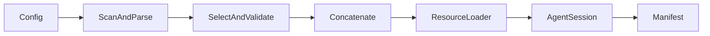

# Core-Soul Profile Assembly With Provenance Design

## 0. Terminology

- **Core-soul base**: optional immutable base markdown.
- **Core-soul module**: `core-soul-{variable}-{value}.md`.
- **Assembly provenance**: resolved files and parsed module identities recorded
  in `AssemblyManifest`.

## 1. Decisions And Constraints

The prompt order is core-soul base/modules, profile, KB declaration. Omitted
core-soul/profile inputs are valid. Explicit missing files, unknown requested
slugs, malformed module names, and duplicate active variables are errors.
Module order is alphabetical by slug. This feature does not author core-soul
content or implement runtime switching.

## 2. Nouns And Orchestration

### 2.1 Noun Layer

**Current state:** core reads one optional profile and records empty core-soul
provenance.

**Change:** `assembleCoreSoul()` returns `{ content, basePath, modules }`.
`AssemblyManifest` records the resolved base and module descriptors.

Example: active `["metacog-act"]` resolves
`core-soul-metacog-act.md` to
`{ slug: "metacog-act", variable: "metacog", value: "act", path }`.

### 2.2 Orchestration Layer

Validation completes before Pi session creation so invalid experiments do not
leave misleading persisted sessions.

### 2.3 Mount Point List

- `AltTheoryConfig`: optional core-soul paths and active slugs.
- `createAltTheorySession()`: deterministic assembly before resource loading.
- `AssemblyManifest.coreSoul`: resolved provenance.

### 2.4 Push Strategy

1. Implement parser/selector with filesystem tests.
2. Wire ordered prompt assembly into core.
3. Write resolved provenance into manifest.
4. Verify normal, omitted, unknown, malformed, and duplicate-variable cases.

### 2.5 Structure Health And Micro-refactor

##### Evaluation
- Prompt module parsing is a separate responsibility from session creation.
- `alt-theory-app/core/` remains small after one focused assembly module.

##### Conclusion: skip

## 3. Acceptance Contract

- Base, selected modules, profile, and KB declaration appear in that order.
- Only selected modules are injected.
- Same-variable duplicates and unknown slugs fail before session creation.
- Omitted core-soul and profile inputs remain valid.
- Manifest exactly matches resolved files used for assembly.

## 4. Architecture Relationship

Whole-plan acceptance adds the assembly pipeline and provenance schema to the
core-session architecture.
