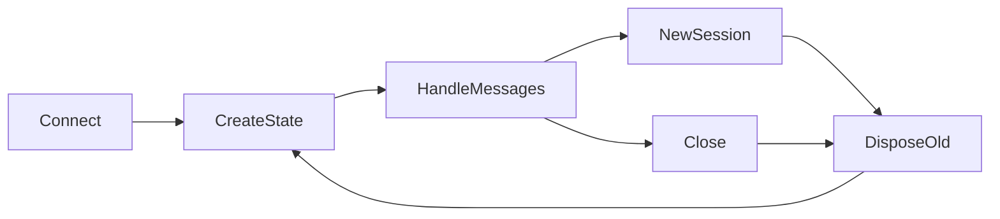

# Per-Connection State Isolation Design

## 0. Terminology

`ConnectionState` owns one live Pi session and connection-local selections.
Profile and KB selections use server-resolved slugs, never client paths.

## 1. Decisions And Constraints

Connect creates a session; `new_session` aborts if needed, disposes the old
session, and creates another using the same selections; close unsubscribes,
aborts if needed, and disposes. Reconnect/resume is out of scope. Invalid slugs
return protocol errors without changing state.

## 2. Nouns And Orchestration

### 2.1 Noun Layer

Replace global `serverState` with a connection-local state containing session,
manifest, profile/domain slugs, subscription, and counters.

### 2.2 Orchestration Layer

Session replacement is serialized within one connection. Other connections are
not read or mutated.

### 2.3 Mount Point List

- WebSocket `connection` handler: create local state.
- `switch_profile` and `switch_kb`: slug validation and local mutation.
- `new_session` and `close`: lifecycle cleanup.

### 2.4 Push Strategy

1. Extract session creation and cleanup helpers.
2. Replace all global selection reads with connection state.
3. Change protocol to profile slugs.
4. Verify two-client isolation and lifecycle.

### 2.5 Structure Health And Micro-refactor

`server.ts` already mixes startup, routes, lifecycle, and event mapping.
New reusable asset logic goes to `asset-registry.ts`; server orchestration stays
in `server.ts`. Conclusion: skip broader refactor.

## 3. Acceptance Contract

Two clients have different session IDs and independent selections. New session
and close affect only the initiating client. Invalid slugs do not mutate state.

## 4. Architecture Relationship

Whole-plan acceptance records per-connection ownership and lifecycle.
