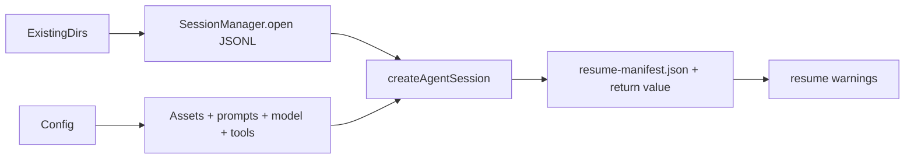

# Core Open Existing Session Design

## 0. Terminology

- **Open existing session**: create a live `AgentSession` from an existing Pi
  JSONL. Conflict check: not the WebSocket `open_session` command.
- **Active resume manifest**: current runtime manifest returned for the resumed
  session and written as `records/resume-manifest.json`. Conflict check: does
  not replace original `records/assembly-manifest.json`.
- **Resume warning**: short runtime drift message comparing original manifest
  facts to current launch/assets. Conflict check: not a user annotation.

## 1. Decisions And Constraints

Requirement summary: backend code must be able to take an existing Alt Theory
session directory plus Pi JSONL and return a live `AgentSession` using the
current asset/prompt/model assembly path. Success means a non-live test can open
the saved context, preserve previewable Pi messages, and report drift warnings.

Non-goals:

- No WebSocket command or browser UI.
- No live provider prompt.
- No overwrite of original `assembly-manifest.json`.
- No cross-machine cwd rewrite; differing cwd is reported as a warning.
- No final provider/auth selection UI.

Complexity tier: local desktop-backend default tier. The only deviation is
runtime drift reporting because resume intentionally crosses time and possibly
different launch config.

Key decisions:

- Keep `createAltTheorySession()` as fresh-session API and add
  `openAltTheorySession()` for persisted JSONL.
- Share the prompt/model/session construction path internally so fresh and
  existing session behavior do not diverge.
- Return active manifest + warnings from core; WebSocket event logging belongs
  to the later protocol feature.
- Persist resume-time active facts to `records/resume-manifest.json`, not to
  `assembly-manifest.json`.

## 2. Nouns And Orchestration

### 2.1 Noun Layer

**Current state:** `createAltTheorySession()` always creates a new
`SessionManager`, calls `newSession({ id })`, and writes
`assembly-manifest.json`.

**Change:** add `openAltTheorySession(config)` and internal shared session
assembly. `AssemblyManifest` gains optional resume fields:

```typescript
openedFrom: "new" | "existing";
resumedFrom?: {
  sessionId: string | null;
  createdAt: string | null;
  rolePresetSlug: string | null;
  kbDomain: string | null;
  provider: string | null;
  model: string | null;
};
resumeWarnings?: string[];
```

Example:

```typescript
await openAltTheorySession({
  ...existingSessionDirs,
  sessionFile,
  originalManifest,
  rolePresetSlug: "default",
  rolePresetPath,
  kbDomain: "ep-core",
  ...
});
// -> { session, manifest, resumeWarnings }
```

Main error: missing/unopenable JSONL rejects open; caller handles it before
replacing any live WebSocket state.

### 2.2 Orchestration Layer



**Current state:** all session creation paths are fresh-session paths.

**Change:** split the core into a public fresh entrypoint, a public existing
entrypoint, and a shared internal assembly function. Fresh sessions still write
`assembly-manifest.json`; existing sessions write `resume-manifest.json`.

Flow constraints:

- Do not create a new session directory in `openAltTheorySession()`.
- Do not call `newSession()` for existing sessions.
- Use current semantic asset paths supplied by caller.
- Compare original manifest facts to active runtime facts and return warnings.
- Keep provider/model/API-key behavior identical to fresh session creation.

### 2.3 Mount Point List

- `openAltTheorySession()`: add exported core entrypoint.
- `AssemblyManifest`: add optional resume/open fields visible to future
  WebSocket metadata.

### 2.4 Push Strategy

1. Shared assembly split: extract fresh-session construction into an internal
   helper without changing fresh-session behavior.
   Exit signal: backend tests still pass before adding existing-session tests.
2. Existing-session open: add `openAltTheorySession()` using
   `SessionManager.open()`.
   Exit signal: non-live test opens an existing JSONL and sees the saved Pi
   context.
3. Drift manifest: add resume manifest fields and warning comparison.
   Exit signal: test creates drift and receives warning plus
   `resume-manifest.json`.
4. Plan writeback and verification.
   Exit signal: checklist and SWE-plan item are updated; backend tests pass.

### 2.5 Structure Health And Micro-refactor

##### Evaluation

- File-level - `alt-theory-app/core/alt-theory-core.ts`: now owns prompt/model
  assembly plus fresh session creation. Adding existing-session support without
  shared internal construction would duplicate most of the file; a targeted
  internal split is part of the feature, not a side refactor.
- Directory-level - `alt-theory-app/core/`: small and already has owned modules
  for data dirs, asset refs, and core soul. No directory pressure.
- Compound convention search: no matching directory/naming convention found.

##### Conclusion: skip

No behavior-preserving pre-refactor is needed. The shared helper is required
feature structure, not independent cleanup.

## 3. Acceptance Contract

- Fresh-session tests continue to pass.
- Opening an existing session uses the existing Pi JSONL and does not call
  `newSession()` or create a new session root.
- Opened session returns the existing session ID and a context containing the
  saved assistant/user message.
- Original `assembly-manifest.json` remains present and is not overwritten.
- `records/resume-manifest.json` records active runtime facts.
- Provider/model, role-preset, KB, and asset-hash drift produce resume warnings.
- No WebSocket command, frontend UI, tag/export behavior, or live prompt is
  introduced.

## 4. Architecture Relationship

Architecture update remains deferred until the WebSocket `open_session` feature
exposes this core capability as current backend behavior.

