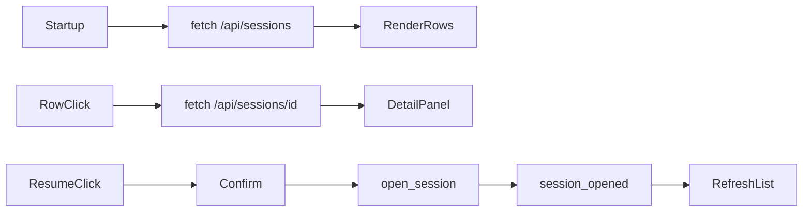

# Researcher Console Session Browser Design

## 0. Terminology

- **Session browser**: compact left-panel UI for historical session list and
  selected-session detail. Conflict check: not export or comparison.
- **Selected historical session**: session chosen in the browser for inspection
  or resume/open. Conflict check: separate from current live session.
- **Resume/Open action**: frontend command that sends WebSocket `open_session`.
  Conflict check: backend command already exists.

## 1. Decisions And Constraints

Requirement summary: the researcher console must let the user see historical
sessions, inspect key facts/preview, and make one existing session current
without needing API-key live prompt testing.

Non-goals:

- No tag, annotation, export, comparison, or asset editing UI.
- No provider/auth switching UI.
- No live provider prompt smoke.
- No new route/page framework; keep the vanilla single-page console.

Complexity tier: frontend default. The UI is a local researcher-control panel,
not final product UI.

Key decisions:

- Put session list/detail in the left panel under the current Session section.
- Keep rows dense: short ID, status, KB, role preset, model/provider, updated
  time, warning marker.
- Fetch list on startup, after new session, after successful open, and by a
  refresh button.
- Fetch detail on row selection and show warning/detail/preview before resume.
- Confirm resume/open when current chat has visible messages.

## 2. Nouns And Orchestration

### 2.1 Noun Layer

**Current state:** `client.js` only fetches role preset and KB discovery. It has
no historical session state.

**Change:** add frontend state:

```javascript
let sessionCatalog = [];
let selectedHistoricalSessionId = "";
let selectedSessionDetail = null;
```

Example:

```text
GET /api/sessions -> render session rows
GET /api/sessions/session-123 -> render detail + preview
Resume/Open -> ws.send({ type: "open_session", payload: { sessionId } })
```

### 2.2 Orchestration Layer



**Current state:** WebSocket `session_opened` updates current session controls
only.

**Change:** successful `session_opened` also refreshes the historical list.
Resume/open clears current chat because the browser is switching the active
conversation surface.

Flow constraints:

- Disable resume/open when no selected detail or WebSocket is disconnected.
- Show REST errors in the session browser, not only console logs.
- Do not render unbounded transcript; use backend preview.
- Keep mobile behavior under existing left-panel scroll.

### 2.3 Mount Point List

- `index.html` left panel: add session browser section.
- `client.js` startup and WebSocket lifecycle: fetch/render session list/detail
  and send `open_session`.
- `style.css`: add compact list/detail/preview styles.

### 2.4 Push Strategy

1. Static UI structure: add left-panel session browser markup and styles.
   Exit signal: page has stable session-list/detail containers.
2. REST state wiring: fetch/render session list and detail.
   Exit signal: local server shows historical rows from `/api/sessions`.
3. Resume/Open interaction: send `open_session`, clear chat, refresh list on
   session_opened.
   Exit signal: manual/non-live smoke resumes an existing session ID in the
   inspector.
4. Plan writeback and verification.
   Exit signal: checklist and SWE-plan item are updated; backend tests and
   local server smoke pass.

### 2.5 Structure Health And Micro-refactor

##### Evaluation

- File-level - `client.js`: already owns all vanilla frontend state. It is
  growing, but this feature is still one screen area and introducing a module
  system would be a larger frontend refactor.
- File-level - `index.html`: adding one left-panel section is within current
  layout style.
- File-level - `style.css`: adding scoped classes is within current stylesheet
  pattern.
- Directory-level - public directory has three files; no pressure.
- Compound convention search: no matching directory/naming convention found.

##### Conclusion: skip

No micro-refactor before this slice.

## 3. Acceptance Contract

- Browser fetches and renders historical sessions.
- Selecting a session shows detail facts, warnings, and bounded preview.
- Resume/Open sends `open_session` and updates the runtime inspector to the
  selected session ID.
- New session and successful open refresh the session list.
- UI handles empty list and REST/WebSocket errors without layout breakage.
- No tags, annotations, export, comparison, asset editing, provider/auth UI, or
  live prompt is introduced.

## 4. Architecture Relationship

After acceptance, update `project/architecture/researcher-console.md` to state
that session list/detail and resume/open are current console behavior, while
tags/export/comparison remain deferred.

