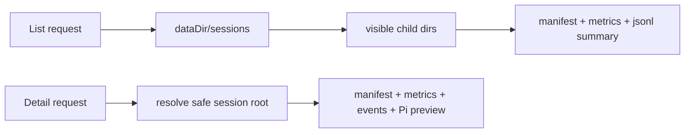

# Session Catalog And Detail API Design

## 0. Terminology

- **Session catalog**: REST-readable index of
  `{ALT_THEORY_DATA_DIR}/sessions/*`; conflict check: no current code object
  owns this.
- **Session summary**: path-free list item for a session root; conflict check:
  `SessionSnapshot` is live WebSocket state, not historical catalog state.
- **Session detail**: bounded inspection response for one session; conflict
  check: not export, not resume.
- **Transcript preview**: small display excerpt derived from Pi context when a
  JSONL exists; conflict check: not the final export/transcript format.

## 1. Decisions And Constraints

Requirement summary: the local researcher console/backend must list historical
sessions and inspect one selected session without creating or resuming a live
agent. Success is deterministic REST output from the current data dir,
including incomplete-session warnings.

Non-goals:

- No WebSocket `open_session`; that is a later child feature.
- No live provider prompt or API-key test.
- No full export or comparison format.
- No tag/annotation data.
- No trust in manifest absolute paths for locating a session root.

Complexity tier: local desktop-backend default tier. The only deviation is
filesystem tolerance: incomplete or malformed session records should return
warnings instead of taking down the server.

Key decisions:

- Session roots are discovered from `dataDir/sessions`, not Pi global session
  listing, because each Alt Theory session has its own workspace cwd.
- The list response omits filesystem paths; the detail response may include
  paths because the current local console already exposes runtime paths.
- Pi JSONL discovery prefers a manifest file path only when it resolves under
  the current session `history/`; otherwise it scans for JSONL files under
  `history/`.

## 2. Nouns And Orchestration

### 2.1 Noun Layer

**Current state:** `data-dir.ts` creates session directories but has no read
catalog helpers. `server.ts` exposes asset discovery REST routes only.

**Change:** add safe session-root helpers and a new `session-store.ts` REST data
module.

Example:

```typescript
listSessionSummaries("D:/tmp/alt-theory")
// -> { dataDir, sessions: [{ sessionId, status, hasManifest, ... }] }

readSessionDetail("D:/tmp/alt-theory", "session-123")
// -> { session, manifest, metrics, events, pi, transcriptPreview, warnings }
```

Main error path:

```text
GET /api/sessions/../bad -> 400 invalid session id
GET /api/sessions/missing -> 404 unknown session
```

### 2.2 Orchestration Layer



**Current state:** REST discovery is static asset scanning and does not inspect
runtime session data.

**Change:** mount `GET /api/sessions` and `GET /api/sessions/:sessionId`.
Both routes call session-store helpers and return JSON. Detail route returns
400 for unsafe IDs and 404 when the resolved session root is absent.

Flow constraints:

- Root validation uses resolved paths and rejects escaped paths.
- Missing `sessions/` returns an empty list.
- Malformed JSONL, metrics, events, or manifest produce warnings and null
  subobjects where possible.
- Transcript preview is bounded to avoid turning this feature into export.

### 2.3 Mount Point List

- `GET /api/sessions`: add historical session list route.
- `GET /api/sessions/:sessionId`: add historical session detail route.

### 2.4 Push Strategy

1. Catalog nouns: add safe session-root and session-store types/helpers.
   Exit signal: helper unit coverage handles empty, complete, and incomplete
   session roots.
2. Detail preview: add Pi JSONL discovery and bounded context preview.
   Exit signal: detail response reports Pi entry/context counts when JSONL
   exists and warning/null values when it does not.
3. REST wiring: mount list/detail routes.
   Exit signal: backend server test fetches both routes successfully.
4. Plan writeback and verification.
   Exit signal: checklist and SWE-plan item are updated; backend tests pass.

### 2.5 Structure Health And Micro-refactor

##### Evaluation

- File-level - `alt-theory-app/web-server/server.ts`: already owns REST route
  mounting and WebSocket lifecycle. Adding two small route mounts is within
  existing responsibility; catalog parsing should not be added inline.
- File-level - `alt-theory-app/core/data-dir.ts`: small and path-policy-owned;
  adding session-root helpers matches existing responsibility.
- Directory-level - `alt-theory-app/web-server/`: moderately flat, but a single
  owned `session-store.ts` file follows existing `asset-registry.ts`,
  `session-events.ts`, and `session-metrics.ts` pattern.
- Compound convention search: no matching directory/naming convention found.

##### Conclusion: skip

No behavior-preserving pre-refactor is required.

## 3. Acceptance Contract

- Empty or missing `sessions/` returns `{ sessions: [] }`.
- Complete sessions list newest first and include role preset, KB domain,
  provider/model, metrics counts when present, and warning-free availability.
- Incomplete sessions list with `status: "incomplete"` and warnings instead of
  crashing.
- Detail response includes manifest, metrics, event tail, Pi session-file info,
  context counts, and a bounded transcript preview when available.
- Unsafe or missing IDs return explicit HTTP errors.
- No WebSocket resume/open, frontend panel, export, tags, or live prompt is
  introduced in this feature.

## 4. Architecture Relationship

Architecture should not be updated until later child features make session
open/resume current. This feature is the backend REST substrate for that later
architecture update.

