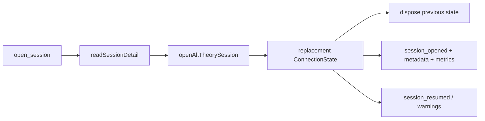

# WebSocket Resume Open Protocol Design

## 0. Terminology

- **`open_session`**: preferred WebSocket client command to make an existing
  session the current live session for that connection.
- **Connection-state replacement**: dispose old live session after a replacement
  has been created successfully. Conflict check: not browser session list UI.
- **Resume event**: append-only runtime record that an existing session became
  current. Conflict check: not a research annotation.

## 1. Decisions And Constraints

Requirement summary: a connected researcher console client must be able to send
`open_session` with a session ID and receive live metadata for that existing
session without silently creating another session root.

Non-goals:

- No browser session-list UI; next child feature.
- No live provider prompt.
- No export, tags, annotations, or comparison.
- No legacy alias for `open_session`.
- No current-session prompt mutation beyond replacing the connection state.

Complexity tier: local backend/WebSocket default tier. Deviation: replacement
must be failure-safe enough not to discard the current live state when opening
the target session fails.

Key decisions:

- Reuse `readSessionDetail()` for safe session-file discovery and original
  manifest access.
- Reuse `openAltTheorySession()` for live resume assembly.
- Use original role-preset slug and KB domain when they still resolve;
  otherwise fall back to current connection selections.
- Send the same three messages used after fresh creation:
  `session_opened`, `session_metadata`, `session_metrics`.
- Append structured events to the resumed session records.

## 2. Nouns And Orchestration

### 2.1 Noun Layer

**Current state:** `ClientMessage` supports `new_session`, but not opening an
existing session. `SessionSnapshot` reports current live session facts only.

**Change:** add:

```typescript
{ type: "open_session"; payload: { sessionId: string } }

type SessionSnapshot = {
  openedFrom?: "new" | "existing";
  resumeWarnings?: string[];
}
```

Event types gain `session_opened_existing`, `session_resumed`, and
`resume_warning`.

### 2.2 Orchestration Layer



**Current state:** `new_session` disposes current state, creates a fresh state,
then sends the standard metadata triplet.

**Change:** `open_session` validates and creates the replacement first. On
success, it disposes the previous state and subscribes to the resumed session.
On failure, it sends an error and keeps the previous state available.

Flow constraints:

- Unsafe/missing session IDs become WebSocket error messages.
- Missing Pi JSONL becomes a WebSocket error; incomplete sessions can be
  inspected by REST but not resumed.
- If the current session is streaming, abort it before replacement.
- Do not create a new session directory during open.
- Record resumed-session events without duplicating conversation bodies.

### 2.3 Mount Point List

- `ClientMessage`: add `open_session`.
- `SessionSnapshot`: add optional `openedFrom` and `resumeWarnings`.
- `server.ts` WebSocket switch: add `open_session`.
- `SessionEventType`: add resume/open warning event types.

### 2.4 Push Strategy

1. Protocol nouns: extend WebSocket and event types.
   Exit signal: type consumers compile/run under backend tests.
2. Server replacement flow: add existing-session state creation and
   `open_session` branch.
   Exit signal: WebSocket test opens an existing ID and receives the standard
   metadata triplet.
3. Event and failure behavior: record resume events and keep current state on
   open failure.
   Exit signal: tests cover no-new-root success and missing-session failure.
4. Plan writeback and verification.
   Exit signal: checklist and SWE-plan item are updated; backend tests pass.

### 2.5 Structure Health And Micro-refactor

##### Evaluation

- File-level - `server.ts`: already owns WebSocket routing and state
  replacement. Adding one branch is within responsibility, but helper
  functions should keep the branch small.
- File-level - `websocket-protocol.ts`: protocol type extension only.
- File-level - `session-events.ts`: event enum extension only.
- Directory-level - no new code directory pressure.
- Compound convention search: no matching directory/naming convention found.

##### Conclusion: skip

No behavior-preserving pre-refactor is required.

## 3. Acceptance Contract

- `open_session` for an existing session ID replaces the current connection
  state and sends `session_opened`, `session_metadata`, and `session_metrics`.
- Metadata and snapshot refer to the existing session ID, not a fresh ID.
- Opening an existing session does not create another session root.
- Resume/open events are appended to the existing session records.
- Missing/invalid/incomplete sessions return WebSocket errors and do not discard
  the current connection state.
- No browser UI, export, tags, annotations, comparison, or live prompt is
  introduced.

## 4. Architecture Relationship

After acceptance, update `project/architecture/core-session-engine.md` to make
WebSocket `open_session` and existing-session state replacement current backend
behavior.

