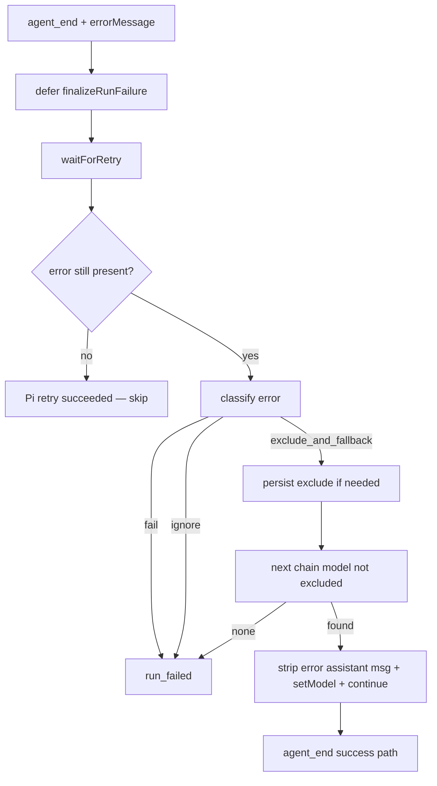

# Model Fallback Chain

## 0. Terminology

- **Fallback chain**: ordered list of model IDs under a single provider; switching only changes `modelId`, not provider or API key.
- **Excluded model**: a `provider/modelId` pair persisted after a permanent-exclusion rule matches; skipped on later runs until state is cleared manually.
- **Permanent-exclusion rule**: error classifier that both triggers fallback and records exclusion (e.g. DashScope allocation quota).
- **Transient error**: rate limit / overload / 5xx; Pi auto-retry handles these on the same model; Alt Theory does not permanently exclude.

Conflict check: not Pi `cycleModel`, not multi-provider routing, not GUI model picker.

## 1. Decisions And Constraints

Requirement summary: when a run fails because a DashScope model's trial/allocation quota is exhausted, automatically retry the same user turn on the next model in a configured chain—all under `qwen-bailian-beijing` with the shared `DASHSCOPE_API_KEY`. Persist exhausted models so they are not retried. Tail reserves: `qwen3.6-max-preview`, `glm-5.2`, `qwen3.7-plus` (all DashScope compatible-mode IDs, same provider).

Non-goals:

- Multi-provider fallback (no Zhipu / OpenRouter / MiMo cross-provider).
- VPS deploy or live pilot switch in this feature (local dev first).
- GUI for chain editing.
- Replacing Pi's built-in transient auto-retry.

Complexity tier: local backend default tier. Deviation: must defer failure handling until after Pi `waitForRetry()` so 429 is not mistaken for quota exhaustion.

Key decisions:

| Decision | Rationale |
|---|---|
| Same provider only | User confirmed one provider, shared key; `glm-5.2` is a DashScope model ID, not a separate vendor. |
| Permanent exclude on DashScope allocation signals, not bare 429 | Probed shape: HTTP **403** with `AllocationQuota` / "free quota … exhausted". Bare 429 is transient rate limit; Pi retries it. |
| Never fallback on 401 / auth errors | Same key for all models; switching model cannot fix auth. |
| Use `openai-completions` locally | `openai-responses` may return empty success on exhausted models; completions surfaces `errorMessage` reliably. |
| Hook in `SessionService` after `waitForRetry` | Runs after Pi transient retry; only permanent rules trigger model switch. |
| State at `{dataDir}/runtime/model-fallback-state.json` | Survives restarts; operator can delete file to reset exclusions. |

Default chain (local, post-pilot verification 2026-06-23):

1. `qwen3.7-max-2026-05-20` (active default)
2. `qwen3.7-max-2026-06-08`
3. `qwen3.7-max-2026-05-17`
4. `qwen3.7-max-preview`
5. `qwen3.6-max-preview`
6. `glm-5.2`
7. `qwen3.7-plus`

Removed from chain: `qwen3.7-max` (trial quota confirmed exhausted).

## 2. Nouns And Orchestration

### 2.1 Noun Layer

**Current state:** `SessionService.handleAgentEvent` on `agent_end` reads `managed.session.state.errorMessage` and immediately emits `run_failed`. No model retry beyond Pi's same-model auto-retry. `AgentSession.setModel()` exists in Pi SDK.

**Change:** add `ModelFallbackCoordinator` in `alt-theory-app/core/model-fallback.ts`:

```typescript
// Config: runs/local-launch/model-fallback.local.json (override via ALT_THEORY_MODEL_FALLBACK_PATH)
interface ModelFallbackConfig {
  enabled: boolean;
  provider: string;
  chain: string[];
  maxFallbacksPerRun: number;
  rules: ModelFallbackRule[];
}

type FallbackAction = "fail" | "ignore" | "exclude_and_fallback";

interface FallbackDecision {
  action: FallbackAction;
  ruleId?: string;
}

// classify("403 AllocationQuota.FreeTierOnly ...") => { action: "exclude_and_fallback", ruleId: "dashscope-allocation-quota" }
// classify("401 status code") => { action: "fail" }
// classify("429 Too Many Requests") => { action: "ignore" }
```

State file:

```typescript
interface ModelFallbackState {
  excluded: Record<string, { excludedAt: string; ruleId: string; lastError: string }>;
}
// key: "qwen-bailian-beijing/qwen3.7-max"
```

Session event: `model_fallback` with `{ fromModel, toModel, ruleId, error }`.

### 2.2 Orchestration Layer



Flow constraints:

- `maxFallbacksPerRun` caps chain walk per user turn.
- `busy` stays true while fallback continue is in flight.
- 401/auth never switches model.

### 2.3 Mount Point List

- `ALT_THEORY_MODEL_FALLBACK_PATH` env: optional config file path.
- `{dataDir}/runtime/model-fallback-state.json`: persisted exclusions.
- `runs/local-launch/model-fallback.local.json`: local default chain config.
- `runs/local-launch/models.local.json`: register all chain model IDs under `qwen-bailian-beijing`.
- `SessionEventType`: add `model_fallback`.

### 2.4 Push Strategy

1. Core classifier + state: rules engine and exclusion persistence with unit tests.
2. Session hook: defer failure, integrate coordinator, `setModel` + continue.
3. Local config: chain JSON + models.local.json entries + `openai-completions`.
4. Live local probe: quota error on chain head → auto land on next checkpoint.

### 2.5 Structure Health And Micro-refactor

Conclusion: skip. New file `model-fallback.ts`; minimal `session-service.ts` hook only.

## 3. Acceptance Contract

- Unit tests: 403+AllocationQuota → exclude_and_fallback; 401 → fail; 429 → ignore.
- Excluded models persist in state file and are skipped on subsequent runs.
- Local chain walks from the configured head model to the next available model on allocation quota error.
- All chain models are registered under `qwen-bailian-beijing` only (no second provider).
- Successful fallback completes the user turn without client-visible `run_failed`.

## 4. Architecture Relationship

Extends `2026-06-07-configurable-provider-model`; does not change manifest credential policy.

### Lifecycle (interim)

This Qwen-specific chain is a **temporary local/pilot safety net** while DashScope
trial quotas are uneven across model IDs. The framework (`model-fallback.ts`,
rules, exclusion state, `SessionService` hook) is reusable, but **this Qwen 3.7
checkpoint chain is not a long-term product default**.

Defer to **dev v0.6.x** for a general fallback design: provider-agnostic rules,
operator-visible switching, VPS/config integration, and retirement of the
hard-coded Qwen chain. See
`project/workstreams/0-backend-agent-harness/notes-and-status/2026-06-23-model-fallback-chain-observation.md`.