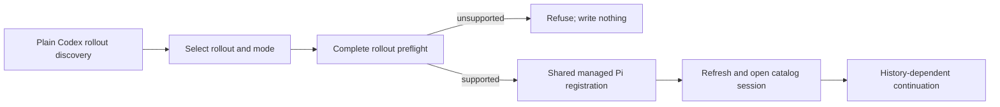

# Codex session import design

> Historical Stage 2 design snapshot. Current implemented support and refusal
> boundaries are in `development/architecture/session-import-adapters.md`.

## 0. Terminology

- **rollout**: one plain Codex JSONL session file selected from the local Codex sessions directory.
- **runtime record**: persisted `turn_context`, `world_state`, or event data used by Codex resume/runtime behavior but not projected as an invented historical prompt.
- **priority transformation**: Codex system/developer text remains labelled and model-visible, but Pi serializes it as a user-role custom message.

## 1. Decisions and Constraints

Requirement: a local user can discover a supported Codex rollout, select it, see declared transformations, import it through the same managed registration used by OpenCode, open it, and continue with the selected Alt Theory mode and tools. The source remains untouched and repeat import remains explicit.

Non-goals: compressed rollouts, inherited/forked/subagent history, compaction, rollback/aborted turns, source old tips, non-text message attachments, Codex-only tool-search/web/image/local-shell state, and recreation of source runtime permissions or model configuration. Encountered unsupported semantics refuse the selected rollout before write.

Complexity: full-stack extension of the existing import feature. No new dependency, registry, session engine, or dialog.

Key decisions:

- Follow Codex's persisted `RolloutItem`/`ResponseItem` types and current reconstruction code rather than infer semantics from UI events.
- Retain every source JSONL record as a Pi raw custom entry.
- Project session base instructions plus response-item system/developer text as labelled model-visible custom messages; disclose the priority transformation.
- Directly map user/assistant text, function/custom tool calls, and their paired text results. Provider reasoning and runtime records remain raw-only and are disclosed. Session-level dynamic tool definitions are likewise retained raw and disclosed but are not registered as active Alt Theory tools; an actual unsupported dynamic-tool call still refuses as an unmapped response item.
- Reject the complete selected rollout before `createSessionDirs` when a record, content item, control event, or tool pair lacks a verified mapping.

## 2. Nouns and Orchestration

### 2.1 Noun Layer

**Current state:** `codex` is a named but unimplemented harness. OpenCode already supplies the reusable prepared-payload registration and the local import dialog is source-specific.

**Change:** Codex discovery returns the existing `ImportSourceSession`. Codex preflight returns the same prepared payload contract used by OpenCode: validated Pi JSONL, source fingerprint/version, and declared transformations. The shared registration accepts `codex` provenance. The existing dialog selects either OpenCode or Codex and uses one harness-parameterized API.

Example: a plain rollout with labelled base/developer text, user/assistant text, and one paired `custom_tool_call/output` returns `ready`, then `imported_with_transformations`; a rollout with an unmatched output returns `refused` with `recordType=custom_tool_call_output` and creates no managed session.

Source: new `alt-theory-app/web-server/codex-session-import.ts`; existing `session-import.ts`, `server.ts`, and frontend import dialog/API.

### 2.2 Orchestration Layer

**Current state:** only the OpenCode branch can dry-preflight and register a non-Pi source.

**Change:** the registry dispatches Codex discovery/preflight, reports the same structured ready/refused/imported result, and passes validated JSONL to the shared registration transaction. Discovery reads only metadata/preview needed for selection. Import re-reads and hashes the complete source before any managed write.

Flow constraints: source is read-only; every line and response item is accounted for; outputs must pair to an earlier call ID/name; raw retention never substitutes for required model visibility; active mode/tools/workspace come from Alt Theory; unchanged and changed-source behavior remains shared.

### 2.3 Mount Points

- Harness registry/API: mark Codex ready and dispatch discovery/preflight/registration.
- Existing local import dialog: add a harness selector and generic request path.

### 2.4 Push Strategy

1. Codex source adapter: discovery, complete preflight, deterministic projection, and atomic refusal. Exit: supported and unsupported fixtures distinguish without managed writes.
2. Shared registration/API: reuse provenance/repeat semantics and structured results. Exit: a supported fixture imports and opens; unchanged remains explicit.
3. Product surface: make the existing dialog harness-aware. Exit: frontend build and browser selection/import/open pass.
4. Product acceptance: import a bounded real Codex rollout and perform a directed tool continuation using a historical path not repeated in the prompt. Exit: the normal product path succeeds and source remains untouched.

### 2.5 Structure Health and Micro-refactor

- `session-import.ts` keeps cross-harness orchestration; Codex parsing belongs in one new harness module.
- The existing import dialog/API should be parameterized in place; a second dialog would duplicate behavior.
- Existing directories fit the change.

##### Conclusion: skip

## 3. Acceptance Contract

- Normal: discover, select, preflight, disclose transforms, import, open, and use a path recoverable only from imported Codex tool history in a live continuation with Alt Theory tools.
- Boundary: repeat discovery reports unchanged and never overwrites the continued managed session.
- Error: an unmatched tool output or unsupported response item refuses atomically with a concrete record type/count/reason.
- Reverse checks: no source mutation, old-tip/branch reconstruction, runtime-permission recreation, silent record omission, or claim that raw runtime metadata is model-visible instruction content.

## 4. Architecture Relationship

After acceptance, update `project/architecture/core-session-engine.md` with the supported Codex rollout subset, priority transformation, raw/model-visible distinction, and shared UI/API path.
