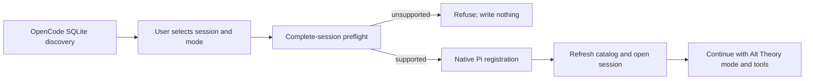

# OpenCode session import design

> Historical Stage 1 design snapshot. Current implemented support and refusal
> boundaries are in `development/architecture/session-import-adapters.md`.

## 0. Terminology

- **preflight**: parse and account for every selected OpenCode message and part before creating an Alt Theory session; matches the term already used by the active v2 record.
- **declared transformation**: a source-to-Pi mapping reported to the caller; it is not silent omission.
- **refusal**: no managed session is written when any selected-session semantic is unsupported.

## 1. Decisions and Constraints

Requirement: a local user can discover an OpenCode conversation, select it, see its transformations, import it through the normal registry, open it, and continue with the selected Alt Theory mode and tools. The source remains untouched; provenance and repeat-import classification remain available.

Non-goals: source branches/old tips, synchronization, handoff summaries, non-image file parts, and tool-result attachments. Encountering either unimplemented part type refuses the whole session before write.

Complexity: full-stack feature with local SQLite input; otherwise use the default tier. No new dependency or session engine.

Key decisions:

- Reuse `session-import.ts` for registry, repeat policy, and Native Pi registration.
- Put OpenCode SQLite parsing/preflight/conversion in one harness-specific module.
- Build the complete Pi JSONL in memory and validate it before the existing managed-session write path begins.
- Use the source's current-compaction selection semantics; preserve all selected message/part source records as Pi custom entries and declare portable transformations.

## 2. Nouns and Orchestration

### 2.1 Noun Layer

**Current state:** `ImportSourceSession`, `discoverImportSessions`, and `registerPiImport` in `alt-theory-app/web-server/session-import.ts` only operate on Pi files; `opencode` is a registered 501 placeholder.

**Change:** OpenCode discovery returns the existing `ImportSourceSession` shape. A preflight result adds a validated Pi JSONL payload, per-session fingerprint, and declared transformations. Registration accepts that prepared payload while retaining the existing manifest, provenance, workspace, and repeat-import behavior.

Example: supported selected session -> `{ status: "imported_with_transformations", sessionId, transformations }`; a `file` part with a non-image MIME -> `{ status: "refused", reason, recordType: "file", count }`, with no session root created.

Source: `alt-theory-app/web-server/session-import.ts` and new harness-specific module.

**Current state:** the local React app has no session-import mount point.

**Change:** add a small local-only OpenCode import dialog reachable from the conversation sidebar. It owns selection/mode/preflight-result display, then refreshes and opens the imported session through existing app actions.

Example: select one session -> Import -> declared transformations shown -> imported session opens; refusal remains in the dialog and opens nothing.

Source: `alt-theory-app/frontend/src/components/shell/LeftNav.tsx`.

### 2.2 Orchestration Layer

**Current state:** the POST route discovers, applies repeat policy, and calls Pi-only registration per selected source.

**Change:** route registry dispatches OpenCode to its discovery/preflight and passes the validated payload into the same registration transaction. A selected session is preflighted before `createSessionDirs`; failures return concrete harness/type/count/reason fields. Repeat imports keep the existing unchanged/conflict/copy rules.

Constraints: source DB is opened read-only; the full selected session is evaluated before managed writes; a failed registration removes its newly allocated session root; source content is never edited; transformations are returned in the API result.

### 2.3 Mount Point List

- `GET/POST /api/session-import/:harness`: change OpenCode registry status and dispatch.
- Conversation sidebar: add local-only “Import conversation” entry and dialog.

### 2.4 Push Strategy

1. Source adapter: deterministic discovery, preflight, and projection. Exit: supported fixture projects and unsupported fixture refuses before write.
2. Registration orchestration: reuse managed Pi path with prepared payload/provenance. Exit: imported session is catalogued/openable and repeat-safe.
3. Product surface: connect the local dialog to the existing API and session open action. Exit: browser can discover, select, import/refuse, and open.
4. Product acceptance: run a directed tool-using continuation dependent on imported history. Exit: the action succeeds through Alt Theory, not a converter/Pi-only path.

### 2.5 Structure Health and Micro-refactor

Search found no applicable compound directory/naming convention beyond reusing the existing session-import decision.

##### Evaluation
- File-level — `session-import.ts`: already owns cross-harness registration; keep harness parsing out of it.
- File-level — `LeftNav.tsx`: sidebar mount is natural; dialog logic should be a separate component to avoid mixing responsibilities.
- Directory-level — both target directories are established, flat module directories; one new file each does not justify reorganization.

##### Conclusion: skip

## 3. Acceptance Contract

- Normal: discover, select, preflight, disclose transforms, import, open, and perform a directed continuation that relies on imported historical skill/read/file content with selected mode and tools.
- Boundary: unchanged and changed-source repeat behavior remains explicit and never overwrites an Alt Theory continuation silently.
- Error: unsupported record semantics return a concrete atomic refusal and create no managed session.
- Reverse checks: no source mutation, no source branch/old-tip import, no silent omission, no claim that refused semantics are impossible.

## 4. Architecture Relationship

After acceptance, update `project/architecture/core-session-engine.md` so the local import section describes OpenCode preflight, declared transformations, atomic refusal, and the local UI path.
