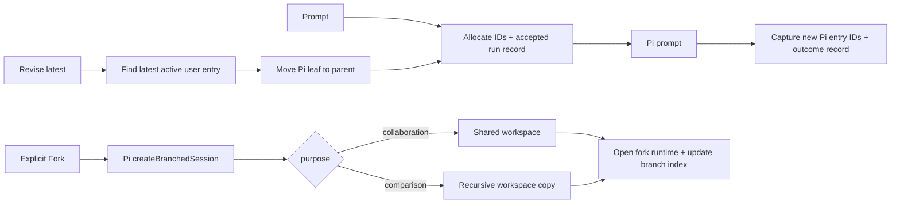

# Conversation Revision and Fork

## 0. Terminology

- **latest-turn revision**: replace the active branch's latest user turn by moving the Pi leaf to its parent and appending a new user/assistant path. It is not a Fork.
- **Fork**: an explicit user operation that creates `fork-NNN` and a separate Pi session file.
- **collaboration Fork**: new branch, shared main workspace.
- **comparison Fork**: new branch, copied workspace snapshot.
- **run record**: append-only mapping from Alt Theory trajectory IDs to Pi entry IDs and status.

Conflict check: Pi uses branch for tree navigation; Alt Theory `branchId` is the analysis-facing logical branch. The design keeps those meanings explicit.

## 1. Decisions and Constraints

Requirement summary:

- ordinary prompt runs receive durable turn/revision/run records;
- revising the latest user turn keeps session, branch, and turn IDs while allocating a new revision/run;
- only explicit Fork creates a new branch;
- collaboration shares workspace; comparison copies it;
- session detail exposes branch index and run lineage.

Non-goals:

- no arbitrary historical turn editing;
- no rollback of tool/file side effects;
- no automatic branching on edit/regenerate/config changes;
- no workspace diff/merge/conflict system;
- no multi-branch simultaneous streaming;
- no visual tree editor or full branch-management panel in this feature.

Complexity tier: local single-process mutation feature; persistence is append-only JSON/JSONL.

Key decisions:

- add a dedicated `lineage-records.ts` owner rather than embedding record parsing in `SessionService`;
- active branch is held by the managed session and persisted in `branch-index.json`;
- Fork makes the new branch active immediately;
- Pi fork files remain in the session history directory and are referenced explicitly by the branch index;
- comparison workspace copying uses Node recursive copy because current workspaces are small.

## 2. Nouns and Orchestration

### 2.1 Noun Layer

Current state: `BranchRecord` exists but only contains `main`; run IDs are returned transiently and `runs.jsonl` does not exist.

Change: add `RunRecord`, append/read helpers, branch allocation/update helpers, and branch/run data to session detail.

Example:

```ts
appendRunRecord(recordsDir, {
  sessionId, branchId: "main", turnId: "turn-000002",
  revisionId: "rev-000003", runId: "run-000004",
  status: "accepted", supersedesRunId: null
})
```

Source: `alt-theory-app/web-server/lineage-records.ts`.

Current state: `ManagedSession` assumes `main`.

Change: add `branchId`, branch-local counters, and latest active run mapping.

Example:

```ts
reviseLatest(sessionId, { text }) -> RunHandle {
  ids: { sessionId, branchId: "main", turnId: existing, revisionId: new, runId: new }
}
```

Source: `alt-theory-app/web-server/session-service.ts`.

Current state: session detail contains no branch/run arrays.

Change: return `branchIndex`, `activeBranch`, and `runs`.

### 2.2 Orchestration Layer



Flow constraints:

- all mutations reject busy sessions with `session_busy`;
- revision requires a v0.4 active run and the latest active user entry;
- accepted and terminal run snapshots are append-only;
- terminal run status includes `superseded` for the prior active revision;
- superseded runs remain readable;
- comparison copy completes before branch index activation;
- failed Fork cleanup removes only the newly created comparison workspace;
- no operation changes `sessionId`.

### 2.3 Mount Point List

- WebSocket protocol: add `revise_latest` and `fork_session`.
- Session detail REST response: add branch/run lineage.
- Composer/message actions: add latest-turn revise action and explicit Fork action.
- `records/runs.jsonl`: add append-only run lineage.

### 2.4 Push Strategy

1. Lineage persistence: run records and branch-index mutations.
   Exit signal: unit tests cover allocation, status snapshots, supersession, and branch updates.
2. Ordinary run instrumentation: persist accepted/completed/failed IDs and Pi entries.
   Exit signal: service tests map ordinary prompts to durable run records.
3. Latest-turn revision: same branch/turn with new revision/run.
   Exit signal: active transcript changes while old Pi evidence remains.
4. Explicit Fork: collaboration shared workspace and comparison copied workspace.
   Exit signal: branch index and physical workspace behavior match purpose.
5. Transport/detail/minimal UI and architecture writeback.
   Exit signal: integration tests pass and plan state is current.

### 2.5 Structure Health and Micro-refactor

##### Evaluation

- `session-service.ts` is large and this feature adds a distinct persistence concern. New lineage record logic therefore goes in a new module.
- `session-records.ts` remains the branch/session schema owner; mutation helpers may extend it without moving existing behavior.
- `web-server/` remains flat but this feature adds only one cohesive lineage module.
- No compound directory convention matched.

##### Conclusion: skip

The new module prevents further responsibility mixing. Splitting the existing service would require interface changes and is outside this feature.

## 3. Acceptance Contract

1. Ordinary prompt records accepted and terminal run snapshots with Pi user/assistant entry IDs.
2. Latest-turn revision keeps `sessionId`, `branchId`, and `turnId`, allocates new revision/run, and supersedes the old run.
3. Revision changes the active transcript without deleting superseded Pi entries.
4. Collaboration Fork creates `fork-001`, a separate Pi file, parent/fork-point lineage, and shared workspace.
5. Comparison Fork creates a separate Pi file and copied branch workspace.
6. Session detail exposes active branch, branch index, and run history.
7. Busy or invalid revision/Fork returns a stable error without partial branch activation.

Reverse checks:

- editing latest does not create a branch;
- config changes remain outside lineage operations;
- no arbitrary historical edit, workspace merge, or automatic Fork.

## 4. Architecture Relationship

Update the core session architecture with run lineage and active logical branches. Update the researcher console architecture with the minimal explicit actions. Current architecture docs continue to describe landed behavior only.
