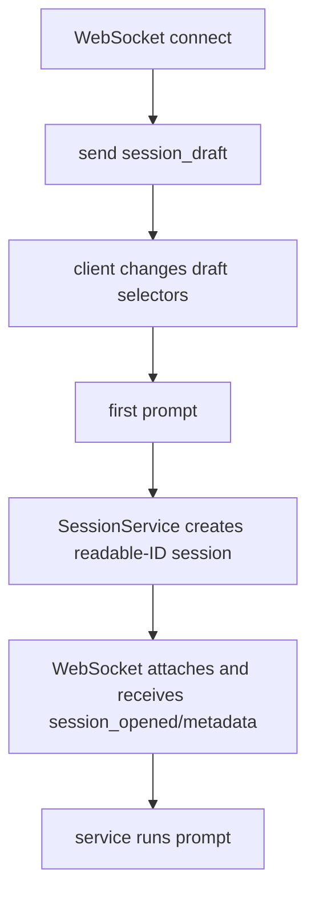

# draft-first-send-session-creation design

## 0. Terminology

- **Draft session** / connection-local launch state with selected KB/role/soul but no persisted session root. Conflict check: no current implementation; current code creates a real session on connect.
- **First-send materialization** / creating session directories, v0.4 records, Pi runtime, and first run when the first prompt is sent. Conflict check: current `SessionService.createSession()` materializes immediately.
- **Readable session ID** / `YYYYMMDD-HHmmss__{role}__{soul}__{model}` with suffix on collision. Conflict check: current `createSessionDirs()` defaults to UUID.
- **Committed session header** / v0.4 `records/session.json` written only for materialized sessions. Conflict check: current foundation writes this on immediate service creation.

## 1. Decisions and Constraints

Requirement summary: opening the console or WebSocket must not create catalog/session noise. The user's first prompt creates exactly one session using the draft selections and a readable ID.

Success criteria:

- WebSocket connect sends draft-ready state without creating `sessions/{id}`;
- changing KB/role/soul before first prompt mutates only draft state;
- first prompt creates one session directory with readable ID and runs the prompt;
- abandoned drafts persist nothing;
- zero-turn materialized sessions are not listed as normal catalog entries;
- existing open/resume still works.

Explicit non-goals:

- no project defaults UI;
- no model selector UI;
- no same-session live config switching after history;
- no soft-delete/trash;
- no frontend redesign beyond necessary draft state handling.

Complexity tier: lifecycle = elevated because creation timing changes; UI = small protocol update only.

Key decisions:

- Add `session_draft` WebSocket message for draft-ready state.
- Keep draft state per WebSocket connection for now; it is intentionally unpersisted.
- Add readable ID allocation to `data-dir.ts` so later REST/automation can reuse it.
- Use model slug from configured model ID, or `default` when absent; role/soul use `none` when absent.

## 2. Nouns and Orchestration

### 2.1 Noun Layer

#### SessionDraftSnapshot

Current state: first server message is `session_opened` for a persisted session.

Change: add a draft snapshot with current selectors and no session ID.

Example:

```ts
{ type: "session_draft", payload: { currentDomain: "ep-core", rolePresetSlug: "default", soulSlug: "soul-latest" } }
// Source: alt-theory-app/web-server/websocket-protocol.ts
```

#### Readable session ID allocator

Current state: `createSessionDirs(dataDir)` defaults to UUID.

Change: add `allocateReadableSessionId()` and use it for first-send materialization.

Example:

```ts
const sessionId = allocateReadableSessionId(dataDir, { rolePresetSlug, soulSlug, modelId }, now);
// Source: alt-theory-app/core/data-dir.ts
```

#### First prompt operation

Current state: `runPrompt(sessionId, text)` requires an already managed session.

Change: add service creation path that accepts selectors and creates a readable-ID session before running the prompt. WebSocket adapter uses this when attached session is absent.

### 2.2 Orchestration Layer



Current state: connect creates session immediately and frontend enables controls after `session_opened`.

Change: connect emits `session_draft`; frontend treats draft as ready for input/config but does not show session records/paths until materialization.

Flow-level constraints:

- no directories are created before first prompt;
- materialization failure before prompt acceptance cleans partial roots when possible;
- a failed accepted run remains evidence;
- resume/open selected session bypasses draft and attaches to existing session.

### 2.3 Mount Point List

- `alt-theory-app/core/data-dir.ts`: readable ID allocator.
- `alt-theory-app/web-server/session-service.ts`: create readable-ID managed session and first-prompt creation path.
- `alt-theory-app/web-server/server.ts`: WebSocket draft state and first-prompt materialization.
- `alt-theory-app/web-server/websocket-protocol.ts`: `session_draft` message.
- `alt-theory-app/web-server/public/client.js`: draft-ready state handling.

### 2.4 Push Strategy

1. ID allocator: add readable ID normalization/allocation with collision suffix tests.
   Exit signal: backend tests cover format, collision, and path guard.
2. Service materialization: create readable-ID managed session from selectors.
   Exit signal: service test verifies ID and v0.4 records.
3. WebSocket draft lifecycle: connect emits draft, first prompt materializes, close without prompt persists nothing.
   Exit signal: backend WebSocket test covers abandoned draft and first prompt creation.
4. Frontend draft state: handle `session_draft` and disable record/paths surfaces until materialized.
   Exit signal: existing frontend protocol still functions and no backend tests regress.
5. Catalog cleanup: hide invalid zero-turn v0.4 roots from normal session catalog.
   Exit signal: backend catalog test covers draft/no-zero-turn behavior.
6. Regression validation.
   Exit signal: `npm run test:backend` passes.

### 2.5 Structure Health and Micro-refactor

##### Evaluation

- File-level - `session-service.ts`: new but already owns the relevant lifecycle; adding first-send materialization is within responsibility.
- File-level - `server.ts`: now much smaller after service extraction; draft adapter logic belongs there.
- File-level - `client.js`: large vanilla client; only a narrow message handler/state update is needed.
- Directory-level - no new directory pressure.

##### Conclusion: skip

No separate refactor. Keep edits directly tied to draft lifecycle.

## 3. Acceptance Contract

Key scenarios:

- Opening and closing WebSocket without prompt leaves no session directory.
- First prompt creates one readable-ID session directory from role/soul/model.
- First prompt sends normal `session_opened`, metadata, metrics, streaming/run events.
- KB/role/soul changed before first prompt affect the first materialized session.
- Existing `open_session` still opens a historical session.
- Zero-turn v0.4 roots are excluded from normal catalog if encountered.

Reverse-check items:

- no project defaults or model selector UI;
- no live same-session role/soul after-history change;
- no revision/fork;
- no trash/soft delete.

## 4. Architecture Relationship

Acceptance must update current architecture docs: connect no longer creates a session, and draft state is unpersisted until first prompt.
