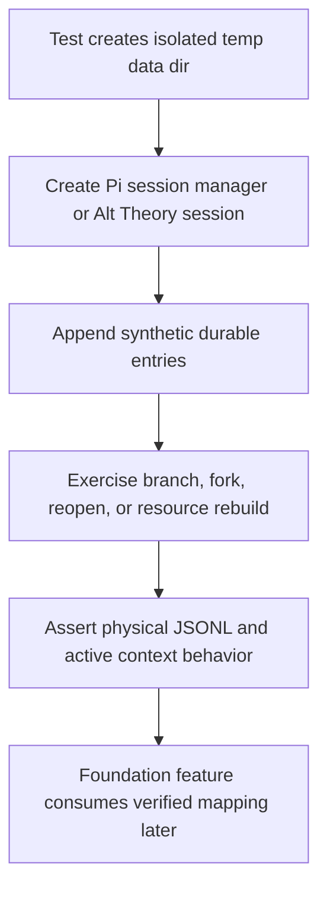

# lineage-runtime-feasibility design

## 0. Terminology

- **Pi session file** / Pi JSONL file owned by `SessionManager`; conflict check: existing code uses `sessionFile` and `piSessionFile`, so the design keeps "Pi session file" for physical storage.
- **Logical trajectory** / Alt Theory mapping of `sessionId`, `branchId`, `turnId`, `revisionId`, and `runId`; conflict check: no current implementation type exists, so tests must not invent product records yet.
- **Latest-turn revision** / same logical branch and turn with a new active Pi path; conflict check: Pi uses `branch()` for tree movement, but v0.4 product language stays "revision".
- **Explicit Fork** / product-visible branch operation; conflict check: Pi has `fork()` and `createBranchedSession()`, but product branch IDs are Alt Theory-owned.
- **Runtime rebuild** / replacing or reopening the Pi runtime against the same physical history while changing prompt/resource assembly; conflict check: current `openAltTheorySession()` writes `resume-manifest.json`, not v0.4 config events.

## 1. Decisions and Constraints

Requirement summary: add repeatable local probes that prove which Pi physical and tree behaviors v0.4 may rely on. The user-facing goal is to avoid building the new session foundation on guessed Pi behavior.

Success criteria:

- tests demonstrate same-file tree behavior for latest-turn revision;
- tests demonstrate physical JSONL creation and parent linkage for explicit fork candidates;
- tests demonstrate restart recovery by reopening JSONL and recovering the active leaf/path;
- tests demonstrate Alt Theory can rebuild/reopen a runtime with changed prompt resources while preserving the same logical session history;
- tests check candidate readable IDs stay filesystem-safe and bounded for realistic role/soul/model slugs.

Explicit non-goals:

- no `SessionService`, run handle, branch-index, config-event, or v0.4 storage implementation;
- no WebSocket or REST contract changes;
- no live model calls;
- no attempt to make Pi physical files the product identity;
- no automatic migration of existing sessions.

Complexity tier: external SDK behavior = elevated because Pi tree/fork semantics are the dependency being tested; otherwise using backend-test default tier.

Key decisions:

- Use local tests instead of live smoke tests. The relevant behavior lives in `SessionManager`, `AgentSession` setup, and Alt Theory core prompt/resource assembly, not provider output.
- Record accepted mapping as assertions and test names now; later foundation work consumes this evidence through the SWE plan dependency.
- Keep any candidate ID normalization inside the test until the first-send feature introduces the product helper.

## 2. Nouns and Orchestration

### 2.1 Noun Layer

#### Pi tree probe

Current state: `node_modules/@mariozechner/pi-coding-agent/dist/core/session-manager.d.ts` exposes `SessionManager.appendMessage()`, `branch()`, `createBranchedSession()`, `open()`, `getBranch()`, `getTree()`, and `buildSessionContext()`.

Change: add tests that create synthetic user/assistant messages, branch from a prior user-turn parent, append a revised turn, reopen the file, and assert the latest leaf path is the active transcript while superseded entries remain in the tree.

Example:

```ts
const manager = SessionManager.create(cwd, historyDir);
const user2 = manager.appendMessage(user("original"));
manager.branch(user2Parent);
const revised = manager.appendMessage(user("revised"));
// Source: alt-theory-app/core/lineage-runtime-feasibility.test.ts
```

#### Physical fork probe

Current state: `SessionManager.createBranchedSession(leafId)` creates a new JSONL file from the path to `leafId` and sets `parentSession` to the previous file when persisted.

Change: add tests that assert forked files are separate physical files, include the expected path only, preserve `cwd`, and reopen with the expected branch context.

Example:

```ts
const forkFile = source.createBranchedSession(firstAssistantId);
const forked = SessionManager.open(forkFile, historyDir);
// Source: alt-theory-app/core/lineage-runtime-feasibility.test.ts
```

#### Runtime rebuild probe

Current state: `createAltTheorySession()` creates new sessions and writes `assembly-manifest.json`; `openAltTheorySession()` reopens a Pi JSONL and writes `resume-manifest.json` with drift warnings.

Change: add a test that creates a session, persists synthetic context, disposes, then reopens the same Pi JSONL with changed soul/role/resource mode and verifies same session ID/file/history with changed active prompt assembly.

Example:

```ts
const reopened = await openAltTheorySession({ ...dirs, sessionFile, rolePresetPath: alternate });
// Source: alt-theory-app/core/lineage-runtime-feasibility.test.ts
```

#### Candidate readable session ID probe

Current state: `createSessionDirs()` accepts filesystem-safe IDs matching `^[A-Za-z0-9][A-Za-z0-9._-]*$`; v0.4 proposes `YYYYMMDD-HHmmss__{role}__{soul}__{model}`.

Change: add a test-local candidate normalizer and assert realistic long slugs produce an accepted, bounded root path. This proves feasibility without introducing the product allocation helper early.

Example:

```ts
const id = candidateReadableSessionId({ role, soul, model });
assert.ok(resolveSessionRoot(dataDir, id));
// Source: alt-theory-app/core/lineage-runtime-feasibility.test.ts
```

### 2.2 Orchestration Layer



Current state: the app relies on Pi history but does not have a dedicated feasibility suite. Existing tests cover working pieces incidentally.

Change: add one focused core test file with independent tests for tree revision, physical fork, Alt Theory rebuild, custom context persistence, and candidate ID feasibility.

Flow-level constraints:

- tests must not depend on network, provider auth, or live model responses;
- tests may use synthetic message entries to force persistence;
- each test owns a temp directory and cannot write runtime evidence into tracked project paths;
- failures should point to the unsupported Pi behavior rather than masking it behind product abstractions.

### 2.3 Mount Point List

This feature introduces no runtime mount points. It adds backend test coverage only.

### 2.4 Push Strategy

1. Evidence scaffold: add focused core test file and synthetic message helpers.
   Exit signal: tests can create persisted Pi JSONL without live model calls.
2. Pi tree/revision probe: assert same-file branch/revision behavior and restart recovery.
   Exit signal: reopened manager returns the revised active path and keeps superseded entries.
3. Physical fork probe: assert `createBranchedSession()` file/path/parent behavior.
   Exit signal: forked JSONL reopens with only the fork-point path and parent linkage.
4. Runtime rebuild probe: assert Alt Theory reopen with changed prompt resources preserves history.
   Exit signal: same `sessionId`/Pi file/history with changed system prompt and resume warnings.
5. Candidate ID probe and validation: assert readable ID shape/path length and run backend tests.
   Exit signal: `npm run test:backend` passes and checklist checks have direct evidence.

### 2.5 Structure Health and Micro-refactor

Compound convention search found no matching directory/naming/ownership decision.

##### Evaluation

- File-level - `alt-theory-app/core/backend-v2.test.ts`: existing file is small but adding unrelated Pi lineage probes would mix core directory tests with SDK behavior probes.
- File-level - `alt-theory-app/web-server/backend-server.test.ts`: already large and combines many backend concerns; this feature should not add more tests there.
- Directory-level - `alt-theory-app/core/`: currently a flat but acceptable module/test directory; adding one targeted test file does not require reorganization.

##### Conclusion: skip

Use a new focused test file rather than expanding the large web-server test.

## 3. Acceptance Contract

Key scenarios:

- Latest-turn revision candidate: branch from the parent of the latest user message, append a replacement user/assistant pair, reopen, and see the replacement path as active while original entries remain.
- Explicit Fork candidate: create a branched session file at a fork point, reopen it, and see a separate physical file with `parentSession` pointing to the source.
- Restart recovery: after reopen, active leaf and context come from the last persisted leaf rather than newest directory guessing.
- Runtime rebuild: changed soul/role/resource assembly can reopen the same JSONL and keep the prior context.
- Structured context evidence candidate: custom message entries persist and participate in context after reopen, proving non-string-prefix context is feasible.
- Session ID feasibility: the proposed readable ID shape is accepted by current path guards and remains bounded with realistic long slugs.

Reverse-check items:

- no product session foundation is implemented in this feature;
- no live provider call is required;
- no Pi physical filename is exposed as product identity;
- no WebSocket connection lifecycle behavior is changed.

## 4. Architecture Relationship

This feature validates the future architecture in the v0.4 SWE plan but does not update current architecture documents. If acceptance confirms the probes, `session-application-foundation` can use the verified Pi mapping and later architecture updates will happen after product structural changes are accepted.
