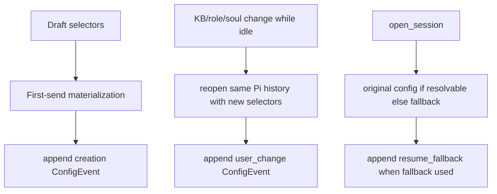

# project-config-and-live-switching design

## 0. Terminology

- **Research project** / optional local grouping/defaults record under the data dir. Conflict check: no current implementation.
- **Effective config** / full analysis-facing snapshot of the configuration actually active for a session/runtime. Conflict check: current manifest records assembly, but no append-only config history.
- **Config event** / append-only `config-events.jsonl` entry for creation, user change, or resume fallback. Conflict check: current `session-events.jsonl` records control events but not full effective snapshots.
- **Live switching** / changing supported config while keeping the same Alt Theory `sessionId`, branch, workspace, and Pi JSONL history. Conflict check: current role/soul switching may allocate a new session after history.
- **Resume fallback** / automatic selection of current fallback asset/config when original manifest values cannot resolve, recorded with warning. Conflict check: current code falls back but only exposes resume warnings/events, not an effective config event.

## 1. Decisions and Constraints

Requirement summary: configuration changes should not create new sessions or branches; resume should continue with warning instead of asking the user to resolve config drift; project defaults are optional and should not add setup burden.

Success criteria:

- creation writes a `ConfigEvent` with the full effective config;
- same-session KB/role/soul changes while idle write `ConfigEvent` and keep `sessionId`;
- role/soul changes after history rebuild the internal Pi runtime against the same JSONL instead of creating a new Alt Theory session;
- opening an existing session with unresolved original config records a `resume_fallback` config event and warning;
- projects can be listed/upserted locally and can supply draft defaults when explicitly selected by API;
- session detail exposes current effective config and config history;
- existing browser controls still work without adding confirmation dialogs.

Explicit non-goals:

- no model selector UI;
- no custom instruction loader;
- no skill picker/invocation;
- no full project-management UI;
- no branch/revision/fork behavior;
- no generic provenance dashboard redesign;
- no mandatory project setup;
- no same-run config changes while a prompt is active.

Complexity tier: elevated but bounded. The main risk is preserving same logical session while replacing the internal Pi runtime.

Key decisions:

- Store full effective snapshots per event; do not reconstruct from patches.
- Keep project files as simple local JSON under `{dataDir}/projects/`.
- Add REST project endpoints now; frontend UI integration can remain minimal.
- Live switching supports only KB, role preset, and soul in this feature because those controls already exist.
- If a config change occurs while busy, return `session_busy`.

## 2. Nouns and Orchestration

### 2.1 Noun Layer

#### ResearchProject

Current state: no project records.

Change: add a local JSON project record.

```ts
type ResearchProject = {
  projectId: string;
  displayName: string;
  defaults: Partial<SessionDraftConfig>;
  notes?: string;
  createdAt: string;
  updatedAt: string;
};
// Source: alt-theory-app/web-server/projects.ts
```

#### EffectiveSessionConfig

Current state: `AssemblyManifest` gives one assembly snapshot, but user changes and fallback history are not first-class analysis records.

Change: add an effective config shape for creation, live changes, and resume fallback.

```ts
type EffectiveSessionConfig = {
  projectId: string | null;
  rolePresetSlug: string | null;
  soulSlug: string | null;
  kbDomain: string;
  provider: string | null;
  model: string | null;
  customInstruction: { ref: string | null; path: string | null; sha256: string | null };
  skills: Array<{ name: string; path: string; sha256: string | null; source: "alt-theory" | "debug" }>;
  promptMode: "pi-default" | "alt-only";
  resourceDiscovery: "clean" | "internal" | "dev-debug";
};
// Source: alt-theory-app/web-server/config-events.ts
```

#### ConfigEvent

Current state: `session-events.jsonl` has lightweight event details but not full effective config snapshots.

Change: add append-only `records/config-events.jsonl`.

```ts
type ConfigEvent = {
  eventId: string;
  sessionId: string;
  branchId: "main";
  at: string;
  reason: "creation" | "user_change" | "resume_fallback";
  effective: EffectiveSessionConfig;
  changedFields: string[];
  warnings: string[];
};
// Source: alt-theory-app/web-server/config-events.ts
```

#### Live runtime replacement

Current state: `SessionService.replaceSession()` may reuse empty sessions but creates a new session boundary after history exists.

Change: replace the internal Pi `AgentSession` by reopening the current session file/history with new selectors while keeping the same Alt Theory session ID and managed-session entry.

### 2.2 Orchestration Layer



Current state: KB changes mutate selector only; role/soul changes call replacement; resume fallback is warning-only.

Change: all supported changes converge on effective-config events. Role/soul no longer allocate a new Alt Theory session. Resume fallback is automatic and visible in session detail.

Flow-level constraints:

- draft changes still persist nothing;
- config changes while a run is active are rejected with `session_busy`;
- changing KB does not require runtime rebuild, but still writes a config event;
- role/soul runtime rebuild keeps the same session root, workspace, history, and session ID;
- original `assembly-manifest.json` remains immutable; active runtime facts are in `resume-manifest.json` and config events;
- project defaults apply only when explicitly selected through API/draft, not silently.

### 2.3 Mount Point List

- `alt-theory-app/web-server/config-events.ts`: effective config and config event records.
- `alt-theory-app/web-server/projects.ts`: local project records and REST payload validation.
- `alt-theory-app/web-server/session-service.ts`: creation/open/change event writes and same-session runtime rebuild.
- `alt-theory-app/web-server/session-store.ts`: expose current effective config and config event history in detail.
- `alt-theory-app/web-server/server.ts`: project REST endpoints and live-switching error behavior.
- `alt-theory-app/web-server/websocket-protocol.ts`: optional config/provenance payload fields if needed.
- `alt-theory-app/web-server/public/client.js`: narrow status handling only if protocol changes.

### 2.4 Push Strategy

1. Config/project records: add append/read config events and simple project list/upsert APIs.
   Exit signal: unit tests cover event shape, project validation, and no secret/body leakage.
2. SessionService creation/open writeback: append creation and resume-fallback effective config events.
   Exit signal: service tests verify config event reasons and fallback warnings.
3. Same-session live switching: role/soul rebuild runtime against the same JSONL/session root; KB writes event without rebuild.
   Exit signal: tests verify session ID/root unchanged after role/soul changes with history.
4. Session detail/provenance: expose config history/current effective config through existing detail API.
   Exit signal: backend tests read config history from REST/detail.
5. Regression validation and docs.
   Exit signal: `npm run test:backend` passes, architecture reflects landed code.

### 2.5 Structure Health and Micro-refactor

##### Evaluation

- `session-service.ts`: this feature naturally extends lifecycle/config ownership, but config-event formatting should live in a separate module to avoid growing service into a serializer.
- `server.ts`: project REST endpoints can be added without a new transport abstraction.
- Frontend: avoid adding new project UI here. The workbench feature should own full layout changes.

##### Conclusion: small split

Create `config-events.ts` and `projects.ts`. Do not introduce a database, generic settings framework, or a separate operation bus.

## 3. Acceptance Contract

Key scenarios:

- First-send materialized session has a `creation` config event.
- KB switch after materialization keeps same session and appends `user_change`.
- Role switch after at least one persisted history message keeps same session ID/root and appends `user_change`.
- Soul switch after at least one persisted history message keeps same session ID/root and appends `user_change`.
- Open existing session with missing original role/soul falls back automatically and appends `resume_fallback` with warning.
- Session detail returns config history and current effective config.
- Project list/upsert works under `{dataDir}/projects` and project defaults can be read without mandatory UI setup.
- Busy config change returns `session_busy`.

Reverse-check items:

- no empty-session toggle;
- no fallback confirmation dialog;
- no model selector UI;
- no custom instruction loader;
- no skill picker;
- no branch/revision/fork behavior.

## 4. Architecture Relationship

Acceptance must update current architecture docs with effective config events, project records, and same-session live KB/role/soul switching. The docs must not claim model/custom-instruction/skill switching is implemented yet.
