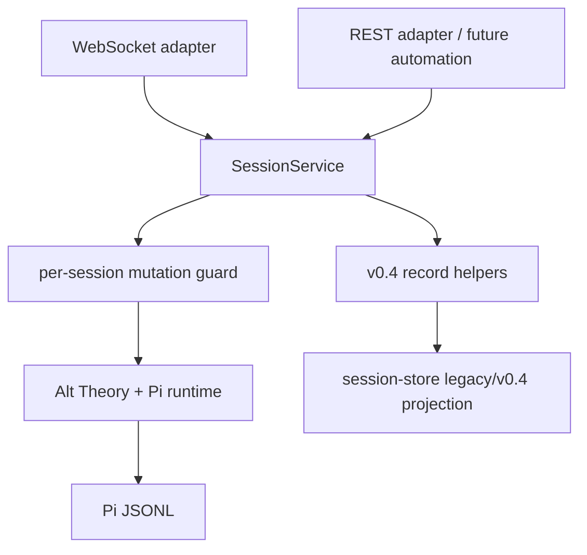

# session-application-foundation design

## 0. Terminology

- **SessionService** / application-owned coordinator for logical sessions, active runtimes, mutation serialization, and run handles. Conflict check: no existing `SessionService` implementation.
- **Managed session** / in-memory service entry holding the current `AgentSession`, manifest, counters, config selectors, transcript cache, and subscribers. Conflict check: current `ConnectionState` owns this per WebSocket; this feature moves ownership.
- **RunHandle** / accepted run identity plus event stream, abort, and completion promise. Conflict check: no existing type; current WebSocket streams directly from `AgentSession.subscribe()`.
- **Mutation guard** / per logical session async guard that rejects concurrent mutations with `session_busy`. Conflict check: current code relies on Pi's streaming rejection.
- **v0.4 record envelope** / `{ schemaVersion: 1, recordType }` marker for new Alt Theory records. Conflict check: current manifests and events do not use this envelope.
- **Legacy projection** / read/open compatibility for existing v0.3 session roots without treating them as v0.4 writable records. Conflict check: current `session-store.ts` reads all roots as one shape.

## 1. Decisions and Constraints

Requirement summary: replace the connection-owned backend lifecycle with application-owned session/runtime handles that both WebSocket and REST-style operations can call. This is the minimal foundation needed before first-send draft creation, live config switching, revision/fork, and automation API.

Success criteria:

- WebSocket handler delegates create/open/run/abort/config-like replacement to one service instead of owning `AgentSession` directly;
- accepted runs are represented by a shared `RunHandle` shape internally;
- same-session mutation conflicts return stable `session_busy`;
- closing a WebSocket detaches that client without aborting/dispose of the service-owned session;
- new v0.4 record helpers write schema-versioned records;
- branch-aware path helpers exist even before revision/fork uses them;
- existing v0.3 sessions remain listable/openable as legacy projection.

Explicit non-goals:

- no draft-first-send behavior; WebSocket may still create an initial session on connect until the next feature;
- no readable session ID allocator yet;
- no project defaults, config events, custom instruction, summary skill, latest-turn revision, or explicit fork UI/API;
- no database, external queue, file lock, distributed lock, or service framework;
- no broad frontend workbench redesign.

Complexity tier: architecture boundary = elevated because this touches WebSocket orchestration and persistence contracts; concurrency = small single-process guard only.

Key decisions:

- Implement one pragmatic service module, not multiple service tiers.
- Preserve the current WebSocket protocol where possible; add only stable error semantics needed by the foundation.
- Keep Pi JSONL primary; new records are thin headers/indexes and do not duplicate transcript bodies.
- Treat v0.3 roots as legacy read/open inputs; do not fabricate historical trajectory IDs.

## 2. Nouns and Orchestration

### 2.1 Noun Layer

#### SessionService

Current state: `alt-theory-app/web-server/server.ts` has a `ConnectionState` interface and nested functions that create/open/replace/dispose sessions inside each WebSocket connection.

Change: add `alt-theory-app/web-server/session-service.ts` with a `SessionService` class. It owns active managed sessions by `sessionId`, creates and opens sessions, serializes mutating operations, and exposes subscribe/detach operations for transports.

Example:

```ts
const service = createSessionService(serverConfig);
const session = await service.createSession(defaultLaunchConfig);
const run = service.runPrompt(session.sessionId, { text });
// Source: alt-theory-app/web-server/session-service.ts
```

#### ManagedSession

Current state: `ConnectionState` contains `session`, `manifest`, current domain/role/soul, counters, and transcript, and is disposed on WebSocket close.

Change: move this state into service-owned `ManagedSession`. A WebSocket stores only the attached session ID and unsubscribe function.

Example:

```ts
type ManagedSession = {
  session: AgentSession;
  manifest: AssemblyManifest;
  counters: SessionCounters;
  selectors: EffectiveSelectors;
};
// Source: alt-theory-app/web-server/session-service.ts
```

#### RunHandle

Current state: `server.ts` awaits `session.prompt()` directly and streams events via connection-local subscription.

Change: add an internal run handle with IDs currently limited to available `sessionId` plus placeholder main lineage counters. Full trajectory allocation belongs to revision/fork features, but the handle establishes one shared operation boundary.

Example:

```ts
type RunHandle = {
  ids: { sessionId: string; branchId: "main"; turnId: string; revisionId: string; runId: string };
  completion: Promise<RunResult>;
  abort(): Promise<void>;
};
// Source: alt-theory-app/web-server/session-service.ts
```

#### Versioned record helpers

Current state: `session-events.ts`, metrics, and assembly manifests are unversioned v0.3-style files.

Change: add `alt-theory-app/web-server/session-records.ts` for v0.4 record envelope helpers and branch-aware path resolution. This feature writes a minimal `records/session.json` and `records/branch-index.json` for newly managed sessions without changing Pi JSONL.

Example:

```ts
writeSessionHeader(recordsDir, { sessionId, createdAt, status: "active" });
resolveBranchWorkspace(sessionRoot, "main");
// Source: alt-theory-app/web-server/session-records.ts
```

#### Legacy projection

Current state: `session-store.ts` lists complete/incomplete sessions by `assembly-manifest.json` and latest JSONL fallback.

Change: make v0.4 records visible when present and mark sessions without `schemaVersion` headers as legacy-compatible in detail/list results. Legacy sessions remain readable/openable but are not treated as new write-model records.

Example:

```ts
session.recordModel = "v0.4" | "legacy-v0.3";
// Source: alt-theory-app/web-server/session-store.ts
```

### 2.2 Orchestration Layer



Current state:

- WebSocket connect creates a session directly.
- WebSocket close aborts/disposes the owned runtime.
- Prompt handling mutates connection counters directly.
- Session replacement is implemented in nested server functions.
- Session catalog reads one legacy shape.

Change:

- Server constructs one `SessionService` alongside Express/WebSocket setup.
- WebSocket connect asks service for a session and attaches a subscriber.
- WebSocket close only detaches the subscriber.
- Prompt/abort/open/replacement operations call service methods.
- Service emits the same existing server messages via subscriber callbacks, preserving the frontend protocol.
- Service writes minimal v0.4 records for new sessions and keeps legacy sessions readable/openable.

Flow-level constraints:

- Only one mutating operation may run per managed session. A second operation returns `session_busy`.
- Explicit abort remains the normal cancellation path; socket close is not abort.
- No distributed synchronization. The guard is process-local.
- If service-owned session creation fails, no WebSocket state is attached.
- If a run is accepted and later fails, the session and evidence remain.
- Existing v0.3 sessions can be opened but do not gain fabricated v0.4 trajectory IDs.

### 2.3 Mount Point List

- `alt-theory-app/web-server/server.ts`: create and use `SessionService` for WebSocket lifecycle and operations.
- `alt-theory-app/web-server/session-store.ts`: expose v0.4/legacy projection fields.
- `alt-theory-app/web-server/session-records.ts`: add versioned record and branch path helper module.
- `alt-theory-app/web-server/websocket-protocol.ts`: add stable `session_busy` error code only if needed by tests.

### 2.4 Push Strategy

1. Service skeleton: introduce `SessionService`, `ManagedSession`, subscription, snapshots, and no-op-compatible create/open behavior.
   Exit signal: existing WebSocket tests pass through service-created sessions.
2. Run operation and mutation guard: route prompt/abort through service and reject concurrent mutation with `session_busy`.
   Exit signal: backend test covers busy rejection without relying on Pi's raw error text.
3. Detach semantics: make WebSocket close unsubscribe only, leaving service-owned session alive until explicit abort/replacement/server shutdown.
   Exit signal: backend test closes one client during an active/managed session without service disposing the runtime.
4. Versioned records and branch paths: add record helpers and write minimal `session.json` / `branch-index.json` for new sessions.
   Exit signal: backend test verifies schemaVersion and main branch workspace path.
5. Legacy projection: update session-store detail/list to distinguish v0.4 vs legacy v0.3 without fabricating IDs.
   Exit signal: backend tests cover both v0.4 and existing legacy sessions.
6. Regression validation: run backend tests and update checklist.
   Exit signal: all foundation checks have evidence.

### 2.5 Structure Health and Micro-refactor

Compound convention search previously found no matching directory/naming/ownership decision for this workstream.

##### Evaluation

- File-level - `alt-theory-app/web-server/server.ts`: over 1000 lines and currently mixes Express routes, WebSocket transport, session lifecycle, config resolution, runtime events, and prompt execution. This feature directly reduces that responsibility by moving session lifecycle/run ownership to a new module.
- File-level - `alt-theory-app/web-server/session-store.ts`: large but read-side focused. Changes should be narrow projection additions only.
- Directory-level - `alt-theory-app/web-server/`: flat but still manageable. Adding `session-service.ts` and `session-records.ts` is consistent with existing `session-events.ts`, `session-metrics.ts`, and `session-store.ts`.

##### Conclusion: skip

Do not do a separate behavior-preserving split first. The minimal extraction is the feature itself: one service module and one record helper module. A larger server decomposition is out of scope.

##### Out-of-scope observations

- `server.ts` still combines REST static routes and WebSocket setup. After v0.4 lifecycle stabilizes, a later refactor could split route registration from server construction.

## 3. Acceptance Contract

Key scenarios:

- WebSocket connect/open/prompt/new-session behavior still works through service delegation.
- Closing a WebSocket does not abort/dispose a service-owned session; explicit abort still cancels.
- Concurrent prompt/config/open mutation on the same managed session returns stable `session_busy`.
- Newly created managed sessions write `records/session.json` and `records/branch-index.json` with `schemaVersion: 1`.
- Main branch path helpers identify shared workspace and active Pi file without relying on newest JSONL directory inference.
- Legacy v0.3 sessions remain listable/openable and are marked as legacy/unknown for v0.4 lineage.

Reverse-check items:

- no draft-first-send or readable ID allocator implemented;
- no project/config events implemented;
- no latest-turn revision or explicit fork operation implemented;
- no database, lock server, queue, or broad framework added;
- no frontend workbench redesign.

## 4. Architecture Relationship

Acceptance must update `project/architecture/core-session-engine.md` because session ownership and close/abort semantics change. `project/architecture/researcher-console.md` only needs an update if the browser-visible protocol or UI behavior changes beyond stable error reporting.
