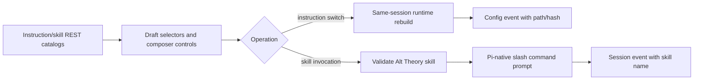

# Text Instructions and Runtime Skills

## 0. Terminology

- **instruction asset**: a safely decodable text file under a configured instruction root. This is independent from soul and role.
- **Alt Theory skill**: a Pi-native skill discovered from `agent-assets/skills/` or the configured replacement directory.
- **debug skill**: a Pi global/project skill available only through `dev-debug` discovery and excluded from the visual picker.
- **skill invocation**: a turn-level explicit `/skill:name` operation initiated by the visual composer control.

Conflict check: existing code has resource discovery modes and Pi skills, but no instruction-asset catalog, Alt Theory-only skill catalog, or explicit skill-invocation operation.

## 1. Decisions and Constraints

Requirement summary:

- recursively catalog readable instruction files without extension allowlisting;
- reject files outside the configured root, binary/undecodable files, and files over 256 KiB;
- allow draft and materialized sessions to change instruction selection without changing session ID;
- preserve `clean`, `internal`, and `dev-debug` semantics;
- expose only Alt Theory skills in the visual picker;
- add a minimal scanned `conversation-summary` skill;
- record instruction provenance and explicit skill invocation.

Non-goals:

- no arbitrary path entry, browser upload store, instruction editor, or freeform instruction box;
- no MIME framework, database, watcher, or hot reload;
- no visual exposure of Pi global/project debug skills;
- no skill enable/disable matrix or per-session skill copying;
- no visual UAT round in this feature; consolidated frontend UAT remains scheduled after the next relevant frontend integration point.

Complexity tier: standard local application feature, no deviations.

Key decisions:

- `agent-assets/instructions/` is the default instruction root.
- Instruction changes use the existing same-session runtime rebuild path and append a `user_change` config event.
- `dev-debug` merges Alt Theory skills into Pi defaults; it does not replace Pi discovery.
- Explicit invocation sends a Pi-native slash command internally and records a separate session event.

## 2. Nouns and Orchestration

### 2.1 Noun Layer

#### Instruction asset

Current state: `AgentAssetPaths` has no instruction directory and the manifest/effective config contains only an empty custom-instruction placeholder.

Change: add an instruction directory path, catalog records, a loaded text reference, and manifest provenance.

Example:

```ts
listInstructionAssets(root) -> [
  { ref: "study/guardrails.rst", displayName: "study/guardrails.rst", size: 842 }
]
loadInstructionAsset(root, "study/guardrails.rst") -> {
  ref, path, sha256, content
}
```

Source: `alt-theory-app/web-server/instruction-assets.ts`.

#### Runtime skill reference

Current state: the core passes Pi resources to the session but does not expose which Alt Theory skills were loaded.

Change: record loaded skill name/path/hash/source in the assembly manifest and effective configuration.

Example:

```ts
manifest.skills -> [
  { name: "conversation-summary", path: ".../SKILL.md", sha256: "...", source: "alt-theory" }
]
```

Source: `alt-theory-app/core/alt-theory-core.ts` `AssemblyManifest`.

#### Session selectors

Current state: `SessionSelectors` contains role, soul, and KB.

Change: add `customInstructionRef`; role/soul/instruction rebuilds reuse one method and preserve identity/history.

Example:

```ts
replaceSession(id, { ...selectors, customInstructionRef: "study/guardrails.rst" }, "instruction_switch")
```

Source: `alt-theory-app/web-server/session-service.ts` `SessionSelectors`.

#### Skill invocation operation

Current state: prompts accept plain user text only.

Change: add `invoke_skill` with `skillName` and optional `userText`.

Example:

```ts
{ type: "invoke_skill", payload: { skillName: "conversation-summary", userText: "Focus on decisions." } }
```

Source: `alt-theory-app/web-server/websocket-protocol.ts` `ClientMessage`.

### 2.2 Orchestration Layer



Current state: server discovery covers role/soul/KB; `internal` replaces skills with one configured directory; `dev-debug` relies only on Pi defaults; prompts have no typed skill operation.

Change:

1. Resolve default instruction and skill roots from agent assets.
2. Provide REST catalogs for instruction assets and Alt Theory skills.
3. Carry instruction selection in draft/session selectors.
4. Rebuild runtime on instruction change while preserving session/history.
5. Compose skill discovery by resource mode.
6. Validate explicit invocation against the Alt Theory catalog and run it through Pi.

Flow constraints:

- path containment is checked lexically and through real paths;
- invalid instruction content fails before runtime replacement;
- busy sessions return `session_busy` for instruction changes and skill invocation;
- duplicate skill names prefer the configured Alt Theory skill in `dev-debug`;
- `clean` exposes an empty skill catalog because no skills are active;
- config and invocation events are append-only.

### 2.3 Mount Point List

- `resolveAgentAssetPaths()`: add default/configurable instruction and skill roots.
- Express routes: add `GET /api/instruction-assets` and `GET /api/skills`.
- WebSocket protocol: add `switch_instruction` and `invoke_skill`.
- Research console: add instruction selector and composer skill action.
- `agent-assets/skills/conversation-summary/SKILL.md`: add scanned runtime skill.

### 2.4 Push Strategy

1. Asset contracts: instruction validation/catalog and asset-root resolution.
   Exit signal: unit tests cover readable, binary, over-limit, and traversal cases.
2. Runtime composition: custom instruction prompt assembly and three-mode skill merge.
   Exit signal: core tests prove clean/internal/dev-debug behavior and manifest provenance.
3. Session orchestration: selector rebuild, config events, and skill invocation.
   Exit signal: service tests prove same identity/history and append-only events.
4. Transport and frontend wiring: REST catalogs, WebSocket operations, and compact controls.
   Exit signal: backend integration tests exercise routes/messages and static UI contains usable controls.
5. Runtime asset and acceptance writeback.
   Exit signal: summary skill is auto-discovered, backend suite passes, and architecture/plan records are current.

### 2.5 Structure Health and Micro-refactor

##### Evaluation

- File-level: `session-service.ts`, `server.ts`, and `client.js` are already broad orchestration files, but this feature adds narrow operations that follow their current ownership.
- Directory-level: `web-server/` is flat, but new instruction validation is isolated in one owned module rather than adding generic utilities.
- Compound convention search returned no matching directory/naming/ownership decision.

##### Conclusion: skip

No behavior-preserving move is required for this feature. A broader server/client decomposition would change ownership and should not be mixed into this capability.

## 3. Acceptance Contract

Key scenarios:

1. A non-`.md` readable UTF-8 instruction under the configured root is cataloged, selected, injected, and recorded with path/hash.
2. Binary, invalid UTF-8, oversized, and traversal instruction references are rejected.
3. `clean` loads no skills; `internal` loads only Alt Theory skills; `dev-debug` includes Pi defaults plus Alt Theory skills with deterministic deduplication.
4. The visual skill catalog contains only active Alt Theory skills.
5. `conversation-summary` is discovered automatically and its explicit invocation records the skill name while preserving session ID.
6. Changing instruction after history exists preserves session ID, session root, and Pi history path.
7. Busy instruction switch or skill invocation returns `session_busy`.

Reverse checks:

- no arbitrary instruction path/editor/upload UI;
- no debug/global skills in the visual catalog;
- no new session or branch caused by instruction or skill operations;
- no extension allowlist.

## 4. Architecture Relationship

Update `project/architecture/core-session-engine.md` with instruction provenance, skill composition, and invocation flow. Update `project/architecture/researcher-console.md` with the new selectors and composer action. The existing session service remains the application-operation owner.
