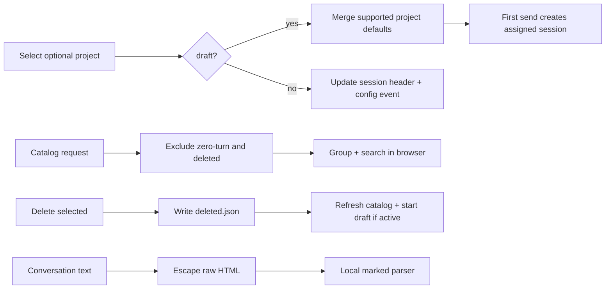

# Workbench Session Management

## 0. Terminology

- **project assignment**: optional `projectId` stored with a v0.4 session and used only for grouping and draft defaults.
- **session catalog**: normal, non-deleted, non-empty session summaries.
- **soft delete**: write `records/deleted.json` and remove the session from the normal catalog without moving or purging its directory.
- **workbench panes**: left session/config pane, center conversation pane, and right inspector pane.
- **Markdown conversation**: escaped user/assistant text rendered with the local `marked` parser; raw model HTML is never trusted.

Conflict check: Research projects already exist as local JSON records, but sessions do not yet persist assignment. Records/Runtime/Paths already exist as inspector tabs and remain the advanced inspection surface.

## 1. Decisions and Constraints

Requirement summary:

- persist optional project assignment and expose it in catalog/detail/draft snapshots;
- apply selected project defaults to supported draft fields without requiring a project;
- group and search the session catalog by project;
- soft-delete a selected non-empty session from the normal catalog;
- make desktop side panes resizable and collapsible while preserving mobile drawers;
- render user and assistant Markdown safely in both loaded and streaming conversation;
- add a compact Provenance inspector view for effective config, warnings, branch, and run IDs.

Non-goals:

- no empty-session toggle, Trash workspace, restore UI, purge, or delete-state management;
- no project creation/import/export UI or forced assignment of legacy sessions;
- no blocking resume/fallback confirmation;
- no arbitrary branch tree manager;
- no new model catalog or model selector in this feature;
- no frontend framework migration, database, generic state store, or layout framework.

Complexity tier: medium cross-layer feature using existing REST, WebSocket, local JSON records, and vanilla frontend boundaries.

Key decisions:

- add nullable `projectId` to `session.json`, selectors, snapshots, summaries, and config events;
- draft project selection merges only available role/soul/KB/custom-instruction defaults; existing-session reassignment changes grouping only;
- soft delete is one atomic JSON marker and catalog filtering;
- serve the already installed local `marked` UMD bundle; escape raw HTML before parsing and reject unsafe link schemes;
- keep pane sizing in browser local storage only because it is user UI state, not research data.

## 2. Nouns and Orchestration

### 2.1 Noun Layer

Current state: `V4SessionHeader` has no grouping field.

Change:

```ts
type V4SessionHeader = {
  sessionId: string;
  projectId: string | null;
  activeBranchId: string;
  // existing record fields
};
```

Current state: `SessionSelectors` and draft snapshots contain runtime selectors only.

Change: add `projectId`; creation writes it to the session header and every effective config event. `switch_project` updates the draft or existing assignment without creating a session/branch.

Current state: catalog reads every durable session directory.

Change:

```ts
type DeletedSessionRecord = {
  schemaVersion: 1;
  recordType: "deleted-session";
  sessionId: string;
  deletedAt: string;
};
```

`listSessionSummaries()` excludes sessions with this marker. Direct detail remains readable for developer recovery.

### 2.2 Orchestration Layer



Flow constraints:

- project remains optional;
- project changes never create a session or branch;
- project defaults never overwrite a resolvable existing session config;
- deletion rejects invalid/missing sessions and never deletes files;
- active-session deletion detaches the browser into a draft after the marker succeeds;
- Markdown rendering never executes model-provided HTML or unsafe URLs;
- resizers operate only on desktop and preserve usable minimum center width.

### 2.3 Mount Point List

- session records/store/service: project assignment and deleted marker.
- REST: soft-delete endpoint and local marked asset.
- WebSocket: `switch_project` plus project fields in draft/session snapshots.
- left pane: project picker, search, grouped catalog, delete action.
- center pane: safe Markdown rendering.
- pane shell: desktop resize/collapse handles.
- inspector: Provenance tab using existing session detail.

### 2.4 Push Strategy

1. Session metadata and soft delete.
   Exit signal: backend tests cover project persistence, catalog grouping data, delete exclusion, and direct recovery detail.
2. Project draft/live orchestration.
   Exit signal: WebSocket tests cover optional project defaults and same-session reassignment.
3. Workbench catalog and pane behavior.
   Exit signal: grouped search/delete controls and desktop resize/collapse are wired without mobile regression.
4. Markdown and Provenance.
   Exit signal: loaded/streamed assistant output renders safe Markdown and inspection detail stays non-blocking.
5. Consolidated browser UAT, acceptance, and architecture writeback.
   Exit signal: backend suite, syntax checks, desktop/mobile visual UAT, and plan records pass.

### 2.5 Structure Health and Micro-refactor

`session-store.ts` already owns catalog projection, so deletion/project projection stays there. A small `session-deletion.ts` module owns marker I/O to avoid mixing deletion serialization into the service. Frontend code remains vanilla JS; splitting it now would combine framework-free reorganization with behavior changes and is outside scope.

## 3. Acceptance Contract

1. A draft can select no project or a local project; supported project defaults apply before first send.
2. First send persists the selected project in session/config records.
3. Existing-session project reassignment keeps session, branch, history, and active config.
4. Catalog search filters by ID, project name, role, KB, and model and displays project groups plus Unassigned.
5. Soft delete removes a non-empty session from the normal catalog while its directory/detail remain recoverable.
6. No zero-turn or deleted-session management toggle appears.
7. Desktop panes resize/collapse without covering the conversation; mobile remains drawer-based.
8. Loaded and streaming user/assistant Markdown renders headings, lists, emphasis, links, and code without executing raw HTML or unsafe links.
9. Provenance inspection exposes effective config, fallback warnings, active branch, and recent run identifiers without a confirmation step.

Reverse checks:

- no physical delete, Trash workspace, restore/purge UI, project administration UI, fallback dialog, model selector, or frontend framework migration;
- no project change creates a new session or branch;
- no raw transcript HTML is inserted into the DOM.

## 4. Architecture Relationship

Acceptance updates researcher-console architecture for workbench layout, project-grouped catalog, Markdown rendering, and provenance. Core session architecture gains project assignment and soft-delete marker semantics. Current docs describe landed code only.
