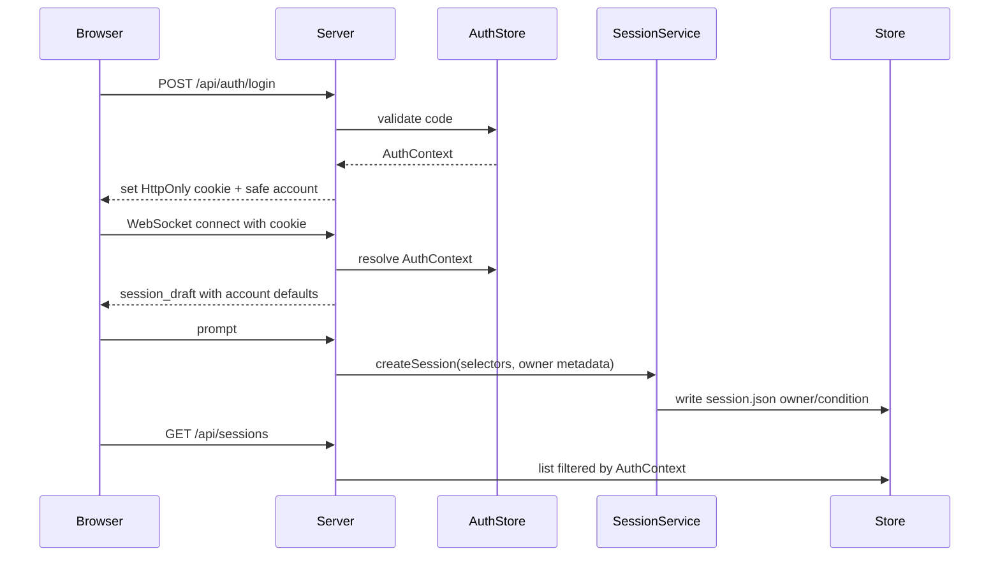

# Pilot Auth And Ownership Foundation Design

## 0. Terminology

- **Account**: app-level identity loaded from the data directory. It is not
  nginx Basic Auth and not a public registration profile.
- **Participant**: an account with `role=participant`. Participant requests see
  only owned participant sessions.
- **Researcher/Admin**: account roles with broader development/research access.
  v0.5.0 does not build global admin UI.
- **Role condition**: analysis-facing condition field mapped to a role preset
  slug. It is not `project`.
- **Session ownership**: persisted link from session header to account id.
- **Legacy/researcher session**: existing v0.4 session with no owner account.
  Kept readable to researcher/admin, not listed to participants.

Terminology grep: no existing `account`, `participant`, or `roleCondition`
module exists in `alt-theory-app/web-server/`. Existing `projectId` remains a
separate grouping/default mechanism.

## 1. Decisions and Constraints

Requirement summary: add the narrow backend foundation that lets hand-created
pilot accounts log in, create owned sessions, and receive filtered session
catalog/detail results. Success means ownership and role condition are durable
and participant APIs do not expose other users' sessions.

Complexity tier: file-backed local/VPS default tier. No database, OAuth,
self-registration, global admin UI, or multi-tenant deployment abstraction.

Key decisions:

- Account data is data-dir backed, not source-code hardcoded.
- Login code/password is stored as a hash.
- Auth browser state uses a minimal HttpOnly cookie/session token mechanism.
- App identity applies to REST and WebSocket connection setup.
- Participant sessions persist owner and role condition in v0.4 session header
  extensions.
- Participant draft defaults use account `defaultRoleCondition` mapped to a
  role preset.
- Researcher/admin can still operate existing ownerless workbench sessions.
- This feature records privacy defaults but does not implement private-session
  retention or file download/delete. Those are the next feature.

Explicit non-goals:

- no self-registration;
- no full admin UI;
- no global participant management UI;
- no private-session deletion logic;
- no participant view shell polish;
- no latest-turn delete/edit/fork UI changes;
- no role-preset content creation;
- no dependency on `project` for participant condition.

## 2. Nouns and Orchestration

### 2.1 Noun Layer

#### Account Store

Current state: no app-level auth module exists. `server.ts` exposes REST and
WebSocket routes without user identity.

Change: add a small auth/account module under `alt-theory-app/web-server/`.

```ts
type AccountRole = "participant" | "researcher" | "admin";
type AccountStatus = "active" | "disabled";

type AccountRecord = {
  schemaVersion: 1;
  accountId: string;
  displayLabel: string;
  role: AccountRole;
  status: AccountStatus;
  loginCodeHash: string;
  defaultRoleCondition: string | null;
  defaultConsent: {
    researcherReadable: boolean;
    quoteAfterAnonymization: boolean;
  };
  limits?: {
    maxTurnsPerSession?: number | null;
    maxSessions?: number | null;
  };
  createdAt: string;
  updatedAt: string;
};
```

Example: `{dataDir}/accounts/accounts.json` contains participant `p01` with
`defaultRoleCondition="conceptual-theory"`. `POST /api/auth/login` with the
matching code sets an auth cookie and `GET /api/auth/me` returns safe fields.

#### Auth Identity

Current state: route handlers and WebSocket connections have no account
context.

Change: add helper functions that parse the request cookie, validate the
account/session token, and return:

```ts
type AuthContext = {
  accountId: string | null;
  role: "anonymous" | AccountRole;
  displayLabel: string | null;
  defaultRoleCondition: string | null;
  defaultConsent: AccountRecord["defaultConsent"] | null;
};
```

Anonymous access remains allowed only where explicitly retained for local
researcher/dev compatibility. Participant-owned data requires account context.

#### Session Header Extension

Current state: `V4SessionHeader` has `sessionId`, `projectId`,
`activeBranchId`, and `recordModel`.

Change: extend v0.4 header compatibly:

```ts
type SessionVisibility = "research" | "private";

type V4SessionHeader = {
  // existing fields...
  ownerAccountId?: string | null;
  roleCondition?: string | null;
  visibility?: SessionVisibility;
  consentSnapshot?: {
    researcherReadable: boolean;
    quoteAfterAnonymization: boolean;
    privateOverride: boolean;
  };
  lastActivityAt?: string;
  retentionDueAt?: string | null;
};
```

Example: first prompt from participant `p01` writes `ownerAccountId="p01"` and
`roleCondition="conceptual-theory"` to `records/session.json`.

#### Role Condition Registry

Current state: role presets are discovered directly from
`agent-assets/role-presets/`; `project` can hold defaults but is not a
participant condition.

Change: add minimal mapping from condition id to role preset slug, loaded from
config/data with a tiny default.

```ts
type RoleConditionRecord = {
  conditionId: string;
  rolePresetSlug: string;
  displayName: string;
};
```

Initial expected mapping:

```text
conceptual-theory -> role-conceptual-theory-companion
metatheory-oriented -> role-metatheory-oriented
```

Missing role preset is a setup error for that account/session.

### 2.2 Orchestration Layer



Current state: `server.ts` creates one shared `SessionService`, exposes
unfiltered session REST routes, and starts each WebSocket with draft selectors
from backend defaults/project changes.

Change:

- register `/api/auth/login`, `/api/auth/logout`, `/api/auth/me`;
- resolve auth context for REST routes and WebSocket connections;
- draft selectors use account role-condition defaults for participant sessions;
- `SessionService.createSession` receives ownership metadata;
- REST session list/detail filter by auth context;
- ownerless legacy/researcher sessions remain hidden from participants and
  visible to researcher/admin.

Flow constraints:

- disabled account login returns 403;
- invalid code returns 401 with generic error;
- missing auth on participant-protected routes returns 401;
- participant requesting another account's session detail returns 404 or 403,
  with no transcript leak;
- failed first-send materialization must not create an ownerless participant
  session;
- auth should not log codes, hashes, cookies, or env secrets.

### 2.3 Mount Point List

- `server.ts` route table — add `/api/auth/login`, `/api/auth/logout`,
  `/api/auth/me`.
- WebSocket connection setup — resolve auth context and include participant
  defaults in draft creation.
- Session REST routes — apply auth-aware list/detail filtering.
- Session creation path — persist owner/roleCondition/consent metadata in
  `records/session.json`.
- Data directory — add `{dataDir}/accounts/accounts.json` account store.

### 2.4 Push Strategy

1. Auth store skeleton: file-backed account loading, hashing/verification, and
   safe account serialization.
   Exit signal: unit tests cover valid, disabled, missing, and wrong-code
   accounts.
2. Auth routes and cookie/session identity: login/logout/me plus request auth
   resolver.
   Exit signal: backend route tests cover cookie round trip and no secret
   leakage.
3. Session ownership persistence: extend session header and create-session
   input.
   Exit signal: service test creates an owned session with roleCondition and
   consent snapshot.
4. Auth-aware REST catalog/detail: filter participant access while preserving
   researcher/admin access.
   Exit signal: backend tests prove participant sees own sessions only.
5. WebSocket draft/first-send ownership: resolve auth context on connection and
   apply role-condition defaults.
   Exit signal: WebSocket test first-send creates an owned role-conditioned
   session.

### 2.5 Structure Health and Micro-refactor

##### Evaluation

- File-level — `server.ts`: already owns many REST and WebSocket branches. This
  feature adds route registration and auth context wiring, but auth logic itself
  should live in new modules.
- File-level — `session-service.ts`: large but already owns create/open
  lifecycle. Add only ownership fields to create-session input and header write;
  avoid adding auth policy logic here.
- File-level — `session-store.ts`: already owns catalog/detail projection. Add
  small filter helpers or a wrapper, not account loading.
- Directory-level — `alt-theory-app/web-server/`: flat but already uses
  focused modules (`projects.ts`, `session-deletion.ts`, `skill-assets.ts`).
  Adding `auth-accounts.ts` / `auth-session.ts` matches current pattern.

Compound convention search found no active naming/ownership decision specific
to this area.

##### Conclusion: skip

No behavior-preserving micro-refactor is required before this feature. The
feature proceeds by adding focused auth modules and narrow integration points.

## 3. Acceptance Contract

Key scenarios:

1. Valid participant code logs in and `GET /api/auth/me` returns safe identity.
2. Wrong code does not disclose whether the account exists.
3. Disabled account cannot log in.
4. Participant first-send creates a session with `ownerAccountId`,
   `roleCondition`, and consent snapshot.
5. Participant catalog lists only that participant's sessions.
6. Participant detail request for another account's session does not return
   transcript/detail content.
7. Researcher/admin can still see existing ownerless/researcher sessions.
8. WebSocket draft for a participant applies the configured role condition.

Reverse checks:

- no self-registration UI or route;
- no private retention/delete implementation in this feature;
- no project dependency for role condition;
- no role-preset text creation;
- no global admin UI.

## 4. Architecture Relationship

This feature will require architecture writeback after acceptance:

- `core-session-engine.md`: app identity, owner metadata, auth-aware catalog.
- `researcher-console.md`: participant/researcher/debug view boundary once the
  frontend shell feature lands.

The full participant shell and privacy retention behavior are intentionally
deferred to later v0.5 child features.
