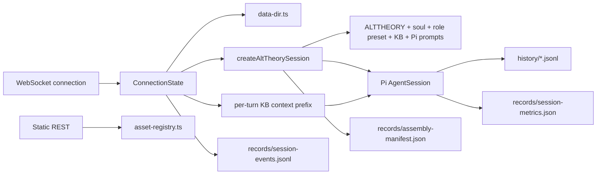

# Architecture: Core Session Engine

## Current Asset Loading Note

This document records the current backend session-engine behavior after the
2026-06-08 agent-asset loading repair. The backend no longer depends on the
removed `agent-assets/runtime/pi-tui/` context or the duplicate
`alt-theory-app/web-server/assets/kb/` copy.

The current session creation path loads semantic assets from `agent-assets/`
and Pi adapter prompt templates from `agent-assets/prompts/pi/`.

## 0. Terminology

- **Session**: one Pi conversation owned by one live WebSocket connection.
- **Session workspace**: Pi tool `cwd`.
- **Pi session directory**: storage for Pi's timestamped JSONL history.
- **Write directory**: the session workspace; agent-authored notes and summaries
  live directly under Pi's `cwd`.
- **Records directory**: Alt Theory-owned manifest, metrics, and runtime events.
- **Assembly manifest**: immutable provenance record for application context,
  soul, role preset, KB selection, Pi adapter prompts, paths, model, and
  provider.
- **Prompt assembly**: the full set of backend-controlled model-visible
  instructions assembled at session creation.
- **Per-turn context prefix**: current hardcoded backend text prepended to user
  prompts when a specific KB domain is selected. This is a temporary hook
  substitute, not a complete hook system.
- **Session metrics**: mutable counters plus Pi token/cost/context statistics.
- **Session events**: append-only Alt Theory control/outcome events without
  conversation bodies.

## 1. Structure



Code anchors:

- `alt-theory-app/core/data-dir.ts`: data-root and session-directory ownership.
- `alt-theory-app/core/agent-assets.ts`: centralized agent-asset path resolver
  and loaded-file hash references.
- `alt-theory-app/core/core-soul.ts`: module parsing, selection, validation, and
  deterministic assembly.
- `alt-theory-app/core/alt-theory-core.ts`: resource loader, tool policy,
  persistent Pi session creation, and manifest.
- `alt-theory-app/web-server/asset-registry.ts`: safe role-preset/KB slugs.
- `alt-theory-app/web-server/server.ts`: REST routes and per-connection
  WebSocket lifecycle.
- `alt-theory-app/web-server/session-metrics.ts`: Pi-native metric mapping and
  atomic snapshot persistence.
- `alt-theory-app/web-server/session-events.ts`: bounded append-only runtime
  event persistence.
- `alt-theory-app/web-server/websocket-protocol.ts`: shared transport types.

## 2. Session Creation

1. Alt Theory generates a UUID and creates:
   `sessions/{id}/workspace`, `history`, and `records`.
2. The core creates `SessionManager.create(sessionCwd, piSessionDir)` and sets
   the same session ID.
3. `DefaultResourceLoader` loads Pi adapter prompt templates from
   `agent-assets/prompts/pi/`.
4. Prompt layers are appended in this order: Alt Theory application context,
   soul, optional core-soul modules, selected role preset, KB declaration,
   optional write policy.
5. Pi returns the reserved timestamped JSONL path. Pi physically writes it once
   an assistant message is present.
6. Alt Theory atomically writes `records/assembly-manifest.json` and appends
   session/runtime events to `records/session-events.jsonl`.

## 3. Prompt Assembly And Injection

Current model-visible content has two levels.

### Session-Creation Assembly

`createAltTheorySession()` creates a `DefaultResourceLoader` with:

- Pi adapter prompt templates from `agent-assets/prompts/pi/`;
- no Alt Theory runtime `AGENTS.md` file;
- `appendSystemPromptOverride` layers in this order:
  1. `agent-assets/ALTTHEORY.md`;
  2. `agent-assets/soul.md`;
  3. optional core-soul module content, when configured;
  4. selected `agent-assets/role-presets/{slug}.md`;
  5. KB root declaration;
  6. write policy when write tools are enabled.

The assembly manifest records the selected paths, existence flags, and SHA-256
hashes for app context, soul, and role preset. It also records KB root/domain,
Pi prompt-template directory, provider/model, session directories, and Pi JSONL
path. Full content snapshots are deferred.

Code anchors:

- `alt-theory-app/core/alt-theory-core.ts`: `DefaultResourceLoader`,
  `agentsFilesOverride`, and `appendSystemPromptOverride`.
- `alt-theory-app/core/agent-assets.ts`: asset root resolution and file hashes.
- `agent-assets/prompts/pi/`: Pi adapter prompt-template directory.

### Per-Turn Context Prefix

For each WebSocket `prompt` message, `server.ts` currently checks the selected
KB domain. When the domain is not `all`, it prepends this hidden backend string
to the user payload before calling `session.prompt()`:

```text
[Context: Search in {kbDir}/{domain}/ unless user says otherwise.]
```

This means a domain-specific session currently sends a backend-augmented prompt
on every user turn. The behavior is current architecture, but it is a known
design weakness: it implements context policy as string concatenation in the
WebSocket handler rather than through an explicit hook/context-policy layer.

The user has decided that injected content should be visible in transcripts.
Other hook-policy choices, such as timing, conditions, and experimental
constant/variable status, remain unsettled.

Code anchor:

- `alt-theory-app/web-server/server.ts`: `prompt` handler builds
  `contextPrefix + msg.payload`.

## 4. Tool Policy

- Read-only: `read`, `ls`, `grep`, `find`.
- Write-enabled: the same tools plus `write`.
- `edit` and `bash` are not enabled by the backend.
- The workspace path restriction is prompt-based guidance, not a hard
  filesystem sandbox. Pi's built-in write tool accepts absolute paths.

## 5. Connection Ownership

Every WebSocket connection owns one `ConnectionState`: session, subscription,
manifest, selected profile/domain, and counters.

- Connect creates a session.
- `new_session` aborts when needed, unsubscribes, disposes, and replaces only
  that connection's session.
- Close cleans up only the owned session.
- Role-preset and KB values are client-safe slugs resolved against server roots.
- Session metadata and metrics use WebSocket; static discovery uses REST.

## 6. Discovery And Introspection

REST:

- `GET /api/role-presets`
- `GET /api/profiles` legacy compatibility alias
- `GET /api/kb-domains`

Both return sorted `{ slug, displayName }` arrays without filesystem paths.

WebSocket:

- server: `session_metadata`, `session_metrics`
- client: `get_session_metadata`, `get_session_metrics`

Metrics include message/turn/tool counts, token totals, cost, and nullable
context usage. Successful runs atomically update
`records/session-metrics.json`.

Runtime events currently cover session creation, KB/profile selection, and run
completion/failure/abort. Pi JSONL remains the conversation record; event files
do not duplicate message bodies.

## 7. Model Configuration

The core may receive an explicit Pi `models.json` path plus provider/model
selection and a runtime-only API key. `ModelRegistry` loads custom model
definitions independently of Pi's built-in model catalog. Runtime keys use
`AuthStorage.setRuntimeApiKey()` and are not persisted by Alt Theory.

The tracked runtime model configuration currently includes Xiaomi MiMo Token
Plan through its Anthropic-compatible endpoint. Model entries can be updated
without upgrading Pi. Its zero cost fields mean no comparable per-token price
is configured; they are not a billing claim.

## 8. Known Constraints

- Session list/resume is not implemented, but it is now considered mandatory
  for the researcher console.
- Role-preset changes apply to the next new session; KB domain changes affect
  the next prompt prefix.
- The per-turn KB context prefix is a temporary hardcoded hook substitute.
  There is no explicit hook/context-policy layer yet.
- The assembly manifest hashes selected app context, soul, and role-preset
  files, but does not yet snapshot all injected content.
- Runtime config is easy to mislaunch: generic Anthropic-compatible environment
  variables do not select the tracked Alt Theory provider/model unless the
  `ALT_THEORY_MODEL_*` and `ALT_THEORY_MODELS_PATH` values are set.
- Pi-native resume has been verified to preserve JSONL history and cwd while a
  newly created runtime can apply a new profile/system prompt. Alt Theory does
  not yet expose or event-log that transition.
- Soul is loaded from `agent-assets/soul.md`; optional core-soul module
  activation remains configured by backend environment/config, not UI.
- Hard write-path enforcement, thinking events, compaction/retry events, and
  provider/auth UI are deferred.
- Frontend consumption of the new APIs is a separate workstream.

## 9. Verification

- `npm run test:backend`: local unit and integration suite.
- `npm run smoke:core`: real Pi initialization without an external model turn.
- `npm run smoke:backend`: three-turn MiMo live test covering identity,
  KB retrieval, workspace write, metrics, events, and JSONL persistence.
- `npm run smoke:resume`: Pi-native resume probe with a changed resume-time
  role preset marker. Both live commands require explicit external-provider
  approval.

## Change Log

- 2026-06-08: Added current prompt assembly and per-turn context-prefix
  architecture, including the known hardcoded hook-substitute constraint.
- 2026-06-08: Updated after minimal agent-asset loading repair. Backend now
  loads `ALTTHEORY.md`, `soul.md`, `role-presets/default.md`,
  `agent-assets/kb/`, and `agent-assets/prompts/pi/`.

## Related Documents

- `project/architecture/researcher-console.md`: browser console consuming the
  session engine for live testing, inspection, and future session work.
