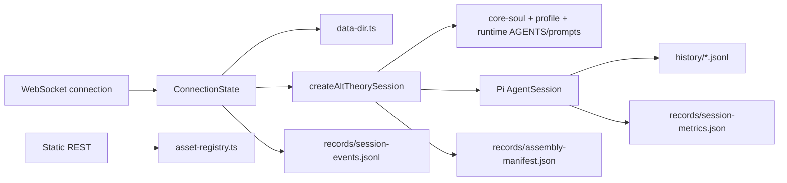

# Architecture: Core Session Engine

## 0. Terminology

- **Session**: one Pi conversation owned by one live WebSocket connection.
- **Session workspace**: Pi tool `cwd`.
- **Pi session directory**: storage for Pi's timestamped JSONL history.
- **Write directory**: the session workspace; agent-authored notes and summaries
  live directly under Pi's `cwd`.
- **Records directory**: Alt Theory-owned manifest, metrics, and runtime events.
- **Assembly manifest**: immutable provenance record for runtime assets, profile,
  core-soul selection, paths, model, and provider.
- **Session metrics**: mutable counters plus Pi token/cost/context statistics.
- **Session events**: append-only Alt Theory control/outcome events without
  conversation bodies.

## 1. Structure

Code anchors:

- `alt-theory-app/core/data-dir.ts`: data-root and session-directory ownership.
- `alt-theory-app/core/core-soul.ts`: module parsing, selection, validation, and
  deterministic assembly.
- `alt-theory-app/core/alt-theory-core.ts`: resource loader, tool policy,
  persistent Pi session creation, and manifest.
- `alt-theory-app/web-server/asset-registry.ts`: safe profile/KB slugs.
- `alt-theory-app/web-server/server.ts`: REST routes and per-connection
  WebSocket lifecycle.
- `alt-theory-app/web-server/session-metrics.ts`: Pi-native metric mapping and
  atomic snapshot persistence.
- `alt-theory-app/web-server/session-events.ts`: bounded append-only runtime
  event persistence.
- `alt-theory-app/web-server/websocket-protocol.ts`: shared transport types.

## 2. Session Creation

1. Alt Theory generates a UUID and creates:
   `sessions/{id}/workspace`, `history`, and `records`.
2. The core creates `SessionManager.create(sessionCwd, piSessionDir)` and sets
   the same session ID.
3. `DefaultResourceLoader` explicitly loads runtime `AGENTS.md` and prompt
   templates because the per-session workspace is not the runtime asset root.
4. Prompt layers are appended in this order: core-soul, profile, KB
   declaration, optional write policy.
5. Pi returns the reserved timestamped JSONL path. Pi physically writes it once
   an assistant message is present.
6. Alt Theory atomically writes `records/assembly-manifest.json` and appends
   session/runtime events to `records/session-events.jsonl`.

## 3. Tool Policy

- Read-only: `read`, `ls`, `grep`, `find`.
- Write-enabled: the same tools plus `write`.
- `edit` and `bash` are not enabled by the backend.
- The workspace path restriction is prompt-based guidance, not a hard
  filesystem sandbox. Pi's built-in write tool accepts absolute paths.

## 4. Connection Ownership

Every WebSocket connection owns one `ConnectionState`: session, subscription,
manifest, selected profile/domain, and counters.

- Connect creates a session.
- `new_session` aborts when needed, unsubscribes, disposes, and replaces only
  that connection's session.
- Close cleans up only the owned session.
- Profile and KB values are client-safe slugs resolved against server roots.
- Session metadata and metrics use WebSocket; static discovery uses REST.

## 5. Discovery And Introspection

REST:

- `GET /api/profiles`
- `GET /api/kb-domains`

Both return sorted `{ slug, displayName }` arrays without filesystem paths.

WebSocket:

- server: `session_metadata`, `session_metrics`
- client: `get_session_metadata`, `get_session_metrics`

Metrics include message/turn/tool counts, token totals, cost, and nullable
context usage. Successful runs atomically update
`records/session-metrics.json`.

Runtime events currently cover session creation, KB/profile selection, and run
completion/failure/abort. Pi JSONL remains the conversation record; event files
do not duplicate message bodies.

## 6. Model Configuration

The core may receive an explicit Pi `models.json` path plus provider/model
selection and a runtime-only API key. `ModelRegistry` loads custom model
definitions independently of Pi's built-in model catalog. Runtime keys use
`AuthStorage.setRuntimeApiKey()` and are not persisted by Alt Theory.

The tracked runtime model configuration currently includes Xiaomi MiMo Token
Plan through its Anthropic-compatible endpoint. Model entries can be updated
without upgrading Pi. Its zero cost fields mean no comparable per-token price
is configured; they are not a billing claim.

## 7. Known Constraints

- Session list/resume is not implemented.
- Profile changes apply to the next new session; KB domain changes affect the
  next prompt prefix.
- Pi-native resume has been verified to preserve JSONL history and cwd while a
  newly created runtime can apply a new profile/system prompt. Alt Theory does
  not yet expose or event-log that transition.
- Core-soul activation is configured by backend environment/config, not UI.
- Hard write-path enforcement, thinking events, compaction/retry events, and
  provider/auth UI are deferred.
- Frontend consumption of the new APIs is a separate workstream.

## 8. Verification

- `npm run test:backend`: local unit and integration suite.
- `npm run smoke:core`: real Pi initialization without an external model turn.
- `npm run smoke:backend`: three-turn MiMo live test covering identity,
  KB retrieval, workspace write, metrics, events, and JSONL persistence.
- `npm run smoke:resume`: Pi-native resume probe with a changed resume-time
  profile. Both live commands require explicit external-provider approval.
