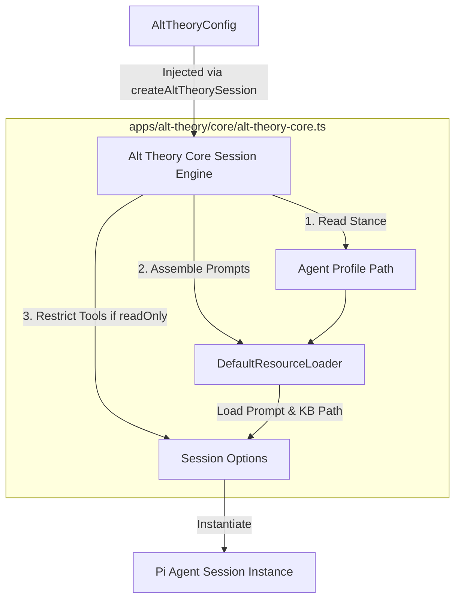

# Architecture: Core Session Engine

## 0. Terminology

* **Pi Coding Agent (`@mariozechner/pi-coding-agent`)**: The underlying LLM agent framework which provides native tools, resource loaders, and session managers.
* **Resource Loader (`DefaultResourceLoader`)**: A Pi Coding Agent class responsible for reading, reloading, and dynamically assembling system prompt assets and configuration states.
* **Agent Profile**: The personality, instructions, or soul overrides injected into the LLM system prompt template before runtime.
* **Read-Only Mode**: A safety mode that restricts the agent's available tools to search-only and read-only tools, disabling code writing or execution capabilities.
* **Coding Mode**: Full-capabilities execution mode where the agent has write, edit, and bash tool execution access.

---

## 1. Positioning and Audience

* **Coverage**: Wraps and configures the raw Pi Coding Agent API specifically for Alt Theory backend and frontend clients (`apps/alt-theory/core/alt-theory-core.ts`).
* **Audience**: Backend developers, feature designers, and future agents writing features that interact with the agent session or add frontend interactions.
* **Usage**: Explains how system prompts, tool restrictions, and directory scopes are injected at runtime during session initialization.

---

## 2. Structure and Interaction

The core session engine orchestrates inputs from files and runtime parameters to spawn a secure, localized LLM coding agent session.

### Flow and Interaction Sequence:
1. **Configuration Resolution**: The caller invokes [createAltTheorySession()](file:///%LLM_THEO_WORKTREES_ROOT%/llm-theo-v0.3-dev/apps/alt-theory/core/alt-theory-core.ts#L41) with paths for `rootDir`, `kbDir`, and an optional `profilePath`.
2. **Profile Injection**: If `profilePath` exists, the file is read synchronously and appended as `## Agent Profile` to the system prompt override list.
3. **Knowledge Base Binding**: The absolute path of the `kbDir` is resolved and appended as `## Knowledge Base` to the system prompt to declare the coding search directory.
4. **Tool Restraints**: 
   * If `readOnly` is true, the session is instantiated with `noTools: "all"` and a restricted whitelist: `["read", "ls", "grep", "find"]`.
   * Otherwise, the full suite of default read-write-execute coding tools is loaded.

---

## 3. Data and State

### AltTheoryConfig Interface
Declared at [alt-theory-core.ts:L23-32](file:///%LLM_THEO_WORKTREES_ROOT%/llm-theo-v0.3-dev/apps/alt-theory/core/alt-theory-core.ts#L23-32):
* `rootDir`: Root directory path where runtime agent files live; used as the working directory.
* `kbDir`: Path of the read-only Knowledge Base used for agent searching and reference.
* `profilePath`: Optional path to an agent profile configuration markdown file.
* `readOnly`: Boolean flag triggering tool reduction (read-only) vs full-write mode.

### State Ownership
* **Session Manager**: The session is instantiated with `SessionManager.inMemory()`. State (conversation history, token consumption, memory) is preserved in-memory for the duration of the Node process and is not persisted to disk.

---

## 4. Key Decisions

* **Wrapper-Based Decoupling**: Rather than directly calling `@mariozechner/pi-coding-agent` in the web controller layers, the wrapper separates the framework package dependency from application-level routes.
* **In-Memory Lifetimes**: The decision to use in-memory SessionManager keeps the server stateless and avoids disk pollution for transient chat runs.
* **Read-Only vs Coding Tool Whitelists**: Whitelists are hardcoded locally to guarantee that the LLM cannot invoke hidden tool capabilities when in preview/read-only user modes.

---

## 5. Code Anchors

* `apps/alt-theory/core/alt-theory-core.ts:createAltTheorySession` — Main session factory endpoint.
* `apps/alt-theory/core/alt-theory-core.ts:READONLY_TOOLS` — Whitelisted tools for secure user execution.
* `apps/alt-theory/core/test-core.ts` — Core integration test suite.

---

## 6. Known Constraints / Edge Cases

* **Hardcoded Whitelist**: The `READONLY_TOOLS` array is static. Custom read-only tools cannot be injected dynamically without changing the code.
* **Synchronous File Reads**: The agent profile file is read using `readFileSync` during initialization. Large profile files will block the main Node loop during session start.
* **Single CWD Lock**: The workspace path is resolved absolutely during startup and cannot be changed dynamically once the session is active.

---

## 7. Related Documents

* [repo-structure-v0.3.md](file:///%LLM_THEO_WORKTREES_ROOT%/llm-theo-v0.3-dev/project/architecture/repo-structure-v0.3.md)
* [pi-alt-theory-spec-v0.6.imported.md](file:///%LLM_THEO_WORKTREES_ROOT%/llm-theo-v0.3-dev/project/architecture/pi-alt-theory-spec-v0.6.imported.md)
