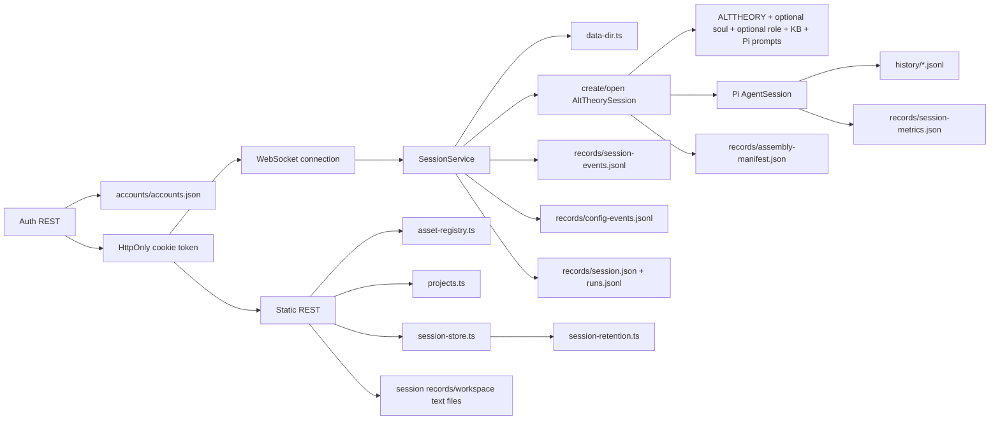

# Architecture: Core Session Engine

## Current Asset Loading Note

This document records the current backend session-engine behavior after the
2026-06-08 agent-asset loading repair. The backend no longer depends on the
removed `agent-assets/runtime/pi-tui/` context or the duplicate
`alt-theory-app/web-server/assets/kb/` copy.

The current session creation path loads semantic assets from `agent-assets/`
and Pi adapter prompt templates from `agent-assets/prompts/pi/`.

## 0. Terminology

- **Session**: one materialized Pi conversation owned by `SessionService`.
- **Draft session**: connection-local launch state containing selected KB,
  role preset, and soul before the first prompt. Drafts are not persisted.
- **Session ID**: Alt Theory-owned identifier generated before Pi session
  creation. New v0.4 sessions use
  `YYYYMMDD-HHmmss__{role}__{soul}__{model}` with a numeric collision suffix.
  Pi receives that id via `SessionManager.newSession({ id })`.
- **Session workspace**: Pi tool `cwd`.
- **Pi session directory**: storage for Pi's timestamped JSONL history.
- **Write directory**: the session workspace; agent-authored notes and summaries
  live directly under Pi's `cwd`.
- **Records directory**: Alt Theory-owned manifest, metrics, and runtime events.
- **Assembly manifest**: immutable provenance record for application context,
  optional soul, optional role preset, KB selection, Pi adapter prompts, paths, model, and
  provider.
- **Prompt assembly**: the full set of backend-controlled model-visible
  instructions assembled at session creation.
- **KB declaration**: neutral model-visible prompt assembly text that tells the
  agent where the knowledge-base root is, or that KB-folder retrieval is
  disabled. It does not tell the agent to search on every turn.
- **Session metrics**: mutable counters plus Pi token/cost/context statistics.
- **Session events**: append-only Alt Theory control/outcome events without
  conversation bodies.
- **Run label / test batch**: optional launch-time metadata recorded in
  manifests for grouping manual UAT sessions without changing provider/model
  identity.
- **Effective config**: analysis-facing snapshot of the active project, KB,
  soul, role preset, provider/model, prompt mode, and resource discovery mode.
- **Config event**: append-only record in `records/config-events.jsonl` for
  creation, user config changes, and resume fallback.
- **Research project**: optional local JSON record under `{dataDir}/projects`
  for grouping and defaults. Project setup is not mandatory.
- **Deletion marker**: optional `records/deleted.json` tombstone that hides a
  session from the normal catalog without removing recoverable data.
- **Session alias**: optional UI display name persisted as
  `records/ui-alias.json`. It is read and written through the session file
  routes; it is not part of the core session header schema.
- **Account**: data-dir backed app identity record under
  `{dataDir}/accounts/accounts.json`. It is separate from outer deployment
  Basic Auth.
- **Auth context**: request/connection identity resolved from an HttpOnly
  browser session cookie. It is anonymous, participant, researcher, or admin.
- **Session owner**: optional `ownerAccountId` persisted in
  `records/session.json`. Participant-created sessions are owner-filtered by
  REST APIs.
- **Role condition**: participant/study condition stored separately from
  `projectId` and mapped to a role preset slug at WebSocket draft creation.
- **Private session**: session with `visibility: private` in
  `records/session.json`. It is owner-readable but blocked from normal
  researcher/admin detail and file routes.
- **Inactive retention**: private sessions are due for hard deletion at
  `lastActivityAt + 7 days`; opening or reading detail does not refresh it.

## 1. Structure



Code anchors:

- `alt-theory-app/core/data-dir.ts`: data-root and session-directory ownership.
- `alt-theory-app/core/agent-assets.ts`: centralized agent-asset path resolver
  and loaded-file hash references.
- `alt-theory-app/core/core-soul.ts`: module parsing, selection, validation, and
  deterministic assembly.
- `alt-theory-app/core/alt-theory-core.ts`: resource loader, tool policy,
  persistent Pi session creation/opening, and manifest.
- `alt-theory-app/web-server/asset-registry.ts`: safe role/KB slugs.
- `alt-theory-app/web-server/auth-accounts.ts`: data-dir backed account store,
  login-code hashing, verification, and safe account serialization.
- `alt-theory-app/web-server/auth-session.ts`: process-local browser session
  tokens, HttpOnly cookie helpers, and request auth-context resolution.
- `alt-theory-app/web-server/server.ts`: REST routes and per-connection
  WebSocket lifecycle.
- `alt-theory-app/web-server/session-metrics.ts`: Pi-native metric mapping and
  atomic snapshot persistence.
- `alt-theory-app/web-server/session-events.ts`: bounded append-only runtime
  event persistence.
- `alt-theory-app/web-server/config-events.ts`: effective config snapshots and
  append-only config event persistence.
- `alt-theory-app/web-server/projects.ts`: optional local project records.
- `alt-theory-app/web-server/session-service.ts`: application-owned session
  runtime lifecycle, WebSocket subscriptions, prompt/abort operations, and
  single-process mutation guard.
- `alt-theory-app/web-server/session-records.ts`: schema-versioned v0.4
  foundation records and branch-aware path helpers.
- `alt-theory-app/web-server/session-store.ts`: historical session catalog,
  detail inspection, v0.4/legacy projection, Pi JSONL discovery, and bounded preview.
- `alt-theory-app/web-server/session-retention.ts`: private retention due-date
  calculation, activity refresh, and explicit expired-private-session cleanup.
- `alt-theory-app/web-server/websocket-protocol.ts`: shared transport types.

## 2. Session Creation

1. WebSocket connect resolves the auth cookie, creates only an unpersisted
   draft selector set, and sends `session_draft`. It does not create a
   `sessions/{id}` directory.
2. The first `prompt` allocates a readable session ID, then creates
   `sessions/{id}/workspace`, `history`, and `records`.
3. The core creates `SessionManager.create(sessionCwd, piSessionDir)` and sets
   the same session ID.
4. `DefaultResourceLoader` loads Pi adapter prompt templates from
   `agent-assets/prompts/pi/`.
5. Prompt layers are appended in this order: Alt Theory application context,
   selected soul when present, optional core-soul modules, selected role preset
   when present, KB declaration, selected KB domain metadata when present,
   optional write policy.
6. Pi returns the reserved timestamped JSONL path. Pi physically writes it once
   an assistant message is present.
7. Alt Theory atomically writes `records/assembly-manifest.json` and appends
   session/runtime events to `records/session-events.jsonl`.
8. If provided, `ALT_THEORY_RUN_LABEL` and `ALT_THEORY_TEST_BATCH` are recorded
   in the manifest as `runLabel` and `testBatch`.
9. For participant auth contexts, `records/session.json` also records
   `ownerAccountId`, `roleCondition`, `visibility`, `consentSnapshot`,
   `lastActivityAt`, and `retentionDueAt`. Private creation forces
   `consentSnapshot.privateOverride: true` and calculates the first
   `retentionDueAt` from creation activity.

## 2.1 Session Catalog And Open

The backend also exposes the current data directory as a historical session
catalog:

- `GET /api/sessions` lists `sessions/{id}` roots without exposing filesystem
  paths in each summary.
- `GET /api/sessions/{id}` returns bounded detail: manifest, metrics, event
  tail, Pi JSONL info, context counts, and a small transcript preview.

When `{dataDir}/accounts/accounts.json` has configured accounts, session REST
routes require app identity. Participant accounts see only sessions whose
`ownerAccountId` matches their account. Researcher/admin accounts can see
ownerless researcher workbench sessions and participant-owned sessions. When no
account store is configured, anonymous access keeps the old local workbench
behavior for v0.4 compatibility.

Private sessions remain visible as summaries for operations, but normal
detail/transcript/file content access is owner-only. Researcher/admin REST
detail and file routes return a private-content error instead of exposing the
Pi transcript or workspace files.

WebSocket `open_session` makes an existing session the current live session for
that connection. The server reads the detail record, opens the existing Pi JSONL
with `openAltTheorySession()`, then sends the same metadata triplet used after a
fresh session:

```text
session_opened
session_metadata
session_metrics
```

The original `records/assembly-manifest.json` is not overwritten on resume.
Resume-time active runtime facts are written to `records/resume-manifest.json`,
and drift warnings are returned in the active manifest/snapshot.

## 3. Prompt Assembly And Injection

Current model-visible content has two levels.

### Session-Creation Assembly

`createAltTheorySession()` creates a `DefaultResourceLoader` with:

- Pi adapter prompt templates from `agent-assets/prompts/pi/`;
- no Alt Theory runtime `AGENTS.md` file;
Since v1-alpha M1 (2026-07-15), the session has a per-session capability mode
(`pure`/`full`, spec §3.2) that decides how the layers apply. The semantic
sections are, in order:
  1. `agent-assets/ALTTHEORY.md`;
  2. selected `agent-assets/soul/{slug}.md`, when a soul is selected;
  3. selected `agent-assets/role-presets/{slug}.md`, when a role preset is
     selected;
  4. selected custom instruction text asset, when present;
  5. KB root declaration;
  6. selected KB domain metadata from `agent-assets/kb/metadata/domains.json`,
     when a concrete KB domain such as `ep-core` is selected.

In Pure, `systemPromptOverride` replaces Pi's default prompt with these
sections plus two Pure-only sections (tool harness description; write policy
when write tools are enabled). In Full, Pi's default prompt is preserved and
the semantic sections are appended via `appendSystemPromptOverride`. Mode is
mutable on the live session: `setMode` re-runs `loader.reload()` and swaps the
active tool set; Pi applies both from the next turn. Mode persists in
`session.json` (`mode`, absent = pure) and maps 1:1 onto the manifest
`promptMode` field (`alt-only` = pure, `pi-default` = full).

The assembly manifest records the selected paths, existence flags, and SHA-256
hashes for app context, soul, role preset, and custom instruction when present.
It also records the loaded skills with their source: `alt-theory` (bundled
skill directory), `external` (user-enabled via app settings, spec §6.1), or
`workspace` (project skills from a Full-mode working directory, spec §5.1).
Per-mode external skill enablement lives in `{dataDir}/app-settings.json`
(null = default policy: Pure none, Full all discovered), is snapshot at
session open, and is served/edited through `GET /api/resources` +
`PUT /api/resources/skills` (local mode only). Base discovery posture stays
the `resourceDiscovery` knob: `clean` loads no skills, `internal` (the
default) loads Alt bundled + user-enabled externals, and `dev-debug`
additionally merges Pi's ambient global/project discovery for debugging
(ambient skills are not recorded in the manifest).

Pi extension posture since M3/M4 (2026-07-15): ambient extension discovery
stays off in every mode (`noExtensions`); only explicit factories load through
the core `extensionFactories` config. The core always registers the Alt Theory
security extension (`core/security-extension.ts`, §4) last, so it evaluates
tool input as finally mutated by any earlier handlers. Extension
`confirm`/`select`/`input` dialogs reach the web UI through the approval
bridge (`web-server/approval-bridge.ts`): `SessionService` binds an
`ExtensionUIContext` implementation via `session.bindExtensions({ uiContext,
mode: "rpc" })` before any prompt can run, dialog requests become
`approval_requested` session events, and the user's `respond_approval` reply
resolves the pending promise. The bridge fails closed — dispose, abort,
timeout, or no reply reads as rejection (spec §5.2/§5.3).

The manifest also records selected soul/role slugs, including `null` for
`None`, plus KB root/domain, the workspace (§3.1), Pi prompt-template
directory, provider/model, session directories, and Pi JSONL path. Full
content snapshots are deferred.

### 3.1 Workspace Model (spec §5.1)

A Full-capable session has a workspace: the primary working directory (the
session cwd; defaults to the data-dir `workspace/`, or a user-chosen directory
passed at creation) plus zero or more additional directories added
intentionally mid-session. In Full mode only:

- the primary directory receives Pi's own project-context discovery (global
  agent-dir context plus the ancestor AGENTS.md/CLAUDE.md chain via
  `loadProjectContextFiles`); each added directory contributes its own context
  file without climbing its ancestors;
- project skills load from `[primary, ...added] × {.pi/skills,
  .agents/skills}` with manifest source `workspace`;
- the guarded-write roots grow to the primary and added directories.

Pure receives none of this. `addWorkspaceDir` mutates closure state and calls
`session.reload()` (a bare `loader.reload()` would not rebuild the system
prompt). The workspace persists in the `V4SessionHeader` and manifest; reopen
restores the primary as the session cwd, and a fork whose primary lies outside
the data dir does not copy the user's project into the data dir. The
`add_workspace_dir` WebSocket message is local-form only.

Code anchors:

- `alt-theory-app/core/alt-theory-core.ts`: `DefaultResourceLoader`,
  `agentsFilesOverride`, and `appendSystemPromptOverride`.
- `alt-theory-app/core/agent-assets.ts`: asset root resolution and file hashes.
- `agent-assets/prompts/pi/`: Pi adapter prompt-template directory.
- `agent-assets/instructions/`: default custom-instruction catalog root.
- `agent-assets/skills/`: runtime Alt Theory skill root (`internal` discovery).
  Pilot keeps only `conversation-summary/` here.
- `project/local-skills/`: dev-only SWE bundles (`cs-swe-v0-4/`, etc.); not
  runtime-loaded.
- `_archives/skills/`: local ignored historical `cs-swe-*` shards.

Custom instruction changes rebuild the runtime against the same Pi JSONL and
Alt Theory session ID. Explicit visual skill invocation is validated against
the active Alt Theory skills, sent through Pi's native `/skill:name` command,
and recorded as `skill_invoked`.

### KB Context Policy

`SessionService.runPrompt()` sends the user's prompt text to Pi without adding a
per-turn KB instruction. Earlier v0.5 code prepended a hidden
`[Context: Search in ...]` string when a specific KB domain was selected; that
behavior is retired because it made KB use an every-turn backend mandate.

Current behavior is:

- session assembly declares the KB root, or declares KB-folder retrieval
  disabled;
- selected concrete KB domains can inject their own scope/coverage/use policy
  from `agent-assets/kb/metadata/domains.json`;
- role presets should not carry KB catalog metadata or domain-specific KB-use
  policy; they remain role/style/behavior presets;
- KB domain selections are recorded as config events and reflected in session
  metadata, but are not injected as hidden per-turn user-message text;
- transcript projection still strips old `[Context: ...]` prefixes for
  backward compatibility with already-written Pi JSONL histories.

Code anchors:

- `alt-theory-app/core/alt-theory-core.ts`: neutral KB declaration in prompt
  assembly.
- `alt-theory-app/web-server/session-service.ts`: prompt forwarding and config
  event recording.
- `alt-theory-app/web-server/session-store.ts`: old hidden-prefix transcript
  cleanup.

## 4. Tool Policy

Since v1-alpha M1, the session keeps Pi's full tool registry and restricts the
ACTIVE tool set per capability mode (an allowlist would be a lifetime registry
filter and block in-session mode switches):

- Pure read-only: `read`, `ls`, `grep`, `find`.
- Pure write-enabled: the same tools plus `write`.
- Full: Pi's default active set (`read`, `bash`, `edit`, `write`). Since M4
  Full is exposed at the policy boundary; the `ALT_THEORY_ENABLE_FULL` gate is
  removed.
- The write tool is the Alt Theory guarded implementation in every mode: it
  shadows Pi's builtin write and hard-enforces the mode's writable roots
  (Pure: Alt writable roots; Full: plus workspace primary and added
  directories), including symlink dereference
  (`createGuardedWriteOperations`).
- The security extension (`core/security-extension.ts`, a vendored light fork
  per `project/compound/2026-07-15-decision-v1-alpha-security-extension.md`)
  mediates every tool call through Pi's native `tool_call` → `{ block }`
  interception: bash commands are scanned per chain segment and substitution
  body on the NFKC-normalized, de-obfuscated form — a hard blocklist (fs
  destruction, privilege escalation, user management) blocks outright, a
  risky list (`rm`, `curl`, `ssh`, `chmod`, …) and credential-path references
  escalate to the §5.2 approval path (deny / allow once / allow for this
  session with a 30-minute TTL; fail closed without a UI); `edit`/`write`
  paths are bounded to the same writable roots via the shared
  realpath+`path.relative` containment (which lives in this file); credential
  stores (`~/.ssh`, `~/.aws`, `~/.pi/agent/auth.json`, …) are blocked for
  read and write in every mode; URL-shaped custom-tool inputs are checked
  against cloud-metadata/internal-host patterns. Blocked and approved calls
  append to `records/security-audit.jsonl`.
- All of the above is a policy check in trusted code, not an OS sandbox. The
  UI must describe it as policy checks and approvals — guard rails, never a
  sandbox (spec §5.3); OS-level enforcement is out of v1.0-alpha scope.

## 5. Application-Owned Session Service

The backend now owns live runtime state through `SessionService`, not through a
per-WebSocket `ConnectionState`. A WebSocket connection attaches to a managed
session and receives forwarded runtime events.

`SessionService` owns:

- the current Pi `AgentSession` for each managed session;
- assembly manifest, selected KB/role/soul, open mode, resume warnings,
  counters, and transcript cache;
- a single internal Pi subscription per managed session;
- attached WebSocket listeners;
- prompt and abort operations;
- one process-local mutation guard per managed session.

Current behavior:

- WebSocket connect sends `session_draft` and creates no persisted session.
- The first WebSocket `prompt` materializes the draft through
  `SessionService.createSession()`, attaches the socket, sends the normal
  `session_opened` / `session_metadata` / `session_metrics` triplet, then runs
  the prompt.
- `new_session` detaches from any current materialized session and returns the
  connection to draft state using the current selectors. It does not allocate a
  zero-turn replacement session.
- Soul and role-preset switching in draft mutates only draft selectors. After a
  session is materialized, these switches still call service replacement until
  the later live-configuration feature changes that behavior.
- `open_session` validates and opens an existing Pi JSONL through the service.
- WebSocket close detaches the listener only. It does not abort or dispose the
  service-owned runtime. Explicit `abort` remains the cancellation operation.
- A concurrent same-session mutation returns stable `session_busy` instead of
  exposing Pi's raw in-flight prompt error.
- Role and KB values are client-safe slugs resolved against server roots.
- Session metadata and metrics still use WebSocket; static discovery and
  historical session catalog/detail still use REST.

New service-created sessions also write minimal v0.4 foundation records:

```text
records/session.json        # schemaVersion: 1, recordType: session
records/runs.jsonl          # append-only accepted/deleted/superseded run records
records/ui-alias.json       # optional UI display name, written by frontend
records/security-audit.jsonl # append-only security extension block/approval log
```

The required records are thin indexes around Pi JSONL. They do not duplicate
conversation bodies. Pi history is the conversation body authority; Alt Theory
derives deleted/superseded transcript projection from `runs.jsonl` instead of
maintaining a separate branch-index authority. `ui-alias.json` is optional
frontend state stored beside other session-local records so display names
follow the session across browsers without changing `records/session.json`.

`records/session.json` also carries v0.5 pilot metadata when present:
`ownerAccountId`, `roleCondition`, `visibility`, `consentSnapshot`,
`lastActivityAt`, and `retentionDueAt`. Since v1-alpha M7 (2026-07-16) it is
the single source of truth for three more optional fields (M7 decision doc
§3/§5b): `studyTag {studyId, batch?}` (session-level study designation;
absent = daily use; forks inherit it; `setStudyTag` + WS `set_study_tag`
mutate it), `modelOverride {provider, modelId, thinkingLevel?}` (per-session
model choice, §7), and a widened `forkedFrom.purpose` vocabulary
`fork | side | helper | ab-arm` — legacy `collaboration`/`comparison` values
are normalized on read (`collaboration→side`, `comparison→ab-arm`) inside
`readV4SessionHeader`, so every consumer sees only the new vocabulary.
Session-list membership derives from the purpose: only roots and `fork`
belong in the user-facing list; a chosen A/B arm is rewritten to the
continuation. Meaningful prompts refresh private
`lastActivityAt` and `retentionDueAt`; session open/detail reads do not.
`session-retention.ts` provides explicit cleanup for expired private sessions:
it removes history, workspace, and non-tombstone records while leaving
`records/deleted.json`.

Ordinary runs append accepted and terminal snapshots to `records/runs.jsonl`.
Each run maps `sessionId`, `branchId`, `turnId`, `revisionId`, and `runId` to
the Pi session file and user/assistant entry IDs. Latest-turn revision moves
the Pi leaf to the latest user entry's parent, appends a new path with the same
turn ID, and marks the prior run `superseded`; it does not create a logical
branch or delete old Pi evidence. Latest-turn delete moves the Pi leaf to that
user entry's parent, marks the run `deleted`, and does not remove disk evidence.

REST session detail and transcript preview are projected in `session-store.ts`
from the active Pi leaf and run evidence, not from all Pi JSONL entries:

- derive the latest active leaf from completed run records not marked deleted
  or superseded;
- align the opened `SessionManager` to that leaf before building transcript;
- build transcript from `sessionManager.getBranch()`;
- omit entries whose latest run snapshot is `deleted` or `superseded`.

When no active leaf can be derived, the reader keeps Pi's default opened leaf.

Opening or reconfiguring a managed session also aligns Pi's leaf from run
evidence before revise/delete guards run.

Explicit Fork (M5 substrate, 2026-07-15) creates a NEW full session, not a
`fork-NNN` branch:

- the child's Pi JSONL is built by COPYING the parent's persisted branch path
  (never via Pi's `createBranchedSession`, which re-points the live parent
  and survives only one fork cycle) — forking is N-repeatable and never
  kicks the live parent (A/B arms, side chats, helper all fork the same
  live parent);
- the child gets its own readable session ID, dirs, and v0.4 records with
  `forkedFrom: { sessionId, purpose }`;
- default-workspace sessions copy the parent workspace; a §3.1 workspace
  session keeps pointing at the user's external primary directory instead
  of copying it into the data dir;
- an A/B arm (or any child that must differ) can override any assembly
  layer via selector overrides while keeping the parent conversation;
- tool/file side effects before revision or Fork are not rolled back.

Service-created sessions also append a `creation` config event. Supported
idle-time KB/role/soul changes append `user_change` config events. Opening an
existing session whose original role/soul/KB cannot resolve falls back
automatically to the current selectors and appends a `resume_fallback` config
event with warnings. Resume never blocks on a confirmation dialog.

Draft project selection may apply supported defaults before first send. After a
session is materialized, project reassignment updates durable grouping metadata
without changing runtime identity, Pi leaf, or effective prompt layers.

Role, soul, and custom-instruction changes rebuild the internal Pi runtime
against the current Pi JSONL and workspace. They keep the same Alt Theory
`sessionId`. KB changes update the selector and per-turn context policy without
rebuilding the runtime. Busy sessions reject config changes with `session_busy`.

### 5.1 Role Resolution (As-Is)

> **Status note:** This subsection documents **current backend behavior only**.
> It is not a target architecture, rational design decision, or endorsement of
> the `default.md` path. Treat it as an implementation snapshot for debugging
> and ops.

Role presets differ from soul: there is no slug alias chain (no
`role-latest` → `role-default`). Resolution is explicit per layer below.

| Layer | When | Role preset slug |
| --- | --- | --- |
| Draft default | Researcher/admin/anonymous WebSocket connect | `null` (`None`), unless a `role-presets/default.md` file exists (legacy code check only; **not** the intended product default) |
| Participant draft | Participant connect with `defaultRoleCondition` | Mapped slug (see below) |
| Project draft override | `switch_project` before first send | `project.defaults.rolePresetSlug` when set |
| Materialized session | First prompt / `createSession` | Snapshot into `records/assembly-manifest.json` |
| Resume / `open_session` | Existing Pi JSONL open | Manifest slug if file still exists; else fallback to current connection selectors; manifest `null` stays `null` |

**Participant condition mapping** (`alt-theory-app/web-server/server.ts`):

```text
conceptual-theory      -> role-conceptual-theory-companion
metatheory-oriented    -> role-metatheory-oriented
(other condition id)   -> used directly as a role preset slug
```

If the resolved slug has no matching `role-presets/{slug}.md`, session setup
**throws** (setup error). There is no silent fallback to `default` or another
slug.

**Resume fallback** uses `SessionService.activeOptionalSlug()`: a missing
manifest file does not block open; the service substitutes the connection's
current draft selector and may append a `resume_fallback` config event. This is
resume-time recovery behavior, not a general default-role policy.

Code anchors:

- `alt-theory-app/web-server/server.ts`: `createDraftSelectors()`,
  `createDraftSelectorsForAuth()`, `DEFAULT_ROLE_CONDITION_PRESETS`,
  `defaultRolePresetSlug()`
- `alt-theory-app/web-server/session-service.ts`: `activeOptionalSlug()`,
  `resolveOptionalRolePresetPath()`
- `agent-assets/README.md`: role-presets asset layout and archive naming

## 6. Discovery And Introspection

REST:

- `POST /api/auth/login`
- `POST /api/auth/logout`
- `GET /api/auth/me`
- `GET /api/role-presets`
- `GET /api/souls`
- `GET /api/profiles` legacy compatibility alias
- `GET /api/kb-domains`
- `GET /api/projects`
- `PUT /api/projects/{projectId}`
- `GET /api/sessions`
- `GET /api/sessions/{sessionId}`
- `GET /api/sessions/{sessionId}/files`
- `GET /api/sessions/{sessionId}/files/content`
- `PUT /api/sessions/{sessionId}/files/content`
- `GET /api/sessions/{sessionId}/files/download?root=workspace&path=...`
- `DELETE /api/sessions/{sessionId}/files/content`
- `POST /api/sessions/{sessionId}/ab-comparisons` (+ `/generate`,
  `/{comparisonId}/choice`) — M6 A/B comparison flow over the append-only
  `records/ab-comparisons.jsonl` side-car

Asset discovery routes return sorted `{ slug, displayName }` arrays without
filesystem paths. Session list returns path-free summaries; session detail may
include local paths because the current researcher console is a local runtime
inspection tool.

Project routes read/write local JSON files under `{dataDir}/projects`. They
are optional grouping/default records, not mandatory launch setup and not a
project-management UI.

Session deletion uses `DELETE /api/sessions/{sessionId}` and writes
`records/deleted.json`. Deleted sessions are excluded from the normal catalog
but remain directly readable for recovery/developer use.

Session file routes expose only `.md`, `.txt`, and `.json` files under a
session's `records/` or `workspace/` roots. Requests must resolve inside the
selected root, and large files are rejected. The routes support lightweight
researcher record inspection/editing, not arbitrary filesystem browsing.
When accounts are configured, these routes use content access filtering:
participant accounts can access only their own sessions, and private session
content is owner-only. The download and delete routes are intentionally
workspace-only.

The participant/researcher frontend also uses these file routes for
`records/ui-alias.json`, a small optional display-name file. This keeps aliases
server-persisted and cross-browser while avoiding a new core session schema
field.

WebSocket:

- server: `session_draft`
- server: `session_metadata`, `session_metrics`
- server: `approval_requested`, `approval_resolved`, `extension_notice`
- client: `get_session_metadata`, `get_session_metrics`, `open_session`
- client: `switch_visibility`, `switch_mode`
- client: `add_workspace_dir` (local form only), `respond_approval`
- client: `revise_latest`, `delete_latest`, `fork_session`
- client: `set_study_tag`, `set_session_model` (M7, 2026-07-16)

`revise_latest` starts a model run and completes with the normal run lifecycle
events (`run_completed` / `run_failed`). The browser refreshes transcript from
REST after completion.

`delete_latest` is synchronous: the server replies with `session_updated` and
`session_transcript` for the same attached session.

`fork_session` creates a logical Branch from a selected Pi entry on the active
branch. Current UI uses it only from researcher/debug assistant-message actions.
The branch workspace is copied at creation time, so later file/tool side
effects do not share a mutable workspace. Collaboration-oriented shared space
should be modeled through projects or another explicit shared-space layer, not
through the Branch button.

`session_draft` contains only selector state and no session ID. The browser may
enable input/config controls in draft, but records, paths, and metrics remain
unavailable until materialization. Draft and materialized sessions both accept
`switch_visibility` between `research` and `private`.

For participant WebSocket connections, the draft role preset is derived from
the account's `defaultRoleCondition`. See §5.1 for the full as-is resolution
table, condition mapping, and resume fallback behavior.

Metrics include message/turn/tool counts, token totals, cost, and nullable
context usage. Successful runs atomically update
`records/session-metrics.json`.

Session detail also returns `effectiveConfig` and `configEvents`, derived from
`records/config-events.jsonl` when present and falling back to the assembly
manifest for older sessions. If a legacy manifest lacks newer v0.4 config
fields, the detail projection returns `effectiveConfig: null` instead of
failing the request.

Runtime events currently cover session creation, existing-session open/resume,
resume warnings, KB/role-preset selection, and run completion/failure/abort. Pi
JSONL remains the conversation record; event files do not duplicate message
bodies.

The normal catalog hides v0.4 roots that have a committed header but no Pi
session file, no metrics, and no durable run event. Legacy incomplete roots
remain visible as `legacy-v0.3` incomplete projections for recovery.

## 7. Model Configuration

The core may receive an explicit Pi `models.json` path plus provider/model
selection and a runtime-only API key. `ModelRegistry` loads custom model
definitions independently of Pi's built-in model catalog. Runtime keys use
`AuthStorage.setRuntimeApiKey()` and are not persisted by Alt Theory.

Local mode exposes `/config` for Pi-native provider/model setup. The GUI writes
`models.json`, `auth.json`, and `settings.json` under `PI_CODING_AGENT_DIR`;
session creation resolves the current active provider/model at runtime and
passes that `models.json` path into Pi. Local-mode session materialization
requires a usable active provider/model; if the active config is missing,
keyless, or invalid, the server refuses the prompt instead of letting Pi fall
back to an unrelated default model. Custom provider definitions are sanitized
before runtime use so stale invalid providers do not poison the whole Pi
registry. Anthropic-compatible runtime base URLs are normalized by stripping
trailing `/v1` because the Anthropic SDK appends `/v1/messages`.

The normal UI can set KB to `none`, which disables the built-in `kb/` folder
context while leaving workspace file reading intact.

### Per-session model override (v1-alpha M7, 2026-07-16)

A session can carry `modelOverride {provider, modelId, thinkingLevel?}` in
`records/session.json`. The override wins over the deployment-global model
config at every open/resume path (`SessionService.modelArgsFor`);
`thinkingLevel` falls back to the global config when unset. WS
`set_session_model` persists the override and, when the model resolves in
the live registry, switches the RUNNING session immediately (the same
`setModel` + manifest-sync mechanism the fallback chain uses, plus Pi's
native `setThinkingLevel`); an unresolvable model applies on next open.
Sending `override: null` clears back to the global config, symmetrically
switching the live session back. Changes append a `model_override_changed`
session event. Forked children inherit the parent's override at creation.
The pickable model list is the configured `models.json` registry — the
override never introduces models outside the configured registry.

### Interim model fallback (v0.5.x pilot)

When `ALT_THEORY_MODEL_FALLBACK_PATH` points at a JSON chain file, `SessionService`
can recover from certain same-provider model errors without aborting the user
turn.

Mechanism:

- `alt-theory-app/core/model-fallback.ts` — rule classifier (quota-style
  messages), per-provider exclusion state, ordered chain resolver.
- On a matching run failure, the service excludes the failed model id, calls
  `setModel()` with the next chain entry that still exists in the Pi registry,
  then `continue()` on the active agent session.
- Successful switches sync `records/assembly-manifest.json` provider/model and
  append a `model_fallback` event to `records/session-events.jsonl`.
- Exclusion state persists under `{dataDir}/runtime/model-fallback-state.json`
  (local dev may mirror under `runs/local-data/…`).

Configuration:

- Env `ALT_THEORY_MODEL_FALLBACK_PATH` — chain file path (hosted pilot:
  `/etc/alt-theory/model-fallback.json`).
- Chain entries are same-provider checkpoint ids sharing one API key; not
  multi-vendor routing.

Limits (current):

- Ops JSON only; no console UI for chain editing or switch notification.
- Resume/open still uses current environment model resolution, not
  manifest-first restore (v0.6 target: see
  `2026-06-18-v0-6-deferred-observations.md` §8).
- General provider-agnostic fallback policy is deferred to v0.6 (see same file
  §6).

## 8. Known Constraints

- Backend REST session list/detail and WebSocket `open_session` are
  implemented. Browser session-list UI is still pending.
- Role-preset and soul changes from the researcher console rebuild the internal
  Pi runtime after materialization but keep the same Alt Theory session ID and
  history. Before the first prompt, the same controls update draft state only.
  The browser also offers `None` for both layers, which injects no role/soul
  prompt section. KB domain changes append a config event but no longer inject
  per-turn prompt text.
- KB-use policy for a concrete KB domain now belongs in
  `agent-assets/kb/metadata/domains.json`, not in role presets. The backend
  injects it at session creation when that domain is selected; it still does
  not prepend hidden per-turn prompt text.
- The assembly manifest hashes selected app context, soul, and role-preset
  files, but does not yet snapshot all injected content.
- Runtime config is easy to mislaunch: generic Anthropic-compatible environment
  variables do not select the tracked Alt Theory provider/model unless the
  `ALT_THEORY_MODEL_*` and `ALT_THEORY_MODELS_PATH` values are set.
- Existing-session open uses Pi JSONL history and current Alt Theory asset
  assembly. Cross-machine cwd mismatch is warning-only; there is no cwd rewrite
  or migration layer yet.
- Existing v0.3 sessions without `records/session.json` are read as
  `legacy-v0.3` projection. The catalog does not fabricate v0.4 trajectory
  IDs for them.
- Legacy/incomplete detail may expose `effectiveConfig: null` when newer
  config structure cannot be inferred safely from old manifests.
- Opening and abandoning the console does not create a session root. If a v0.4
  zero-turn root is encountered, the normal catalog suppresses it instead of
  offering a user-facing empty conversation.
- Default soul discovery prefers `agent-assets/soul/soul-latest.md`, then
  `agent-assets/soul/soul.md`; if neither exists, no soul layer is injected.
  Optional core-soul module activation remains configured by backend
  environment/config, not UI, but no core-soul assets or launch env are set in
  production; the layer is effectively unused (v0.6 deprecate: deferred
  observations §9).
- Resume/open uses current environment provider/model
  (`resolveEffectiveRuntimeModelConfig`), not manifest-first restore; provenance
  may warn on drift (v0.6 §8).
- Live WebSocket runs forward `assistant_delta` and tool events only; Pi
  `thinking_delta` is not streamed. Transcript load preserves thinking text for
  Developer view after the turn. Run-phase labels (connecting vs thinking) are
  not exposed (v0.6 §7).
- Compaction/retry events and provider/auth UI are deferred. Write-path
  enforcement is hard (guarded write + security extension), but it remains
  policy in trusted code; OS-level enforcement is out of scope.
- App-level auth is file-backed and process-local in v0.5.0: account records
  persist in the data directory, but browser auth tokens are in memory and
  require re-login after server restart. There is no self-registration or
  global admin UI.
- Private-session cleanup is explicit backend logic. There is no background
  scheduler, encryption layer, or broad participant file manager.
- Hosted model selector UI remains deferred. Local mode has `/config` for model
  setup; custom instruction loading and visual Alt Theory skill invocation are
  implemented; the normal skill picker excludes Pi global/project debug skills.
- Transcript detail now preserves assistant thinking and distinguishes tool
  calls from tool results so the researcher console can switch between User,
  Researcher, and Evidence views.
- Branch creation is available from researcher/debug assistant-message actions,
  but branch-tree browsing and switching back to older branches are not
  implemented.

## 9. Verification

- `npm run test:backend`: local unit and integration suite.
- `npm run smoke:core`: real Pi initialization without an external model turn.
- `npm run smoke:backend`: three-turn MiMo live test covering identity,
  KB retrieval, workspace write, metrics, events, and JSONL persistence.
- `npm run smoke:resume`: Pi-native resume probe with a changed resume-time
  role preset marker. Both live commands require explicit external-provider
  approval.

## Change Log

- 2026-07-16: v1-alpha M7 backend pass. `records/session.json` gains
  `studyTag`, `modelOverride`, and the widened `forkedFrom.purpose`
  vocabulary (`fork | side | helper | ab-arm`, legacy values normalized on
  read). Per-session model override with live switch (§7), `setStudyTag` /
  `setSessionModel` service methods, WS `set_study_tag` /
  `set_session_model`. Install-level participant designation in
  `app-settings.json` (`participant {designated, label}`); `/api/auth/me`
  returns `participant` (hosted from account role, local from the install
  flag); local non-designated installs default new drafts to `private`
  (sharing default follows designation, M7 decision doc §4). Fork section
  rewritten to describe the M5 copy-fork substrate. Registered here after
  the M7 IA design pass (`compound/2026-07-16-decision-v1-alpha-m7-ia-*`).
- 2026-07-15: v1-alpha M1–M4 refresh. Per-session capability mode (§3/§4),
  workspace model with primary + added directories (§3.1), approval bridge
  binding extension dialogs to the web UI, always-on vendored security
  extension with session-records audit (§4), workspace skill source in the
  manifest, new WebSocket messages (`switch_mode`, `add_workspace_dir`,
  `respond_approval`, approval/extension server events), and removal of the
  `ALT_THEORY_ENABLE_FULL` gate.
- 2026-06-23: Documented interim same-provider model fallback (§7), resume
  model drift, core-soul unused state, and live thinking/run-phase limits (§8).
- 2026-06-23: Re-enabled Branch creation through `fork_session` for
  researcher/debug assistant-message actions, using copied branch workspaces.
  KB `none` is now a backend-discovered selectable domain and disables only
  built-in `kb/` folder retrieval, not workspace file access.
- 2026-06-22: Added v0.5.4 local-mode model configuration architecture:
  `/config` writes Pi-native provider/auth/default files, runtime resolves the
  active model per session, KB can be disabled with `none`, custom provider
  configs are sanitized, Anthropic-compatible base URLs are normalized, and
  Branch is globally disabled at the UI/WebSocket boundary pending repair.
- 2026-06-23: Tightened local-mode model setup: active provider/model must be
  runtime-usable before a local session can materialize, preventing silent Pi
  fallback to an unrelated default model.
- 2026-06-18: Added §5.1 role preset resolution (as-is only). Documents
  `None` as the researcher draft default, legacy `default.md` code debt,
  participant condition mapping, and resume fallback without treating them as
  target design.
- 2026-07-03: Removed branch-index as a current session authority. Transcript
  projection now derives the active Pi leaf from append-only run records.
- 2026-06-17: Updated transcript projection and conversation-action runtime
  notes. `session-store.ts` builds REST transcript from the active Pi branch and
  filters `deleted` / `superseded` run entries. Documented current WebSocket
  shapes for `revise_latest`, `delete_latest`, and `fork_session`, and
  corrected materialized `switch_visibility` behavior.
- 2026-06-17: Added current UI alias persistence note. Session display aliases
  are stored as optional `records/ui-alias.json` files via the existing
  `GET/PUT /api/sessions/{sessionId}/files/content` routes, not in
  `records/session.json`; participant access remains governed by the existing
  session content authorization rules.
- 2026-06-16: Added backend latest-turn delete foundation. The WebSocket
  protocol accepts `delete_latest`; `SessionService` moves the Pi leaf away from
  the deleted latest user turn, appends `deleted` run evidence, preserves disk
  history, and rejects busy or no-completed-turn sessions.
- 2026-06-16: Added private session retention and workspace-file foundation.
  Private WebSocket drafts can materialize owner-scoped private sessions,
  private prompts refresh inactive retention, detail reads do not, researcher
  normal detail/file routes cannot read private content, explicit cleanup
  hard-deletes expired private evidence with a tombstone, and workspace
  download/delete routes are constrained to owner-visible workspace files.
- 2026-06-16: Added v0.5 pilot account/auth foundation. The backend now has
  data-dir account records, login/logout/me routes, HttpOnly browser auth,
  owner/role-condition/consent metadata in `records/session.json`,
  participant-filtered REST session access, and participant WebSocket
  first-send ownership.
- 2026-06-15: Updated after workbench-session-management acceptance. Added
  durable project assignment, recoverable delete tombstones, and safe legacy
  detail fallback when v0.4 config projection is unavailable.
- 2026-06-14: Added append-only run lineage, same-branch latest-turn revision,
  and explicit collaboration/comparison Fork with shared/copied workspace
  policies. Alt Theory and Pi session identities are now explicitly separate.
- 2026-06-14: Added content-validated custom instructions, three-mode skill
  composition, Alt Theory-only skill discovery, explicit skill invocation, and
  the minimal `conversation-summary` runtime skill.
- 2026-06-14: Updated after project-config/live-switching implementation.
  Added optional project records, effective config events, automatic
  resume-fallback records, and same-session KB/role/soul switching.
- 2026-06-14: Updated after draft-first-send implementation. WebSocket connect
  now creates only `session_draft`; first prompt materializes a readable-ID
  session; `new_session` returns to draft; v0.4 zero-turn roots are hidden from
  the normal catalog.
- 2026-06-08: Added current prompt assembly and per-turn context-prefix
  architecture, including the known hardcoded hook-substitute constraint.
- 2026-06-08: Updated after minimal agent-asset loading repair. Backend now
  loads `ALTTHEORY.md`, selected soul/role assets when present,
  `agent-assets/kb/`, and `agent-assets/prompts/pi/`.
- 2026-06-27: Moved KB domain scope/use-policy metadata out of role presets
  into `agent-assets/kb/metadata/domains.json`; selected KB domains inject
  metadata during session prompt assembly.
- 2026-06-08: Added backend session catalog/detail and WebSocket
  `open_session` for existing persisted sessions.
- 2026-06-12: Added optional run grouping metadata, transcript thinking/tool
  result preservation, and session-local records/workspace text-file routes.

## Related Documents

- `project/architecture/researcher-console.md`: browser console consuming the
  session engine for live testing, inspection, and future session work.


