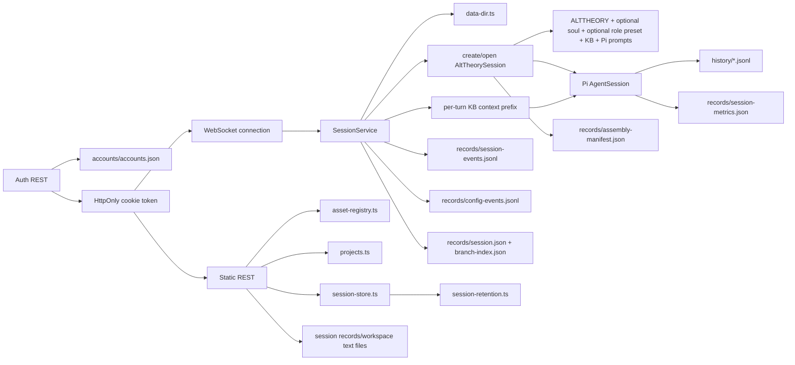

# Architecture: Core Session Engine

## Current Asset Loading Note

This document records the current backend session-engine behavior after the
2026-06-08 agent-asset loading repair. The backend no longer depends on the
removed `agent-assets/runtime/pi-tui/` context or the duplicate
`alt-theory-app/web-server/assets/kb/` copy.

The current session creation path loads semantic assets from `agent-assets/`
and Pi adapter prompt templates from `agent-assets/prompts/pi/`.

## 0. Terminology

- **Session**: one materialized Pi conversation owned by `SessionService`.
- **Draft session**: connection-local launch state containing selected KB,
  role preset, and soul before the first prompt. Drafts are not persisted.
- **Session ID**: Alt Theory-owned identifier generated before Pi session
  creation. New v0.4 sessions use
  `YYYYMMDD-HHmmss__{role}__{soul}__{model}` with a numeric collision suffix.
  Pi receives that id via `SessionManager.newSession({ id })`.
- **Session workspace**: Pi tool `cwd`.
- **Pi session directory**: storage for Pi's timestamped JSONL history.
- **Write directory**: the session workspace; agent-authored notes and summaries
  live directly under Pi's `cwd`.
- **Records directory**: Alt Theory-owned manifest, metrics, and runtime events.
- **Assembly manifest**: immutable provenance record for application context,
  optional soul, optional role preset, KB selection, Pi adapter prompts, paths, model, and
  provider.
- **Prompt assembly**: the full set of backend-controlled model-visible
  instructions assembled at session creation.
- **Per-turn context prefix**: current hardcoded backend text prepended to user
  prompts when a specific KB domain is selected. This is a temporary hook
  substitute, not a complete hook system.
- **Session metrics**: mutable counters plus Pi token/cost/context statistics.
- **Session events**: append-only Alt Theory control/outcome events without
  conversation bodies.
- **Run label / test batch**: optional launch-time metadata recorded in
  manifests for grouping manual UAT sessions without changing provider/model
  identity.
- **Effective config**: analysis-facing snapshot of the active project, KB,
  soul, role preset, provider/model, prompt mode, and resource discovery mode.
- **Config event**: append-only record in `records/config-events.jsonl` for
  creation, user config changes, and resume fallback.
- **Research project**: optional local JSON record under `{dataDir}/projects`
  for grouping and defaults. Project setup is not mandatory.
- **Deletion marker**: optional `records/deleted.json` tombstone that hides a
  session from the normal catalog without removing recoverable data.
- **Session alias**: optional UI display name persisted as
  `records/ui-alias.json`. It is read and written through the session file
  routes; it is not part of the core session header schema.
- **Account**: data-dir backed app identity record under
  `{dataDir}/accounts/accounts.json`. It is separate from outer deployment
  Basic Auth.
- **Auth context**: request/connection identity resolved from an HttpOnly
  browser session cookie. It is anonymous, participant, researcher, or admin.
- **Session owner**: optional `ownerAccountId` persisted in
  `records/session.json`. Participant-created sessions are owner-filtered by
  REST APIs.
- **Role condition**: participant/study condition stored separately from
  `projectId` and mapped to a role preset slug at WebSocket draft creation.
- **Private session**: session with `visibility: private` in
  `records/session.json`. It is owner-readable but blocked from normal
  researcher/admin detail and file routes.
- **Inactive retention**: private sessions are due for hard deletion at
  `lastActivityAt + 7 days`; opening or reading detail does not refresh it.

## 1. Structure



Code anchors:

- `alt-theory-app/core/data-dir.ts`: data-root and session-directory ownership.
- `alt-theory-app/core/agent-assets.ts`: centralized agent-asset path resolver
  and loaded-file hash references.
- `alt-theory-app/core/core-soul.ts`: module parsing, selection, validation, and
  deterministic assembly.
- `alt-theory-app/core/alt-theory-core.ts`: resource loader, tool policy,
  persistent Pi session creation/opening, and manifest.
- `alt-theory-app/web-server/asset-registry.ts`: safe role-preset/KB slugs.
- `alt-theory-app/web-server/auth-accounts.ts`: data-dir backed account store,
  login-code hashing, verification, and safe account serialization.
- `alt-theory-app/web-server/auth-session.ts`: process-local browser session
  tokens, HttpOnly cookie helpers, and request auth-context resolution.
- `alt-theory-app/web-server/server.ts`: REST routes and per-connection
  WebSocket lifecycle.
- `alt-theory-app/web-server/session-metrics.ts`: Pi-native metric mapping and
  atomic snapshot persistence.
- `alt-theory-app/web-server/session-events.ts`: bounded append-only runtime
  event persistence.
- `alt-theory-app/web-server/config-events.ts`: effective config snapshots and
  append-only config event persistence.
- `alt-theory-app/web-server/projects.ts`: optional local project records.
- `alt-theory-app/web-server/session-service.ts`: application-owned session
  runtime lifecycle, WebSocket subscriptions, prompt/abort operations, and
  single-process mutation guard.
- `alt-theory-app/web-server/session-records.ts`: schema-versioned v0.4
  foundation records and branch-aware path helpers.
- `alt-theory-app/web-server/session-store.ts`: historical session catalog,
  detail inspection, v0.4/legacy projection, Pi JSONL discovery, and bounded preview.
- `alt-theory-app/web-server/session-retention.ts`: private retention due-date
  calculation, activity refresh, and explicit expired-private-session cleanup.
- `alt-theory-app/web-server/websocket-protocol.ts`: shared transport types.

## 2. Session Creation

1. WebSocket connect resolves the auth cookie, creates only an unpersisted
   draft selector set, and sends `session_draft`. It does not create a
   `sessions/{id}` directory.
2. The first `prompt` allocates a readable session ID, then creates
   `sessions/{id}/workspace`, `history`, and `records`.
3. The core creates `SessionManager.create(sessionCwd, piSessionDir)` and sets
   the same session ID.
4. `DefaultResourceLoader` loads Pi adapter prompt templates from
   `agent-assets/prompts/pi/`.
5. Prompt layers are appended in this order: Alt Theory application context,
   selected soul when present, optional core-soul modules, selected role preset
   when present, KB declaration, optional write policy.
6. Pi returns the reserved timestamped JSONL path. Pi physically writes it once
   an assistant message is present.
7. Alt Theory atomically writes `records/assembly-manifest.json` and appends
   session/runtime events to `records/session-events.jsonl`.
8. If provided, `ALT_THEORY_RUN_LABEL` and `ALT_THEORY_TEST_BATCH` are recorded
   in the manifest as `runLabel` and `testBatch`.
9. For participant auth contexts, `records/session.json` also records
   `ownerAccountId`, `roleCondition`, `visibility`, `consentSnapshot`,
   `lastActivityAt`, and `retentionDueAt`. Private creation forces
   `consentSnapshot.privateOverride: true` and calculates the first
   `retentionDueAt` from creation activity.

## 2.1 Session Catalog And Open

The backend also exposes the current data directory as a historical session
catalog:

- `GET /api/sessions` lists `sessions/{id}` roots without exposing filesystem
  paths in each summary.
- `GET /api/sessions/{id}` returns bounded detail: manifest, metrics, event
  tail, Pi JSONL info, context counts, and a small transcript preview.

When `{dataDir}/accounts/accounts.json` has configured accounts, session REST
routes require app identity. Participant accounts see only sessions whose
`ownerAccountId` matches their account. Researcher/admin accounts can see
ownerless researcher workbench sessions and participant-owned sessions. When no
account store is configured, anonymous access keeps the old local workbench
behavior for v0.4 compatibility.

Private sessions remain visible as summaries for operations, but normal
detail/transcript/file content access is owner-only. Researcher/admin REST
detail and file routes return a private-content error instead of exposing the
Pi transcript or workspace files.

WebSocket `open_session` makes an existing session the current live session for
that connection. The server reads the detail record, opens the existing Pi JSONL
with `openAltTheorySession()`, then sends the same metadata triplet used after a
fresh session:

```text
session_opened
session_metadata
session_metrics
```

The original `records/assembly-manifest.json` is not overwritten on resume.
Resume-time active runtime facts are written to `records/resume-manifest.json`,
and drift warnings are returned in the active manifest/snapshot.

## 3. Prompt Assembly And Injection

Current model-visible content has two levels.

### Session-Creation Assembly

`createAltTheorySession()` creates a `DefaultResourceLoader` with:

- Pi adapter prompt templates from `agent-assets/prompts/pi/`;
- no Alt Theory runtime `AGENTS.md` file;
- `appendSystemPromptOverride` layers in this order:
  1. `agent-assets/ALTTHEORY.md`;
  2. selected `agent-assets/soul/{slug}.md`, when a soul is selected;
  3. optional core-soul module content, when configured;
  4. selected `agent-assets/role-presets/{slug}.md`, when a role preset is
     selected;
  5. selected custom instruction text asset, when present;
  6. KB root declaration;
  7. write policy when write tools are enabled.

The assembly manifest records the selected paths, existence flags, and SHA-256
hashes for app context, soul, role preset, and custom instruction when present.
It also records Alt Theory skills loaded from the configured skill directory.
Skill discovery follows three modes: `clean` loads none, `internal` loads only
Alt Theory skills, and `dev-debug` merges Alt Theory skills with Pi's normal
global/project discovery while preferring Alt Theory on name collision. It
also records selected soul/role slugs, including `null` for `None`, plus KB
root/domain, Pi prompt-template directory, provider/model, session directories,
and Pi JSONL path. Full content snapshots are deferred.

Code anchors:

- `alt-theory-app/core/alt-theory-core.ts`: `DefaultResourceLoader`,
  `agentsFilesOverride`, and `appendSystemPromptOverride`.
- `alt-theory-app/core/agent-assets.ts`: asset root resolution and file hashes.
- `agent-assets/prompts/pi/`: Pi adapter prompt-template directory.
- `agent-assets/instructions/`: default custom-instruction catalog root.
- `agent-assets/skills/`: configured Alt Theory skill root.

Custom instruction changes rebuild the runtime against the same Pi JSONL and
Alt Theory session ID. Explicit visual skill invocation is validated against
the active Alt Theory skills, sent through Pi's native `/skill:name` command,
and recorded as `skill_invoked`.

### Per-Turn Context Prefix

For each WebSocket `prompt` message, `server.ts` currently checks the selected
KB domain. When the domain is not `all`, it prepends this hidden backend string
to the user payload before calling `session.prompt()`:

```text
[Context: Search in {kbDir}/{domain}/ unless user says otherwise.]
```

This means a domain-specific session currently sends a backend-augmented prompt
on every user turn. The behavior is current architecture, but it is a known
design weakness: it implements context policy as string concatenation in the
WebSocket handler rather than through an explicit hook/context-policy layer.

The user has decided that injected content should be visible in transcripts.
Other hook-policy choices, such as timing, conditions, and experimental
constant/variable status, remain unsettled.

Code anchor:

- `alt-theory-app/web-server/server.ts`: `prompt` handler builds
  `contextPrefix + msg.payload`.

## 4. Tool Policy

- Read-only: `read`, `ls`, `grep`, `find`.
- Write-enabled: the same tools plus `write`.
- `edit` and `bash` are not enabled by the backend.
- The workspace path restriction is prompt-based guidance, not a hard
  filesystem sandbox. Pi's built-in write tool accepts absolute paths.

## 5. Application-Owned Session Service

The backend now owns live runtime state through `SessionService`, not through a
per-WebSocket `ConnectionState`. A WebSocket connection attaches to a managed
session and receives forwarded runtime events.

`SessionService` owns:

- the current Pi `AgentSession` for each managed session;
- assembly manifest, selected KB/role/soul, open mode, resume warnings,
  counters, and transcript cache;
- a single internal Pi subscription per managed session;
- attached WebSocket listeners;
- prompt and abort operations;
- one process-local mutation guard per managed session.

Current behavior:

- WebSocket connect sends `session_draft` and creates no persisted session.
- The first WebSocket `prompt` materializes the draft through
  `SessionService.createSession()`, attaches the socket, sends the normal
  `session_opened` / `session_metadata` / `session_metrics` triplet, then runs
  the prompt.
- `new_session` detaches from any current materialized session and returns the
  connection to draft state using the current selectors. It does not allocate a
  zero-turn replacement session.
- Soul and role-preset switching in draft mutates only draft selectors. After a
  session is materialized, these switches still call service replacement until
  the later live-configuration feature changes that behavior.
- `open_session` validates and opens an existing Pi JSONL through the service.
- WebSocket close detaches the listener only. It does not abort or dispose the
  service-owned runtime. Explicit `abort` remains the cancellation operation.
- A concurrent same-session mutation returns stable `session_busy` instead of
  exposing Pi's raw in-flight prompt error.
- Role-preset and KB values are client-safe slugs resolved against server roots.
- Session metadata and metrics still use WebSocket; static discovery and
  historical session catalog/detail still use REST.

New service-created sessions also write minimal v0.4 foundation records:

```text
records/session.json        # schemaVersion: 1, recordType: session
records/branch-index.json   # schemaVersion: 1, activeBranchId: main
records/ui-alias.json       # optional UI display name, written by frontend
```

The required records are thin indexes around Pi JSONL. They do not duplicate
conversation bodies. `branch-index.json` is the authoritative active logical
branch pointer; Pi's internal fork session ID remains an implementation detail
and does not replace the Alt Theory `sessionId`. `ui-alias.json` is optional
frontend state stored beside other session-local records so display names
follow the session across browsers without changing `records/session.json`.

`records/session.json` also carries v0.5 pilot metadata when present:
`ownerAccountId`, `roleCondition`, `visibility`, `consentSnapshot`,
`lastActivityAt`, and `retentionDueAt`. Meaningful prompts refresh private
`lastActivityAt` and `retentionDueAt`; session open/detail reads do not.
`session-retention.ts` provides explicit cleanup for expired private sessions:
it removes history, workspace, branch workspace, and non-tombstone records while
leaving `records/deleted.json`.

Ordinary runs append accepted and terminal snapshots to `records/runs.jsonl`.
Each run maps `sessionId`, `branchId`, `turnId`, `revisionId`, and `runId` to
the Pi session file and user/assistant entry IDs. Latest-turn revision moves
the Pi leaf to the latest user entry's parent, appends a new path with the same
turn ID, and marks the prior run `superseded`; it does not create a logical
branch or delete old Pi evidence. Latest-turn delete uses the same active-branch
latest-user-turn guard, moves the Pi leaf to that user entry's parent, marks the
run `deleted`, updates the active branch head, and does not remove disk evidence.

REST session detail and transcript preview are projected in `session-store.ts`
from the active branch, not from all Pi JSONL entries:

- resolve the active branch Pi file from `records/branch-index.json`;
- when `activeLeafEntryId` is present, align the opened `SessionManager` to
  that leaf before building transcript;
- build transcript from `sessionManager.getBranch()`;
- omit entries whose latest run snapshot is `deleted` or `superseded`.

When `activeLeafEntryId` is missing, the reader keeps Pi's default opened leaf.

Opening or reconfiguring a managed session also aligns Pi's leaf to the active
branch head recorded in `branch-index.json` before revise/delete guards run.

Only explicit Fork creates `fork-NNN`:

- collaboration Fork uses the shared session `workspace/`;
- comparison Fork copies the source branch workspace to
  `branches/{branchId}/workspace/`;
- both use a separate Pi JSONL with parent linkage and preserve the Alt Theory
  session ID;
- tool/file side effects before revision or Fork are not rolled back.

Service-created sessions also append a `creation` config event. Supported
idle-time KB/role/soul changes append `user_change` config events. Opening an
existing session whose original role/soul/KB cannot resolve falls back
automatically to the current selectors and appends a `resume_fallback` config
event with warnings. Resume never blocks on a confirmation dialog.

Draft project selection may apply supported defaults before first send. After a
session is materialized, project reassignment updates durable grouping metadata
without changing runtime identity, active branch, or effective prompt layers.

Role, soul, and custom-instruction changes rebuild the internal Pi runtime
against the active branch's Pi JSONL and workspace. They keep the same Alt
Theory `sessionId` and logical branch. KB changes update the selector and
per-turn context policy without rebuilding the runtime. Busy sessions reject
config changes with `session_busy`.

## 6. Discovery And Introspection

REST:

- `POST /api/auth/login`
- `POST /api/auth/logout`
- `GET /api/auth/me`
- `GET /api/role-presets`
- `GET /api/souls`
- `GET /api/profiles` legacy compatibility alias
- `GET /api/kb-domains`
- `GET /api/projects`
- `PUT /api/projects/{projectId}`
- `GET /api/sessions`
- `GET /api/sessions/{sessionId}`
- `GET /api/sessions/{sessionId}/files`
- `GET /api/sessions/{sessionId}/files/content`
- `PUT /api/sessions/{sessionId}/files/content`
- `GET /api/sessions/{sessionId}/files/download?root=workspace&path=...`
- `DELETE /api/sessions/{sessionId}/files/content`

Asset discovery routes return sorted `{ slug, displayName }` arrays without
filesystem paths. Session list returns path-free summaries; session detail may
include local paths because the current researcher console is a local runtime
inspection tool.

Project routes read/write local JSON files under `{dataDir}/projects`. They
are optional grouping/default records, not mandatory launch setup and not a
project-management UI.

Session deletion uses `DELETE /api/sessions/{sessionId}` and writes
`records/deleted.json`. Deleted sessions are excluded from the normal catalog
but remain directly readable for recovery/developer use.

Session file routes expose only `.md`, `.txt`, and `.json` files under a
session's `records/` or `workspace/` roots. Requests must resolve inside the
selected root, and large files are rejected. The routes support lightweight
researcher record inspection/editing, not arbitrary filesystem browsing.
When accounts are configured, these routes use content access filtering:
participant accounts can access only their own sessions, and private session
content is owner-only. The download and delete routes are intentionally
workspace-only.

The participant/researcher frontend also uses these file routes for
`records/ui-alias.json`, a small optional display-name file. This keeps aliases
server-persisted and cross-browser while avoiding a new core session schema
field.

WebSocket:

- server: `session_draft`
- server: `session_metadata`, `session_metrics`
- client: `get_session_metadata`, `get_session_metrics`, `open_session`
- client: `switch_visibility`
- client: `revise_latest`, `delete_latest`, `fork_session`

`revise_latest` starts a model run and completes with the normal run lifecycle
events (`run_completed` / `run_failed`). The browser refreshes transcript from
REST after completion.

`delete_latest` is synchronous: the server replies with `session_updated` and
`session_transcript` for the same attached session.

`fork_session` switches the attached managed runtime to the new active branch and
replies with `session_transcript` only. It does not currently send
`session_opened` or `session_updated` with branch metadata.

`session_draft` contains only selector state and no session ID. The browser may
enable input/config controls in draft, but records, paths, and metrics remain
unavailable until materialization. Draft and materialized sessions both accept
`switch_visibility` between `research` and `private`.

For participant WebSocket connections, the draft role preset is derived from
the account's `defaultRoleCondition`. The built-in mapping currently includes
`conceptual-theory -> role-conceptual-theory-companion` and
`metatheory-oriented -> role-metatheory-oriented`; a condition may also point
directly to an existing role preset slug. Missing role presets are setup
errors, not silent fallbacks.

Metrics include message/turn/tool counts, token totals, cost, and nullable
context usage. Successful runs atomically update
`records/session-metrics.json`.

Session detail also returns `effectiveConfig` and `configEvents`, derived from
`records/config-events.jsonl` when present and falling back to the assembly
manifest for older sessions. If a legacy manifest lacks newer v0.4 config
fields, the detail projection returns `effectiveConfig: null` instead of
failing the request.

Runtime events currently cover session creation, existing-session open/resume,
resume warnings, KB/role-preset selection, and run completion/failure/abort. Pi
JSONL remains the conversation record; event files do not duplicate message
bodies.

The normal catalog hides v0.4 roots that have a committed header but no Pi
session file, no metrics, and no durable run event. Legacy incomplete roots
remain visible as `legacy-v0.3` incomplete projections for recovery.

## 7. Model Configuration

The core may receive an explicit Pi `models.json` path plus provider/model
selection and a runtime-only API key. `ModelRegistry` loads custom model
definitions independently of Pi's built-in model catalog. Runtime keys use
`AuthStorage.setRuntimeApiKey()` and are not persisted by Alt Theory.

The tracked runtime model configuration currently includes Xiaomi MiMo Token
Plan through its Anthropic-compatible endpoint. Model entries can be updated
without upgrading Pi. Its zero cost fields mean no comparable per-token price
is configured; they are not a billing claim.

## 8. Known Constraints

- Backend REST session list/detail and WebSocket `open_session` are
  implemented. Browser session-list UI is still pending.
- Role-preset and soul changes from the researcher console rebuild the internal
  Pi runtime after materialization but keep the same Alt Theory session ID and
  history. Before the first prompt, the same controls update draft state only.
  The browser also offers `None` for both layers, which injects no role/soul
  prompt section. KB domain changes affect the next prompt prefix and append a
  config event.
- The per-turn KB context prefix is a temporary hardcoded hook substitute.
  There is no explicit hook/context-policy layer yet.
- The assembly manifest hashes selected app context, soul, and role-preset
  files, but does not yet snapshot all injected content.
- Runtime config is easy to mislaunch: generic Anthropic-compatible environment
  variables do not select the tracked Alt Theory provider/model unless the
  `ALT_THEORY_MODEL_*` and `ALT_THEORY_MODELS_PATH` values are set.
- Existing-session open uses Pi JSONL history and current Alt Theory asset
  assembly. Cross-machine cwd mismatch is warning-only; there is no cwd rewrite
  or migration layer yet.
- Existing v0.3 sessions without `records/session.json` are read as
  `legacy-v0.3` projection. The catalog does not fabricate v0.4 trajectory
  IDs for them.
- Legacy/incomplete detail may expose `effectiveConfig: null` when newer
  config structure cannot be inferred safely from old manifests.
- Opening and abandoning the console does not create a session root. If a v0.4
  zero-turn root is encountered, the normal catalog suppresses it instead of
  offering a user-facing empty conversation.
- Default soul discovery prefers `agent-assets/soul/soul-latest.md`, then
  `agent-assets/soul/soul.md`; if neither exists, no soul layer is injected.
  Optional core-soul module activation remains configured by backend
  environment/config, not UI.
- Hard write-path enforcement, thinking events, compaction/retry events, and
  provider/auth UI are deferred.
- App-level auth is file-backed and process-local in v0.5.0: account records
  persist in the data directory, but browser auth tokens are in memory and
  require re-login after server restart. There is no self-registration or
  global admin UI.
- Private-session cleanup is explicit backend logic. There is no background
  scheduler, encryption layer, or broad participant file manager.
- Model selector UI remains deferred. Custom instruction loading and visual
  Alt Theory skill invocation are implemented; the normal skill picker excludes
  Pi global/project debug skills.
- Transcript detail now preserves assistant thinking and distinguishes tool
  calls from tool results so the researcher console can switch between User,
  Researcher, and Evidence views.
- Branch browsing/switching UI is not implemented. `fork_session` backend
  support exists, but the current WebSocket reply shape does not expose branch
  activation to the client beyond transcript replacement.

## 9. Verification

- `npm run test:backend`: local unit and integration suite.
- `npm run smoke:core`: real Pi initialization without an external model turn.
- `npm run smoke:backend`: three-turn MiMo live test covering identity,
  KB retrieval, workspace write, metrics, events, and JSONL persistence.
- `npm run smoke:resume`: Pi-native resume probe with a changed resume-time
  role preset marker. Both live commands require explicit external-provider
  approval.

## Change Log

- 2026-06-17: Updated transcript projection and conversation-action runtime
  notes. `session-store.ts` now builds REST transcript from the active Pi branch
  and filters `deleted` / `superseded` run entries; managed-session open/reopen
  aligns Pi leaf to `branch-index.json`. Documented current WebSocket shapes for
  `revise_latest`, `delete_latest`, and `fork_session`, and corrected
  materialized `switch_visibility` behavior.
- 2026-06-17: Added current UI alias persistence note. Session display aliases
  are stored as optional `records/ui-alias.json` files via the existing
  `GET/PUT /api/sessions/{sessionId}/files/content` routes, not in
  `records/session.json`; participant access remains governed by the existing
  session content authorization rules.
- 2026-06-16: Added backend latest-turn delete foundation. The WebSocket
  protocol accepts `delete_latest`; `SessionService` moves the Pi leaf away from
  the deleted latest user turn, appends `deleted` run evidence, preserves disk
  history, and rejects busy or no-completed-turn sessions.
- 2026-06-16: Added private session retention and workspace-file foundation.
  Private WebSocket drafts can materialize owner-scoped private sessions,
  private prompts refresh inactive retention, detail reads do not, researcher
  normal detail/file routes cannot read private content, explicit cleanup
  hard-deletes expired private evidence with a tombstone, and workspace
  download/delete routes are constrained to owner-visible workspace files.
- 2026-06-16: Added v0.5 pilot account/auth foundation. The backend now has
  data-dir account records, login/logout/me routes, HttpOnly browser auth,
  owner/role-condition/consent metadata in `records/session.json`,
  participant-filtered REST session access, and participant WebSocket
  first-send ownership.
- 2026-06-15: Updated after workbench-session-management acceptance. Added
  durable project assignment, recoverable delete tombstones, and safe legacy
  detail fallback when v0.4 config projection is unavailable.
- 2026-06-14: Added append-only run lineage, same-branch latest-turn revision,
  and explicit collaboration/comparison Fork with shared/copied workspace
  policies. Alt Theory and Pi session identities are now explicitly separate.
- 2026-06-14: Added content-validated custom instructions, three-mode skill
  composition, Alt Theory-only skill discovery, explicit skill invocation, and
  the minimal `conversation-summary` runtime skill.
- 2026-06-14: Updated after project-config/live-switching implementation.
  Added optional project records, effective config events, automatic
  resume-fallback records, and same-session KB/role/soul switching.
- 2026-06-14: Updated after draft-first-send implementation. WebSocket connect
  now creates only `session_draft`; first prompt materializes a readable-ID
  session; `new_session` returns to draft; v0.4 zero-turn roots are hidden from
  the normal catalog.
- 2026-06-08: Added current prompt assembly and per-turn context-prefix
  architecture, including the known hardcoded hook-substitute constraint.
- 2026-06-08: Updated after minimal agent-asset loading repair. Backend now
  loads `ALTTHEORY.md`, selected soul/role assets when present,
  `agent-assets/kb/`, and `agent-assets/prompts/pi/`.
- 2026-06-08: Added backend session catalog/detail and WebSocket
  `open_session` for existing persisted sessions.
- 2026-06-12: Added optional run grouping metadata, transcript thinking/tool
  result preservation, and session-local records/workspace text-file routes.

## Related Documents

- `project/architecture/researcher-console.md`: browser console consuming the
  session engine for live testing, inspection, and future session work.
