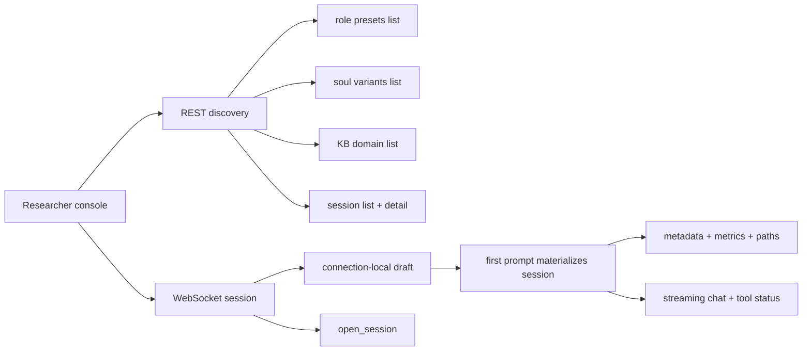

# Architecture: Researcher Console

## 0. Terminology

- **Researcher console**: the browser surface used by the user as first tester,
  designer, asset author, and research observer. It is not the final learner UI.
- **Runtime inspector**: the right-side information surface showing current
  session metadata, metrics, paths, provider/model, and selected assets.
- **Session/config panel**: the left-side control surface for creating a new
  session and selecting KB, soul, and role preset.
- **Temporary frontend seed**: the current vanilla HTML/CSS/JS implementation.
  It is functional enough for live testing but not yet a complete researcher
  console.

## 1. Positioning And Audience

This architecture records the current browser console that sits on top of the
core session engine. Future frontend agents should read this before treating
the temporary frontend as either disposable UI or final product design.

The console's current purpose is to support real user interaction as design and
research evidence. That includes live conversation, runtime inspection,
historical session browse/resume, and later comparison, annotation, and export.

## 2. Structure And Interaction

Current implementation:

```text
alt-theory-app/web-server/public/
  index.html   # static three-area DOM
  client.js    # REST discovery + WebSocket session client
  style.css    # responsive temporary layout
```

Browser interaction shape:



The left panel currently owns:

- new session button;
- compact draft selectors including project, KB, soul, role preset, and custom
  instruction;
- grouped/searchable historical session list/detail/preview;
- resume/open selected session control;
- session delete control with recoverable soft delete;
- provider/model display.

The center panel currently owns:

- chat message stream;
- streaming assistant text;
- inline tool status;
- prompt input;
- Alt Theory skill selector and explicit Invoke action;
- send/stop controls.

The right runtime inspector currently owns:

- full session ID;
- connection status;
- active KB, soul, and role preset;
- provider/model;
- counters, tokens, context usage, cost;
- key runtime paths under a dedicated Paths tab;
- effective config warnings and recent run lineage under a dedicated
  Provenance tab;
- loaded app context, soul, role preset, KB, and Pi prompt-template paths;
- core-soul modules when present.

Code anchors:

- `alt-theory-app/web-server/public/index.html`: current DOM layout.
- `alt-theory-app/web-server/public/client.js`: current REST/WebSocket client.
- `alt-theory-app/web-server/public/style.css`: current temporary visual layer.
- `alt-theory-app/web-server/websocket-protocol.ts`: client/server message
  contract.
- `alt-theory-app/web-server/server.ts`: REST discovery and WebSocket session
  behavior.

## 3. Data And State

Current console attachment state is browser-local and tied to one live
WebSocket connection. A new connection starts in draft state with selected KB,
  soul, role preset, and optional custom instruction but no session ID. The active backend runtime is
application-owned by `SessionService` only after a draft is materialized by the
first prompt or an existing session is opened. Closing the browser socket
detaches the listener rather than aborting a materialized session. The browser
reads a durable session index from the backend data directory but does not own
or persist that index locally.

Current backend-facing state:

- discovery lists from `GET /api/role-presets`, `GET /api/souls`, and
  `GET /api/kb-domains`;
- content-validated instruction catalog from `GET /api/instruction-assets`;
- active Alt Theory-only skill catalog from `GET /api/skills`;
- legacy compatibility alias from `GET /api/profiles`;
- historical session list and detail from `GET /api/sessions` and
  `GET /api/sessions/{sessionId}`;
- optional project list from `GET /api/projects`;
- current live session metadata from `session_metadata`;
- current live session metrics from `session_metrics`;
- connection-local draft state from `session_draft`;
- session resume/open over WebSocket `open_session`;
- project switching over WebSocket `switch_project`;
- streaming output and tool events over WebSocket;
- stable `session_busy` errors when a same-session mutation is already active;
- selected KB domain in the current connection;
- selected soul slug or `None` in the current connection;
- selected role-preset slug or `None` in the current connection.
- effective config and config-event history from session detail;
- optional project records from REST when external clients or later UI need
  local grouping/defaults;
- loaded transcript view state in the browser, switchable between User and
  Developer views;
- session-local record files read through REST for files under `records/` and
  `workspace/`.

Current persistence belongs to the backend data directory, not the browser:

```text
{ALT_THEORY_DATA_DIR or default data root}/
  sessions/{session-id}/
    workspace/
    history/
    records/
```

The console can display paths from the manifest, list historical sessions,
inspect selected-session detail/preview, resume/open a selected session, switch
loaded transcripts between User/Developer views, and lightly edit
allowed session-local text records. It cannot yet tag, annotate, compare, or
export sessions.

## 4. Current Capabilities

- Opens to an unpersisted draft on WebSocket connect.
- Materializes the draft into one readable-ID backend session when the first
  prompt is sent.
- Populates KB, soul, and role-preset selectors from REST discovery.
- Populates historical session list/detail from REST.
- Groups historical sessions by project with an `Unassigned` bucket and local
  search filtering.
- Sends prompts and abort requests.
- Revises the latest user turn on the same logical branch using replacement
  text from the composer.
- Creates an explicit collaboration or comparison Fork from the current point.
- Starts a new draft within the same browser connection without creating an
  empty session.
- Resumes/opens an existing session within the same browser connection.
- Switches soul and role preset immediately after materialization by
  rebuilding the active backend runtime while keeping the same Alt Theory
  session id, workspace, and Pi history.
- Switches KB domain in the same session and records the effective config
  change.
- Displays streaming assistant text.
- Displays tool started/updated/finished states.
- Renders loaded and streaming assistant Markdown through a local vendor parser
  with post-render sanitization.
- Displays manifest and metrics in the Runtime inspector tab.
- Displays loaded asset paths in the Paths inspector tab.
- Displays effective config and recent run lineage in the Provenance inspector
  tab.
- Displays resumed/history transcripts in two hot-switchable views: User hides
  thinking and tool events; Developer shows thinking, tool calls, and collapsed
  tool results.
- Provides a right-panel Records tab with a text editor for path-contained
  `.md`, `.txt`, and `.json` files under the active session's `records/` and
  `workspace/`.
- Supports recoverable soft delete from the normal catalog.
- Supports desktop left/right pane resize, collapse, and restore controls.
- Disables records/paths/metrics surfaces while the connection is still draft.
- Passed consolidated browser UAT for resize/collapse, Markdown rendering,
  delete, and provenance on 2026-06-15.

## 5. Known Constraints / Edge Cases

- Provider/model switching is not implemented in the console.
- Core-soul module switching is not implemented in the console.
- Role-preset and soul switching rebuild the backend runtime rather than
  mutating an in-flight model prompt after a session has materialized. In
  draft, those controls only update the pending launch selectors.
- Custom-instruction switching uses the same same-session rebuild behavior.
- The skill picker exposes only configured Alt Theory skills, even when the
  backend is in `dev-debug`; Pi debug/global skills remain outside the picker.
- Project assignment and draft project selection exist in the current
  frontend, but project creation/administration UI does not.
- Tags and annotations are not implemented.
- Export is not implemented.
- Historical session comparison is not implemented.
- Branch-tree browsing and switching back to an older branch are not yet
  implemented. The new Fork becomes active immediately.
- Revision/Fork does not roll back tool or file side effects. Comparison Fork
  copies only the selected branch workspace at Fork time.
- Model-comparison prompts across multiple providers are not implemented.
- The Session Records editor is plain text only. It has no Markdown preview,
  diff, autosave, conflict handling, or new-file UI.
- Soft delete hides sessions from the normal catalog but does not yet expose a
  restore or Trash-management surface in ordinary UI.
- Runtime config visibility is still partial: the console shows active
  provider/model and loaded asset paths, while full startup source and
  provider/auth selection UI are not implemented.
- The console does not yet show prompt assembly, hook/context policy, or
  injected transcript components clearly.
- The current frontend is a researcher-console seed, not final product UI.

## 6. Related Documents

- `project/architecture/core-session-engine.md`: backend session, prompt
  assembly, persistence, and WebSocket architecture.
- `project/workstreams/0-backend-agent-harness/notes-and-status/2026-06-08-researcher-console-issue-pool-plan-record-v1.md`:
  current issue pool and implementation priority discussion.
- `project/workstreams/0-frontend-and-research-console/notes-and-status/2026-06-07-temporary-frontend-implementation-report.md`:
  implementation report and live-turn smoke record for the temporary frontend.

## Change Log

- 2026-06-17: Updated after v0.5 zcode UI-polish + Summary-panel pass. Theme is
  now a warm light/flat palette (chat canvas `#f8f8f9`, side panels `#ebebec`,
  near-invisible hairlines, no blue/purple accents). The composer is one
  white rounded elevated block: the `#input` has no visible border inside it;
  Send is an icon-only ink button (masked up-arrow SVG, `aria-label="Send"`);
  Stop is a stop-sign (terracotta-tinted rounded button with a solid bar, also
  `aria-label`-only). Send-edited lives inside the same white block as an ink
  button. A new right-tab `Summary` is visible to participant / researcher /
  debug; it carries a Records-style editor for an optional user note and a
  `总结 session 到文件` button that sends WebSocket `invoke_skill` with a
  hardcoded `skillName = "conversation-summary"`. Backend errors are
  surfaced plainly; no fake success state. The visibility toggle stays
  editable on a live session (the 2026-06-17 backend resume-leaf fix made
  post-materialization `switch_visibility` valid); private mode toggles a
  `.private-active` class on `#chat-panel` that drops the canvas to side-panel
  depth for a subtle but visible distinction. Verified via backend regression
  57/57, new UAT 22/22, and the prior participant-shell UAT 24/24.
- 2026-06-16: Updated after participant-view-shell + conversation-action frontend
  acceptance. The shell now resolves app identity from `GET /api/auth/me` and gates
  itself into participant / researcher / debug view modes. With configured accounts,
  an anonymous browser sees a login gate (the backend 401 on session routes is the
  signal); participant login hides Launch/Config, project, model/provider, Records/
  Paths/Provenance tabs, and the revise/fork lineage row, and shows a role-condition
  label plus a low-noise private-mode toggle/badge. The private toggle sends
  WebSocket `switch_visibility` before first prompt and locks once materialized.
  Conversation actions gained a delete-latest control near the composer, a hardened
  send lockout while running (Send hidden/disabled; Stop available), and a stop→
  "edit or delete your latest message" hint. A client-side Debug toggle (researcher/
  admin only) re-shows advanced inspector panels for current-browser troubleshooting;
  it changes no server identity, ownership, or consent. Frontend hiding remains
  presentational: the backend is the authorization gate. Verified via browser UAT
  (22/22) and backend regression (55/55).
- 2026-06-15: Updated after workbench-session-management acceptance. The
  frontend now exposes project grouping/search, recoverable delete, resizable
  panes, rendered Markdown, and a Provenance inspector tab.
- 2026-06-14: Added minimal latest-turn revision and explicit
  collaboration/comparison Fork controls. Full branch browsing remains
  deferred to later workbench UI.
- 2026-06-14: Added custom-instruction selection and explicit Alt Theory skill
  invocation near the composer. Unified visual UAT remains scheduled for the
  later consolidated frontend checkpoint.
- 2026-06-14: Updated after project-config/live-switching implementation.
  Materialized KB/role/soul changes now remain inside the same Alt Theory
  session and config provenance is available through session detail.
- 2026-06-14: Updated after draft-first-send implementation. Console opens in
  `session_draft`, first prompt materializes the session, and records/paths/
  metrics remain unavailable while draft.
- 2026-06-08: Created current-state architecture for the researcher console
  seed.
- 2026-06-08: Updated after session browser/resume-open slice. Console now
  lists historical sessions, shows selected detail/preview, and sends
  WebSocket `open_session`.
- 2026-06-12: Updated after researcher-console asset switching alignment.
  Console now exposes soul and role `None` selectors, immediate backend
  rebuild, and no-history session-id reuse.
- 2026-06-12: Updated after UAT data-management implementation. Console now
  has transcript User/Developer views and right-panel Records/Runtime/Paths
  tabs.
