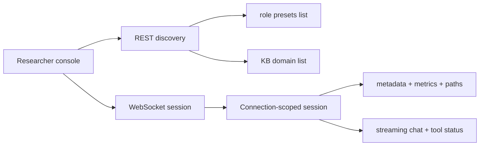

# Architecture: Researcher Console

## 0. Terminology

- **Researcher console**: the browser surface used by the user as first tester,
  designer, asset author, and research observer. It is not the final learner UI.
- **Runtime inspector**: the right-side information surface showing current
  session metadata, metrics, paths, provider/model, and selected assets.
- **Session/config panel**: the left-side control surface for creating a new
  session and selecting KB/role preset.
- **Temporary frontend seed**: the current vanilla HTML/CSS/JS implementation.
  It is functional enough for live testing but not yet a complete researcher
  console.

## 1. Positioning And Audience

This architecture records the current browser console that sits on top of the
core session engine. Future frontend agents should read this before treating
the temporary frontend as either disposable UI or final product design.

The console's current purpose is to support real user interaction as design and
research evidence. That includes live conversation, runtime inspection, and
soon session comparison/resume, annotation, and export.

## 2. Structure And Interaction

Current implementation:

```text
alt-theory-app/web-server/public/
  index.html   # static three-area DOM
  client.js    # REST discovery + WebSocket session client
  style.css    # responsive temporary layout
```

Browser interaction shape:



The left panel currently owns:

- new session button;
- session ID/status summary;
- KB selector;
- role-preset selector;
- provider/model display.

The center panel currently owns:

- chat message stream;
- streaming assistant text;
- inline tool status;
- prompt input;
- send/stop controls.

The right runtime inspector currently owns:

- full session ID;
- connection status;
- active KB/role preset;
- provider/model;
- counters, tokens, context usage, cost;
- key runtime paths;
- loaded app context, soul, role preset, KB, and Pi prompt-template paths;
- core-soul modules when present.

Code anchors:

- `alt-theory-app/web-server/public/index.html`: current DOM layout.
- `alt-theory-app/web-server/public/client.js`: current REST/WebSocket client.
- `alt-theory-app/web-server/public/style.css`: current temporary visual layer.
- `alt-theory-app/web-server/websocket-protocol.ts`: client/server message
  contract.
- `alt-theory-app/web-server/server.ts`: REST discovery and WebSocket session
  behavior.

## 3. Data And State

Current console state is browser-local and tied to one live WebSocket
connection. The browser does not yet own a durable session index or local
project state.

Current backend-facing state:

- discovery lists from `GET /api/role-presets` and `GET /api/kb-domains`;
- legacy compatibility alias from `GET /api/profiles`;
- current live session metadata from `session_metadata`;
- current live session metrics from `session_metrics`;
- streaming output and tool events over WebSocket;
- selected KB domain in the current connection;
- selected role-preset slug for the next `new_session`.

Current persistence belongs to the backend data directory, not the browser:

```text
{ALT_THEORY_DATA_DIR or default data root}/
  sessions/{session-id}/
    workspace/
    history/
    records/
```

The console can display paths from the manifest but cannot yet list historical
sessions, resume them, tag them, annotate them, or export them.

## 4. Current Capabilities

- Opens a live backend session on WebSocket connect.
- Populates KB and role-preset selectors from REST discovery.
- Sends prompts and abort requests.
- Starts a new session within the same browser connection.
- Displays streaming assistant text.
- Displays tool started/updated/finished states.
- Displays manifest, loaded asset paths, and metrics in the runtime inspector.
- Passed a user-run browser + live LLM smoke on 2026-06-08.

## 5. Known Constraints / Edge Cases

- Historical session list is not implemented.
- Resume/open previous session is not implemented.
- Provider/model switching is not implemented in the console.
- Core-soul module switching is not implemented in the console.
- Role-preset switching is implemented for the next new session; current-session
  prompt mutation is not implemented.
- Tags and annotations are not implemented.
- Export is not implemented.
- Runtime config visibility is still partial: the console shows active
  provider/model and loaded asset paths, while full startup source and
  provider/auth selection UI are not implemented.
- The console does not yet show prompt assembly, hook/context policy, or
  injected transcript components clearly.
- The current frontend is a researcher-console seed, not final product UI.

## 6. Related Documents

- `project/architecture/core-session-engine.md`: backend session, prompt
  assembly, persistence, and WebSocket architecture.
- `project/workstreams/0-backend-agent-harness/notes-and-status/2026-06-08-researcher-console-issue-pool-plan-record-v1.md`:
  current issue pool and implementation priority discussion.
- `project/workstreams/0-frontend-and-research-console/notes-and-status/2026-06-07-temporary-frontend-implementation-report.md`:
  implementation report and live-turn smoke record for the temporary frontend.

## Change Log

- 2026-06-08: Created current-state architecture for the researcher console
  seed.
