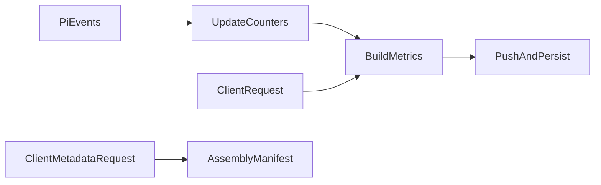

# Session Metrics And Introspection Design

## 0. Terminology

`SessionMetrics` combines Alt Theory event counters with Pi-native session
statistics. Assembly metadata remains a separate immutable manifest.

## 1. Decisions And Constraints

WebSocket is the only session-scoped transport. Metrics are pushed after a
successful run and returned on request. A JSON snapshot is atomically written
after successful runs. Token/context values come from Pi APIs, not manual
parsing. Failed tool calls count because `tool_execution_end` occurred.

## 2. Nouns And Orchestration

### 2.1 Noun Layer

Add `SessionMetrics` with message/turn/tool counts, token totals, cost, and
nullable context usage. Add metadata/metrics request and response messages.

### 2.2 Orchestration Layer

### 2.3 Mount Point List

- `get_session_metadata` WebSocket message.
- `get_session_metrics` WebSocket message.
- `session_metadata` and `session_metrics` server messages.
- Successful `agent_end` metric persistence/push.

### 2.4 Push Strategy

1. Extend shared protocol types.
2. Build metrics from state and Pi stats.
3. Add request handlers and creation/run pushes.
4. Persist metric snapshots atomically.
5. Verify live connection behavior and inspect JSONL evidence.

### 2.5 Structure Health And Micro-refactor

Metric construction is extracted from event cases into one helper. No broader
server split is required. Conclusion: skip.

## 3. Acceptance Contract

Creation pushes metadata and zero metrics. Requests return current values. A
successful run increments turn count and pushes/persists metrics. Pi token,
cost, and context values are included when available.

## 4. Architecture Relationship

Whole-plan acceptance records WebSocket introspection and metric persistence.
