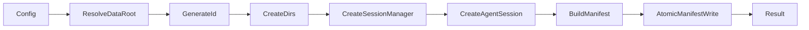

# Session Persistence And Output Folders Design

## 0. Terminology

- **Data directory**: Alt Theory-owned persistent root. No conflict with Pi's
  global agent directory.
- **Session root**: `{dataDir}/sessions/{sessionId}`.
- **Session workspace (`sessionCwd`)**: Pi tool working directory under the
  session root.
- **Pi session directory (`piSessionDir`)**: directory containing Pi's
  timestamped JSONL file.
- **Write directory (`writeDir`)**: notes directory under the session root.

## 1. Decisions And Constraints

The feature must create durable per-session directories, use Pi file-backed
sessions, expose actual paths to later features, and support
`ALT_THEORY_DATA_DIR`. It does not implement list/resume, core-soul assembly,
discovery routes, or a hard write sandbox.

Complexity uses the local desktop-backend default tier. Persistence is local
filesystem only; concurrency is limited to independent session roots.

Key decisions:

- Generate a UUID in Alt Theory before directory creation.
- Call `SessionManager.create(sessionCwd, piSessionDir)`, then
  `newSession({ id: sessionId })` so Pi, directories, and manifest share one ID.
- Write the initial manifest only after `createAgentSession()` exposes the
  actual `sessionFile`, model, and provider.
- Repair the stale `package.json` paths because otherwise this feature cannot
  be executed through the repository's declared scripts.

## 2. Nouns And Orchestration

### 2.1 Noun Layer

**Current state:** `AltTheoryConfig` uses `rootDir`; sessions use
`SessionManager.inMemory()` and return only `{ session }`.

**Change:** add `SessionDirectories`, `AssemblyManifest`, data-directory
functions, and the revised `AltTheoryConfig` path fields. The session factory
returns `{ session, manifest }`.

Example:

```typescript
const dirs = createSessionDirs("D:/tmp/alt-theory", "session-123");
// dirs.sessionCwd   = .../sessions/session-123/workspace
// dirs.piSessionDir = .../sessions/session-123/history
// dirs.writeDir     = .../sessions/session-123/notes
```

Main error: an unusable data root or directory creation failure rejects session
creation; no in-memory fallback silently loses persistence.

### 2.2 Orchestration Layer



**Current state:** the caller provides one runtime root and Pi owns no files.

**Change:** the core factory creates or accepts session directories, creates a
file-backed Pi manager with the pre-generated ID, and atomically writes the
initial manifest. Each factory call is independent.

Constraints:

- All returned paths are absolute.
- Partial manifest writes use a temporary file and rename.
- Existing session roots are rejected instead of reused.
- The JSONL filename is read from `session.sessionFile`, never predicted.

### 2.3 Mount Point List

- `AltTheoryConfig`: replace `rootDir` with session path configuration.
- `createAltTheorySession()`: mount file-backed session creation.
- `package.json`: repair `dev:web` and `smoke:core` execution paths.

### 2.4 Push Strategy

1. Add path and manifest nouns; exit when deterministic filesystem tests pass.
2. Wire persistent Pi session creation; exit when session ID and JSONL path
   match the created session root.
3. Write manifest atomically and return it; exit when disk and return value
   agree.
4. Update smoke script and npm paths; exit when repository scripts resolve.
5. Run focused tests and type/runtime smoke checks.

### 2.5 Structure Health And Micro-refactor

##### Evaluation
- `alt-theory-core.ts` is small but should not own platform path policy.
- `alt-theory-app/core/` is flat and currently has two files; one new owned
  module does not create directory pressure.

##### Conclusion: skip

Path management goes into the new `data-dir.ts`; no behavior-preserving
pre-refactor is needed.

## 3. Acceptance Contract

- With an override data root, one factory call creates a unique session root
  containing `workspace`, `history`, and `notes`.
- Pi reports the same pre-generated session ID and a JSONL path under `history`.
- `assembly-manifest.json` exists under `workspace` and records actual paths.
- A second factory call creates a different root.
- A filesystem failure is reported; it does not fall back to memory.
- No list/resume behavior or hard write enforcement is introduced.

## 4. Architecture Relationship

Acceptance updates `project/architecture/core-session-engine.md` from in-memory
session ownership to Alt Theory-owned persistent session directories and fixes
its stale code anchors.
